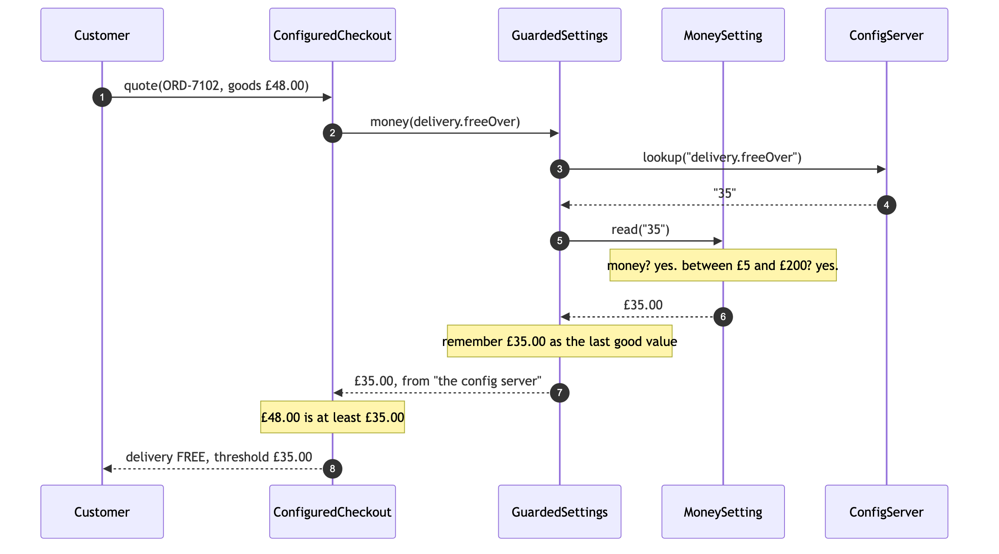
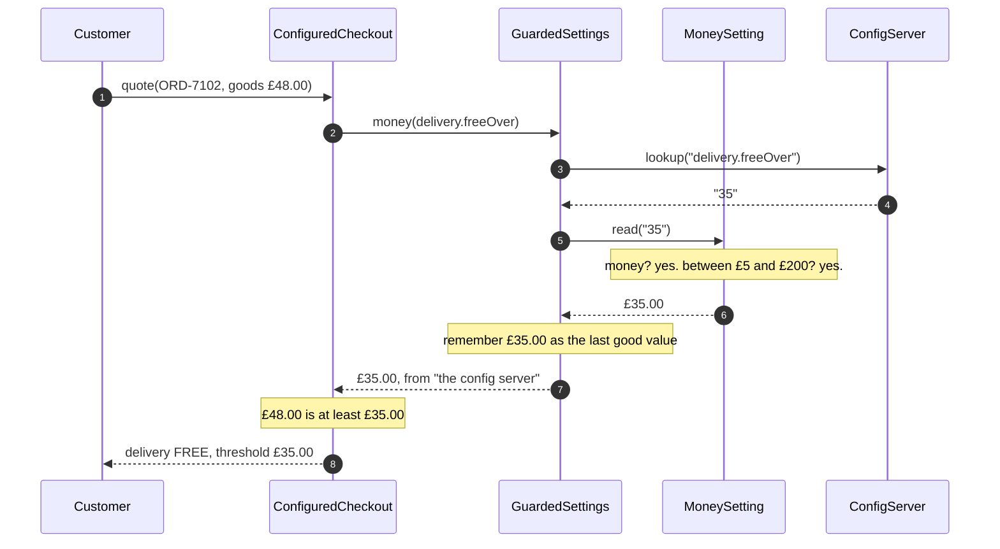
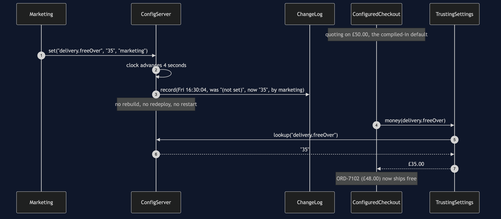
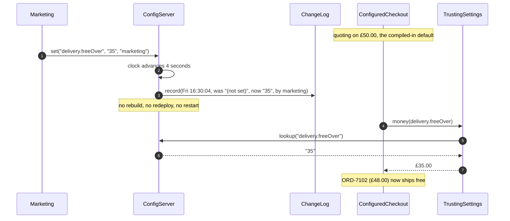
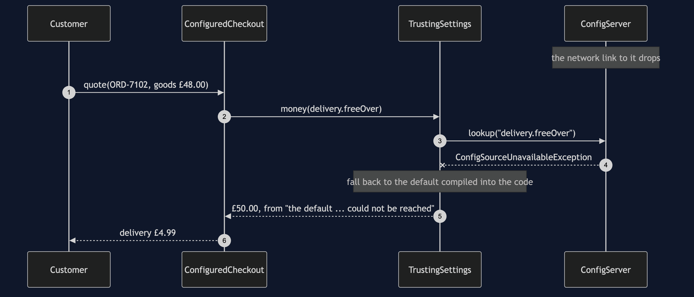
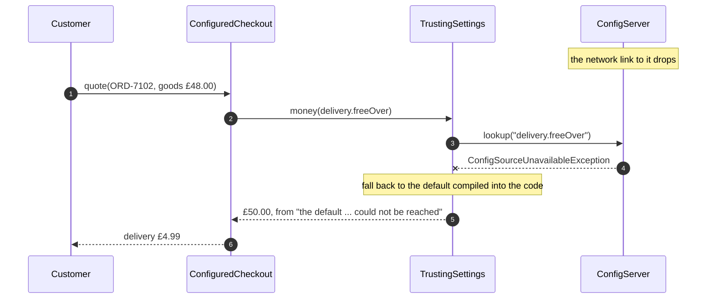
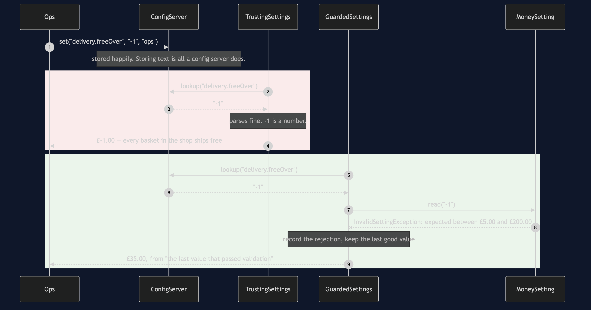
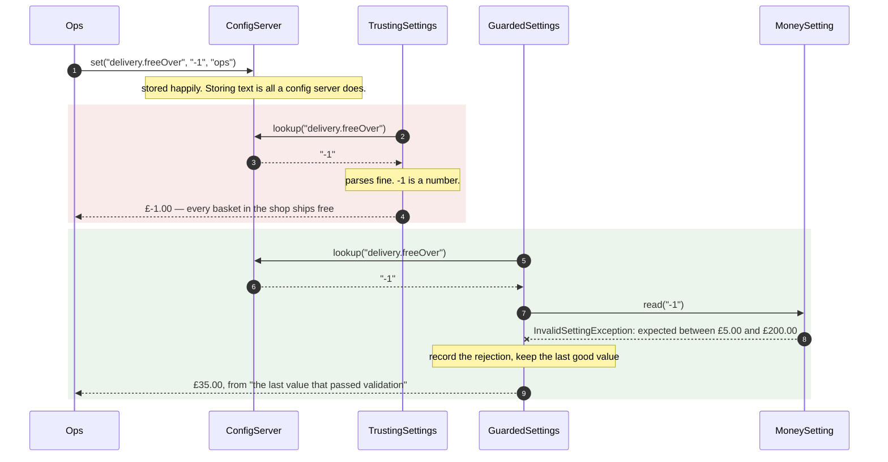
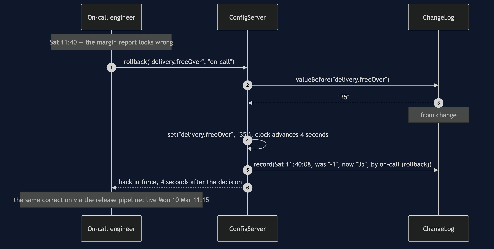
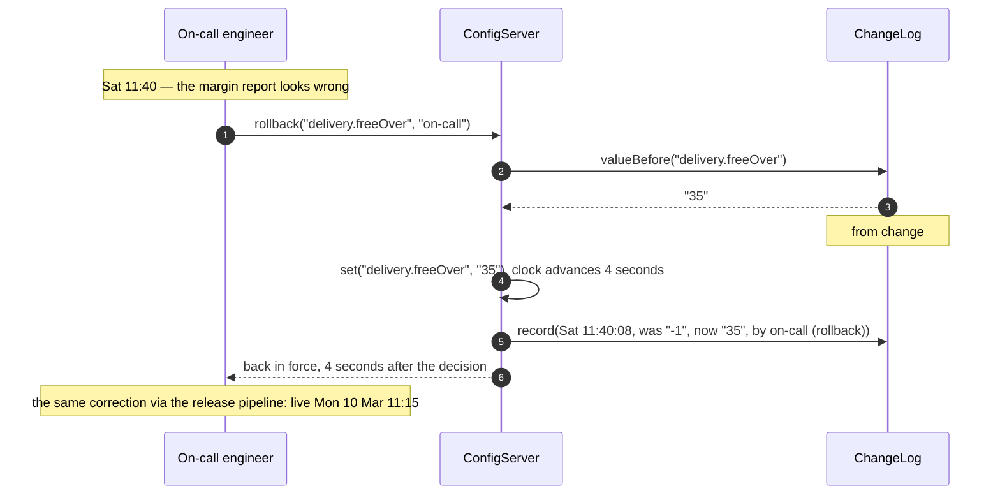

# Externalised Configuration Pattern — UML Sequence Diagrams

Five sequences. The first is the pattern in one picture; the next four are the four
things that only become possible — or only become dangerous — once the value lives
outside the program.

## 1. One Quote, With The Value Read From Outside

The read happens inside the quote, which is the whole pattern.

Mermaid source

Read step 2 and notice where it is. The lookup happens *inside* `quote`, not in the
constructor. That single placement decision is what makes a configuration change take
effect on the next order rather than on the next restart, and it is the detail people
get wrong when they tidy this code up.

Steps 5 to 7 are the replacement for the compiler. The text `"35"` is turned into
money and checked against a declared range before it gets any further into the
program, so nothing downstream of the reader ever has to wonder whether the threshold
is sane.

Step 8 carries an origin string back with the amount. That is what lets the quote —
and the support agent reading it three weeks later — say not just what the threshold
was but where it came from.

## 2. The Change That Lands In Four Seconds

The point of the whole exercise, and the reason anybody accepts the bill.

Mermaid source

Compare the elapsed time with the release pipeline the pattern replaced: 135 minutes
of work, spread from Friday afternoon to Monday at 10:45. The promotion was for the
weekend.

Note step 4. The change is recorded as it happens, and it is recorded with the value
it displaced. That is not bookkeeping for its own sake — it is what makes sequence 5
possible.

## 3. The Source Is Unreachable, And The Shop Keeps Selling

The failure mode of this pattern, and the reason every setting declares a default.

Mermaid source

The shop starts, and keeps trading, which is the point of step 6. A shop that refuses
to serve customers because a configuration server is down is a worse shop than one
with a hard-coded threshold.

Now read what it cost. The promotion is off. The threshold is back to fifty pounds,
no exception reaches a customer, no alert fires, and the only trace anywhere is the
origin string in step 7. Surviving an outage quietly is not the same as surviving it
correctly, and this is exactly why the provenance is worth carrying.

## 4. The Bill: A Well-Formed Number Nobody Checked

Two sequences side by side. Same server, same value, different reader.

Mermaid source

The top half is the pattern working exactly as designed with a value somebody typed
wrongly. There is no exception, no log line, and no alert — the program was told the
threshold is minus one pound and is faithfully applying it. The first symptom is the
margin.

The bottom half is the same read with one guard in place. Notice what it falls back
to: **not** the compiled-in fifty pounds, but the last value that passed validation.
Reverting a good promotion because of an unrelated typo would be its own kind of
wrong.

Notice also that it records the rejection. A guard that silently swallows bad input
is half a guard: the typo is still there and the promotion still is not running, and
nobody is looking.

## 5. The Rollback That Is A Lookup, Not A Memory

The guard with no equivalent in the source-code world.

Mermaid source

Step 4 is the one to look at. Nobody had to remember that the threshold used to be
thirty-five pounds, at speed, on a Saturday, while the shop gave delivery away. The
log had it, because every change records the value it displaced.

And step 7 is the honest comparison. A bad release takes a release to undo. A bad
value takes four seconds. That is what makes externalised configuration genuinely
safer rather than merely faster — and it only holds if you built the audit trail,
which is why the trail is part of the pattern and not an optional extra.
