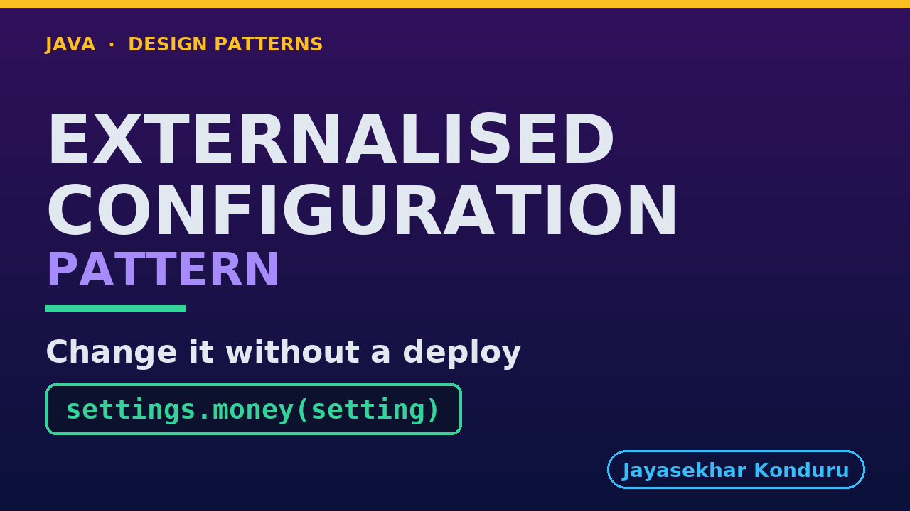

# YouTube — Externalised Configuration Pattern

Everything needed to publish `video/externalised-configuration-pattern-explained.mp4`. Copy the fields straight out of this file.

Chapter timings are generated from the video's `.srt`. Re-run `python3 docs/make_youtube_docs.py externalised-configuration` after any change to the narration, or they will be wrong.

## Title

```
Externalised Configuration in Java - No Deploy Needed
```

53 characters — under the 60 YouTube shows before truncating in search results.

## Description

The first two lines are what a viewer sees above the fold, so they carry the hook rather than the boilerplate.

```
Learn externalised configuration in Java 21, starting from a constant that is not wrong: free delivery over fifty pounds, named, typed as money, in exactly one place, and a reviewer would approve it without a comment. Then marketing ask at half past four on a Friday for thirty-five pounds by Saturday morning, and the release pipeline prices that at a hundred and thirty-five minutes of work, live on Monday at a quarter to eleven — two days late for a weekend promotion. Nothing in that pipeline is unreasonable; the value is simply sitting somewhere with an engineering change speed. So we move the read outside and into the method, and the same change takes four seconds. The second half is the half most write-ups leave out. A constant was getting four guards for free — the compiler, a reviewer, version control and a revert — and moving the value outside throws all four away. Minus one parses, ships every basket free, and nothing throws or logs. The word fifty takes the shop down from a text box. We rebuild each guard deliberately, and finish on what to externalise and what never to.

CHAPTERS
00:00 Introduction
01:29 The Scenario
02:31 Where the Number Lives Today
03:29 What Changing One Number Costs
05:22 The Pattern
06:32 Three Moves
07:53 Who Does What
09:37 The One Line That Is the Pattern
11:19 Four Seconds
12:28 The Bill, Part One — When the Source Goes Away
13:38 The Bill, Part Two — A Number Nobody Checked
15:13 The Bill, Part Three — Not a Number at All
16:25 The Four Guards, and What Replaces Them
17:42 Declared, and Validated at the Boundary
19:56 The Trail, and a Rollback in Four Seconds
21:59 What to Externalise, and What Never To
23:29 Thanks for Watching

SOURCE CODE, WRITTEN NOTES AND AN INTERACTIVE ANIMATION
https://github.com/jk-boot-up/java-design-patterns/tree/main/gradle-java/platform-design-patterns/externalised-configuration-pattern

WHAT YOU NEED FIRST
Java 21 and a working knowledge of classes and interfaces. No prior design-pattern knowledge is assumed. The full prerequisites are in docs/prerequisites.md in the repository.
```

## Chapters

YouTube renders these as chapters only if there are at least three and the first is at `00:00`.

```
00:00 Introduction
01:29 The Scenario
02:31 Where the Number Lives Today
03:29 What Changing One Number Costs
05:22 The Pattern
06:32 Three Moves
07:53 Who Does What
09:37 The One Line That Is the Pattern
11:19 Four Seconds
12:28 The Bill, Part One — When the Source Goes Away
13:38 The Bill, Part Two — A Number Nobody Checked
15:13 The Bill, Part Three — Not a Number at All
16:25 The Four Guards, and What Replaces Them
17:42 Declared, and Validated at the Boundary
19:56 The Trail, and a Rollback in Four Seconds
21:59 What to Externalise, and What Never To
23:29 Thanks for Watching
```

## Tags

```
externalised configuration, feature flags java, twelve factor app, design patterns, java design patterns, gang of four, java 21, software design, clean code, object oriented design, java tutorial, ecommerce, programming tutorial
```

228 characters, under YouTube's 500 limit.

## Thumbnail



**Upload `docs/thumbnail.png`** — 1280×720, the size YouTube recommends, generated by `docs/make_thumbnails.py`. It is deliberately not the same image as the video's opening frame: a thumbnail is judged at about 360 pixels wide in a search result, so this one carries only the pattern name, one line of promise and one short piece of code, each set large enough to survive the shrink.

`video/poster.png` is the 1920×1080 opening frame, produced by the video build. It stays in the repository as the title card; it is not what gets uploaded.

YouTube will not pick the thumbnail up on its own — upload it under **Details → Thumbnail → Upload file**. A custom thumbnail requires a verified channel.

## Upload checklist

- [ ] Upload `video/externalised-configuration-pattern-explained.mp4` (1080p, H.264, 30 fps, AAC 48 kHz — already YouTube's recommended settings, no re-encode needed)
- [ ] Set the video language to **English** first, or the subtitle option may not appear
- [ ] Add subtitles: *Video elements → Add subtitles → Upload file → With timing* → `video/externalised-configuration-pattern-explained.srt`
- [ ] Upload `docs/thumbnail.png` as the thumbnail — do not let YouTube auto-pick a frame
- [ ] Paste the title, description and tags from above
- [ ] Add to the **Java Design Patterns** playlist, in learning order
- [ ] Wait for 1080p processing before sharing the link — code slides are unreadable at 360p

## Cards and end screen

End screen links to whichever pattern video goes up next — set it at upload time rather than assuming an order.

Add a card partway through pointing at the playlist, so a viewer who arrives at this pattern from search can find the rest of the series.

## Runtime

Approximately 24:45, narrated at 145 words per minute.
