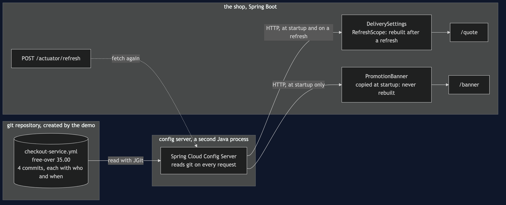
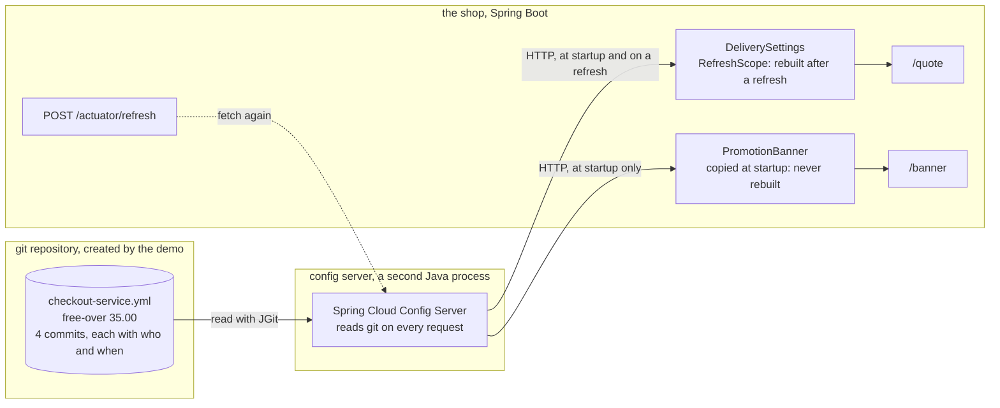

# Externalised Configuration with Spring Cloud Config Pattern — Architecture Diagram

Three places, and the value passes through all of them. A git repository in a temporary folder holds the file. The config server, a separate Java process, reads it on every request. The shop fetches from the server at startup and on a refresh, and inside the shop only the refresh-scoped settings are rebuilt.

Mermaid source

