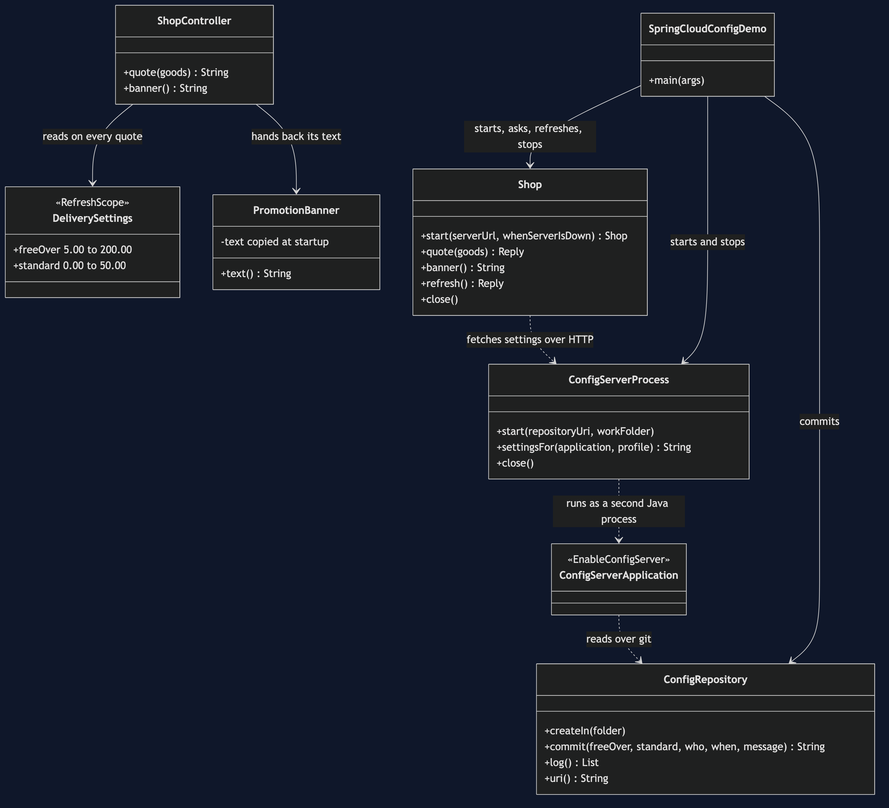

# Externalised Configuration with Spring Cloud Config Pattern — Class Diagram

The pattern sits in two classes in the shop. `DeliverySettings` holds the threshold and is marked `@RefreshScope`, so a refresh rebuilds it; `PromotionBanner` copies the same threshold once, at startup, and keeps it. The config server is one annotation. The rest starts, stops and talks to the two programs.

