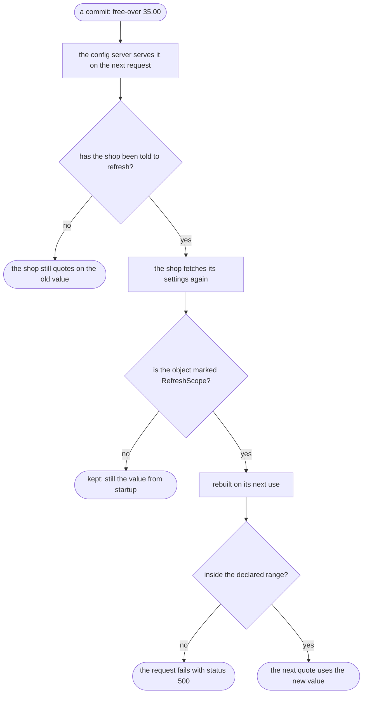

# Externalised Configuration with Spring Cloud Config Pattern — Data Flow Diagram

Where a value goes, from a commit to a quote, and the three places it can stop on the way.

Mermaid source

```mermaid
flowchart TD
    C(["a commit: free-over 35.00"])
    S["the config server serves it on the next request"]
    Asked{"has the shop been told to refresh?"}
    Old(["the shop still quotes on the old value"])
    Fetch["the shop fetches its settings again"]
    Scope{"is the object marked RefreshScope?"}
    Kept(["kept: still the value from startup"])
    Rebuild["rebuilt on its next use"]
    Range{"inside the declared range?"}
    Fail(["the request fails with status 500"])
    Quote(["the next quote uses the new value"])
    C --> S --> Asked
    Asked -- no --> Old
    Asked -- yes --> Fetch --> Scope
    Scope -- no --> Kept
    Scope -- yes --> Rebuild --> Range
    Range -- no --> Fail
    Range -- yes --> Quote
```

