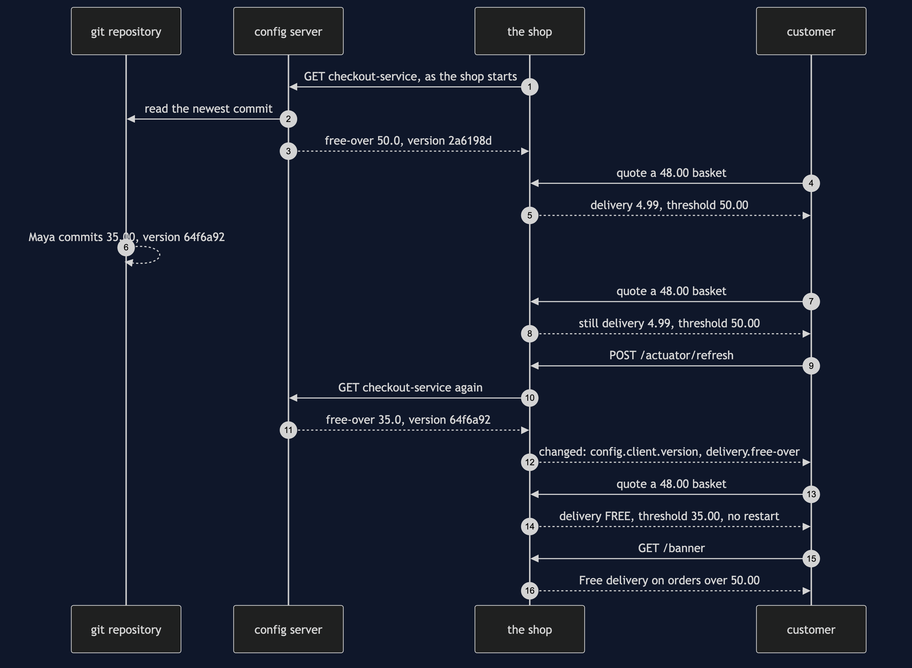
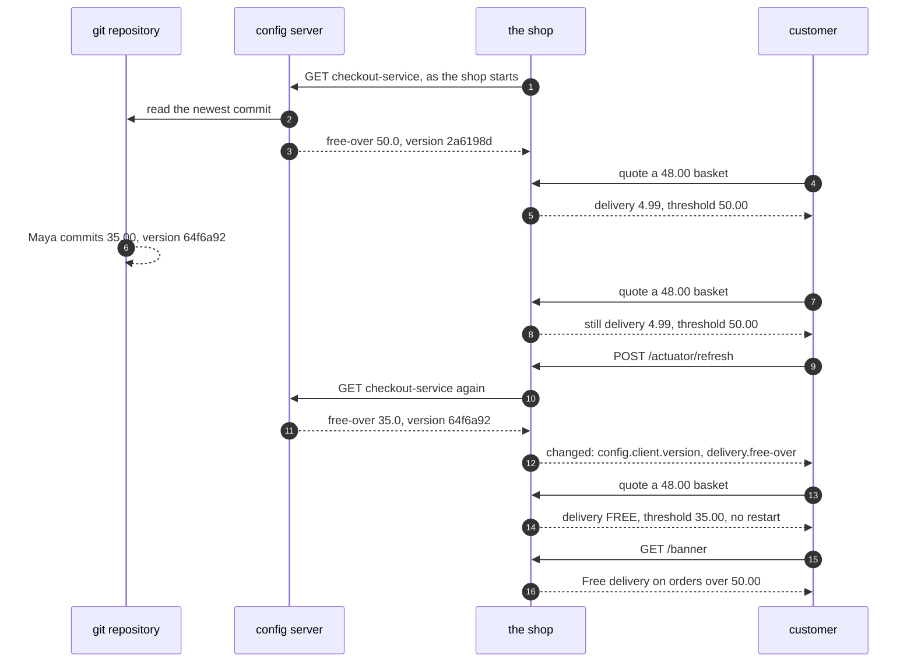

# Externalised Configuration with Spring Cloud Config Pattern — Sequence Diagram

Written for a listener with the screen off.

Say it in words. The shop starts, and before it takes a single order, it asks the config server for the settings of the application called checkout-service. The config server reads the git repository and answers: free delivery over fifty pounds. The shop quotes a forty-eight pound basket, and charges four ninety-nine for delivery. Then Maya in marketing commits thirty-five pounds to the repository. Asked again, the config server would answer thirty-five at once, but nobody asks it: the shop still quotes on fifty. Then somebody sends the shop a refresh request. The shop asks the config server again, gets thirty-five, and throws away its refresh-scoped settings object. The next quote rebuilds that object with thirty-five, and the forty-eight pound basket ships free. The shop never restarted. But the banner, which copied fifty pounds when the shop started, still says fifty.

Mermaid source

The load-bearing sentence: **a commit is served at once but is in force only after a refresh, and only in the objects the refresh rebuilds.**

For the stale banner, the refused value and the server that stops, see [`uml-diagram.md`](uml-diagram.md).
