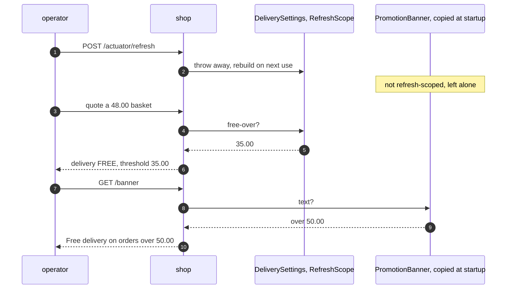
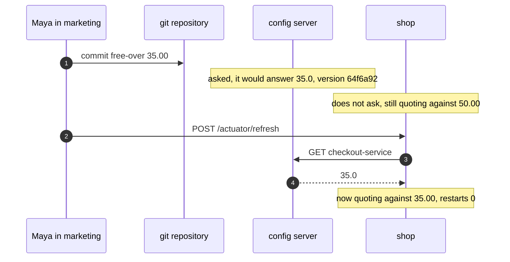
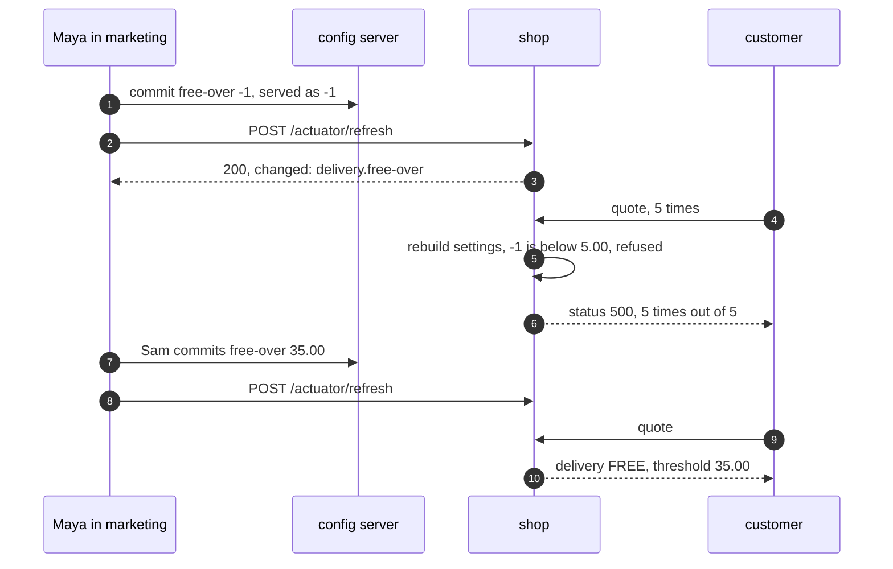
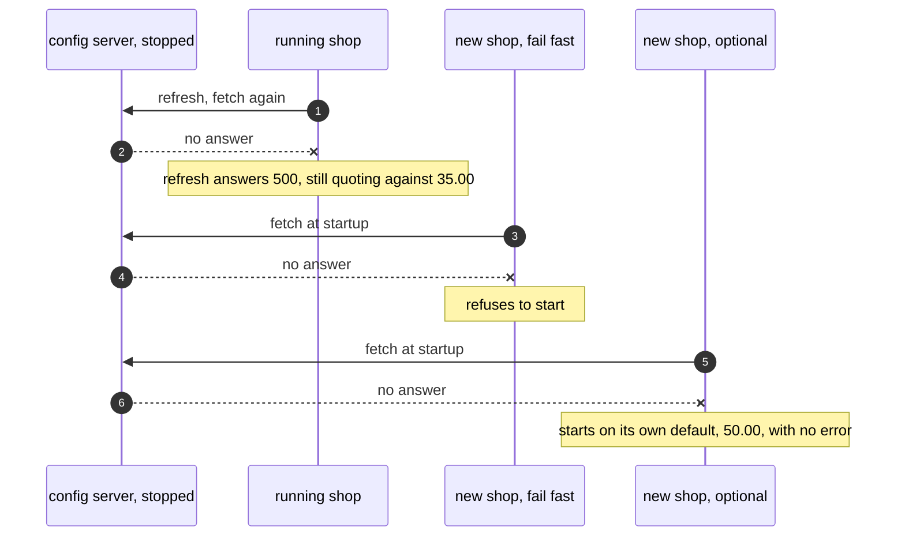

# Externalised Configuration with Spring Cloud Config Pattern — UML Sequence Diagrams

Four sequences. The stale banner comes first, because it is the headline find and the one thing a program that reads a map on every quote could never show.

## 1. One Refresh, Two Thresholds

The refresh rebuilds the refresh-scoped settings, and the checkout moves to £35.00. The banner copied £50.00 into a field when the shop started, and nothing rebuilds it.

Mermaid source

## 2. Committed, Not In Force

The server reads git on every request, so it serves the new commit at once. The shop fetched its settings when it started, and keeps them until it is told to fetch again.

Mermaid source

## 3. A Range Check With Nothing Behind It

The server serves -1, because it checks nothing. The refresh answers 200. The range check runs when the settings object is rebuilt, on the next quote, and fails; there is nothing to fall back to, so every quote fails until a good value is committed.

Mermaid source

## 4. The Server Stops

A running shop keeps what it fetched; only its refresh fails. A new copy must choose: fail fast and refuse to start, or treat the server as optional and start on the default packed inside it.

Mermaid source

