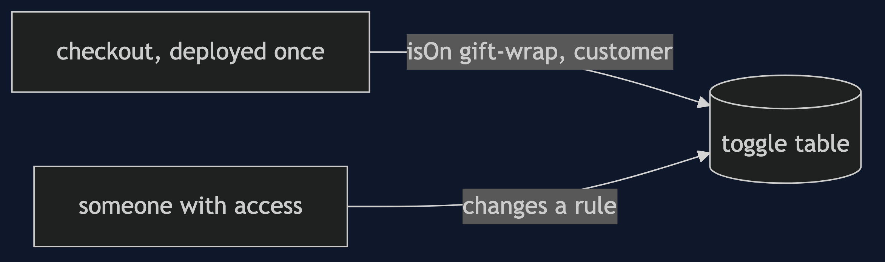
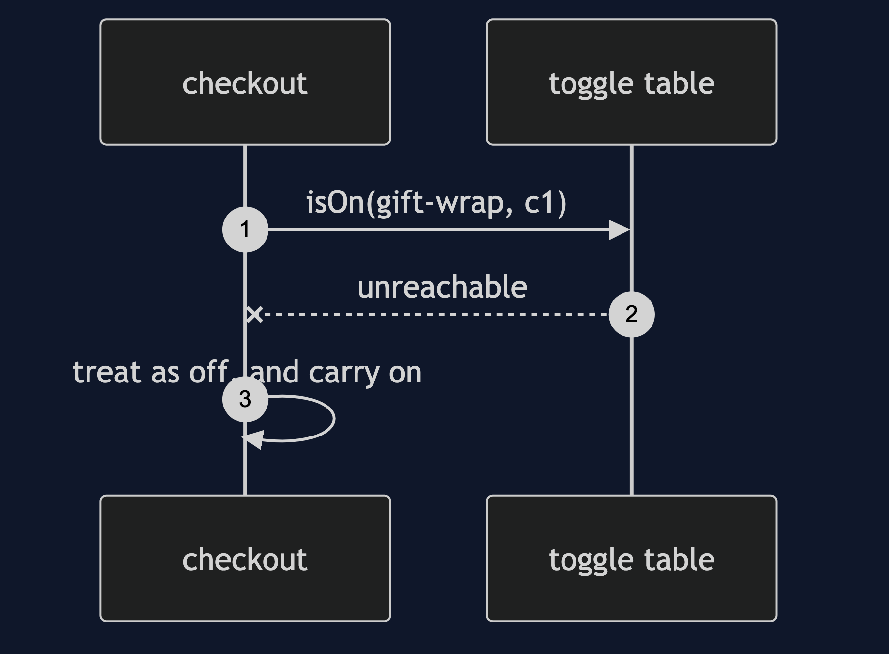

# Feature Toggle Pattern

```
src/main/java/com/jk/explore/featuretoggle/
├── FeatureToggleDemo.java           the six acts
├── Toggles.java                     the table of switches, read at run time
├── Rule.java                        off, on, a percentage, or named customers
├── Checkout.java                    ships with gift wrap already in it
```

**Feature toggle: ship the feature switched off, and decide at run time who gets it.**

This project is in [platform-design-patterns](..). It is [Externalised Configuration](../externalised-configuration-pattern) used for behaviour, and the partner of [Blue-Green and Canary](../blue-green-and-canary-pattern): a canary moves traffic between releases, and a toggle moves customers between behaviours.

## Run

```bash
./gradlew run
```

Six acts. Every number quoted below comes from this program's own output.

```
ONE. Deploying is releasing.
  gift wrap goes live by deploying it: 1 deploy. it has a bug, so taking it away is another: 2 deploys.
  each deploy ships every other change waiting in the branch too, so the wish to switch one thing carries everything else with it.
TWO. Deploy dark, switch later.
  gift wrap is in the deployed code, switched off. an order of 5000 costs: 5000.
  the switch is turned on in the table. no deploy. the same order costs: 5300.
THREE. Switch on for some.
  10 percent rollout. of 100 customers, got it: 10.
  only two named testers. of 100 customers, got it: 2.
FOUR. The kill switch.
  gift wrap has a bug. with 20 percent on, of 100 orders, failed: 20.
  one change in the table turned it off. of 100 orders, failed: 0. no deploy.
FIVE. When the table cannot be read.
  the table is up. an order of 5000: 5300.
  the table is down. an order of 5000: 5000. the order still works, and every feature falls back to off.
SIX. The bill.
  5 toggles make 32 possible combinations. the tests usually run one.
  on day 200, settled for over 90 days and still in the code: [express-shipping, gift-wrap, new-search]. every one is an if that nobody needs.
```

## Test

```bash
./gradlew test
```

2 test classes, 6 test methods, offline, with nothing installed and no framework.

## Technologies and versions

| What | Version | Why it is here |
| --- | --- | --- |
| Java | 21 | The repository standard, via the Gradle toolchain block |
| Gradle | 9.2.1 | The wrapper in this directory; no separate install needed |
| JUnit 5 | 5.10.2 | Test runner |

No framework. A hand-built project stays plain Java so the mechanism is the whole lesson.

## Learning Material

| Document | What it covers |
| --- | --- |
| [`docs/problem-statement.md`](docs/problem-statement.md) | The scenario, and the problem |
| [`docs/feature-toggle-pattern-explained.md`](docs/feature-toggle-pattern-explained.md) | The pattern, and six acts |
| [`docs/class-diagram.md`](docs/class-diagram.md) | The types |
| [`docs/architecture-diagram.md`](docs/architecture-diagram.md) | The parts and how they connect |
| [`docs/data-flow-diagram.md`](docs/data-flow-diagram.md) | What happens to one request |
| [`docs/sequence-diagram.md`](docs/sequence-diagram.md) | Written for a listener with the screen off |
| [`docs/uml-diagram.md`](docs/uml-diagram.md) | Four sequences |
| [`docs/animation.html`](docs/animation.html) | The six acts in a browser |
| [`docs/prerequisites.md`](docs/prerequisites.md) | What you need to know |
| [`docs/session.md`](docs/session.md) | A one-hour taught session |
| [`docs/spec.md`](docs/spec.md) | The generated specification |
| [`docs/youtube.md`](docs/youtube.md) | Title, description and chapters |

### The pattern in one picture


### Where each piece sits



### How one request moves


### Who calls whom, in order


### All four sequences




### Video

Built from [`video/scenes.py`](video/scenes.py) by
[`video/build_video.sh`](video/build_video.sh). The rendered file is not
committed; see the repository README for why.

## Where you have already met this

Every large web company's releases, and the way trunk-based development keeps unfinished work out of sight.

## When this is too much

For a change that is small and safe, a plain release is simpler. A toggle is a branch in your code that must later be removed.

## Where this sits

This project is in [`platform-design-patterns`](..), and is meant to be read with its neighbours there.
