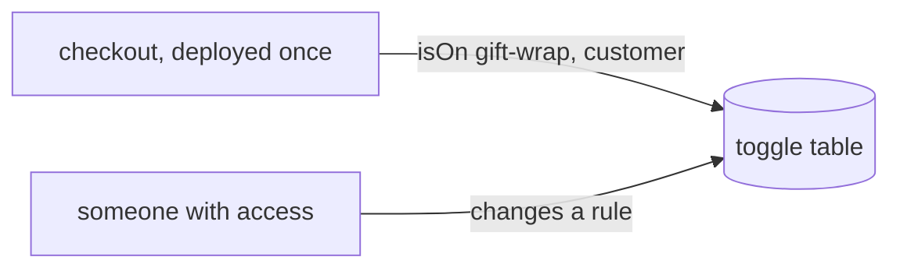

# Feature Toggle Pattern — Architecture Diagram

The checkout asks the table at run time. The table can be changed without a deploy.

Mermaid source

```mermaid
flowchart LR
    C["checkout, deployed once"] -->|isOn gift-wrap, customer| T[("toggle table")]
    A["someone with access"] -->|changes a rule| T
```

