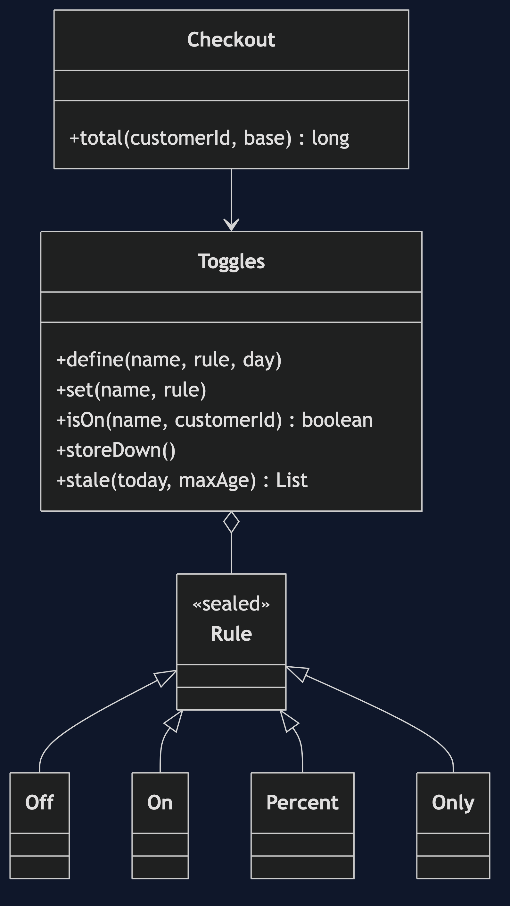
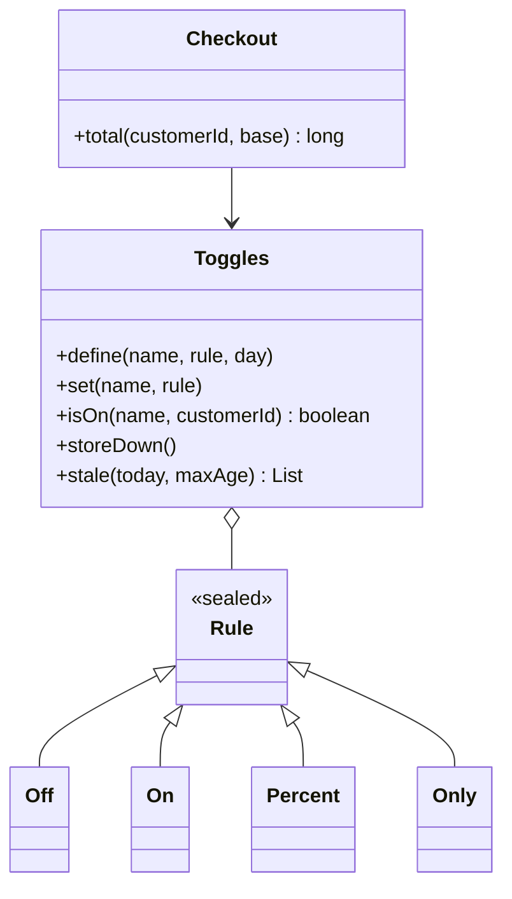

# Feature Toggle Pattern — Class Diagram

A table of switches with rules, and a checkout that reads it.

Mermaid source

```mermaid
classDiagram
    class Toggles {
        +define(name, rule, day)
        +set(name, rule)
        +isOn(name, customerId) boolean
        +storeDown()
        +stale(today, maxAge) List
    }
    class Rule {
        <<sealed>>
    }
    class Checkout {
        +total(customerId, base) long
    }
    Rule <|-- Off
    Rule <|-- On
    Rule <|-- Percent
    Rule <|-- Only
    Toggles o-- Rule
    Checkout --> Toggles
```

