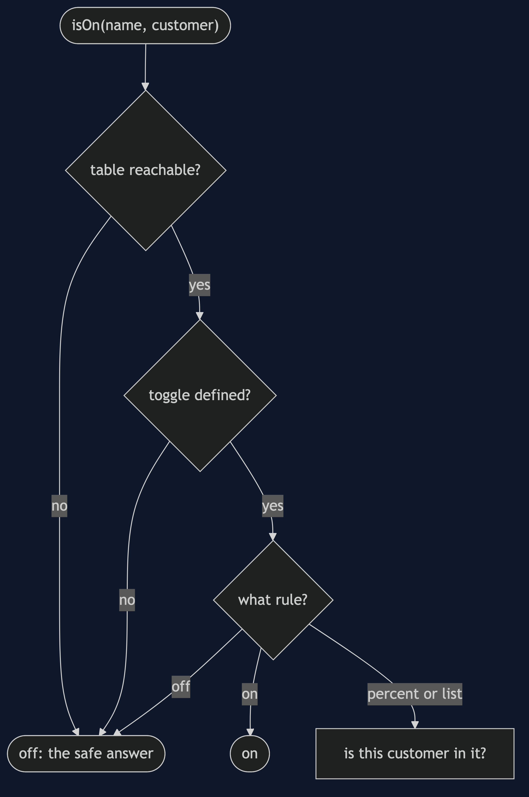
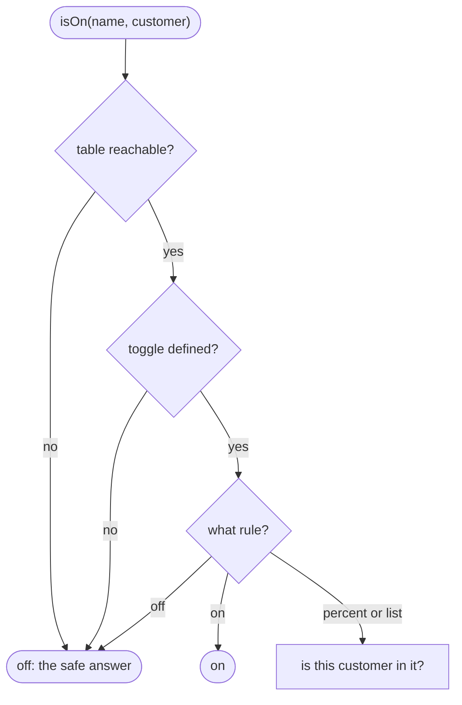

# Feature Toggle Pattern — Data Flow Diagram

How the table answers a question.

Mermaid source

```mermaid
flowchart TD
    Q(["isOn(name, customer)"])
    Up{"table reachable?"}
    Known{"toggle defined?"}
    Rule{"what rule?"}
    Off(["off: the safe answer"])
    On(["on"])
    Q --> Up
    Up -- no --> Off
    Up -- yes --> Known
    Known -- no --> Off
    Known -- yes --> Rule
    Rule -- on --> On
    Rule -- off --> Off
    Rule -- percent or list --> Check["is this customer in it?"]
```

