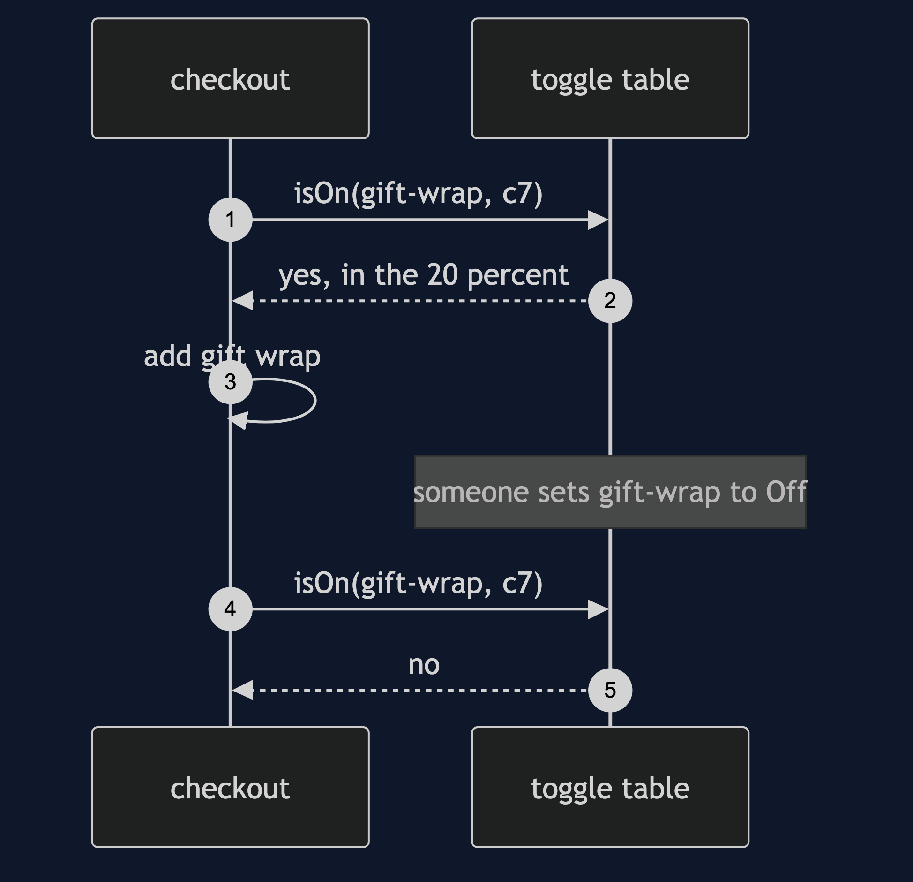
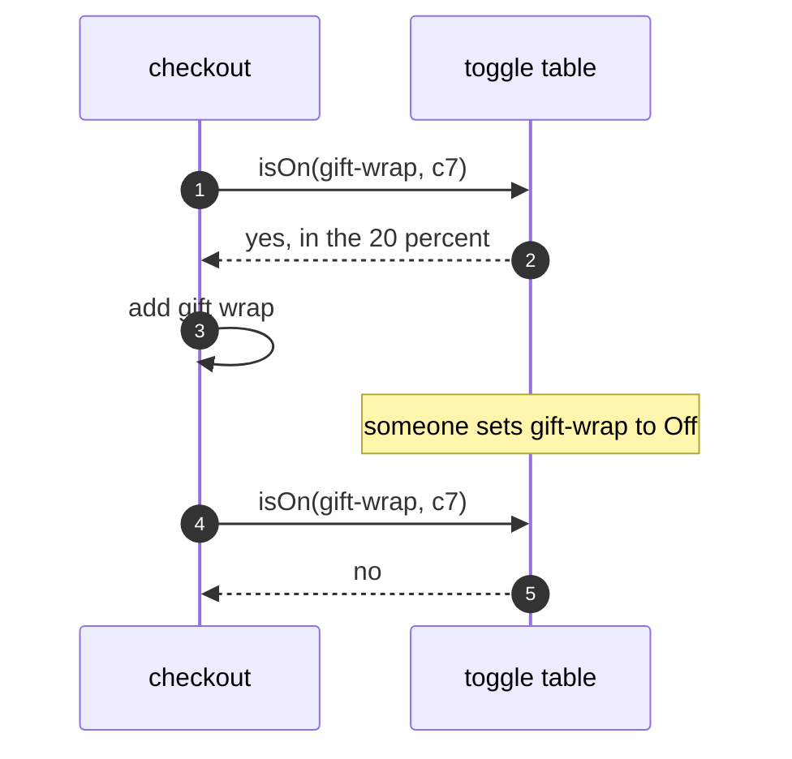

# Feature Toggle Pattern — Sequence Diagram

Written for a listener with the screen off.

Say it in words. A customer places an order. The checkout asks the toggle table whether gift wrap is on for this customer. The table checks the rule, which is twenty percent, finds the customer inside it, and says yes. The checkout adds the gift wrap fee. If someone changes the rule to off, the next order is answered no, with no new release.

Mermaid source

The load-bearing sentence: **the answer changes with the table, and the checkout does not.**
