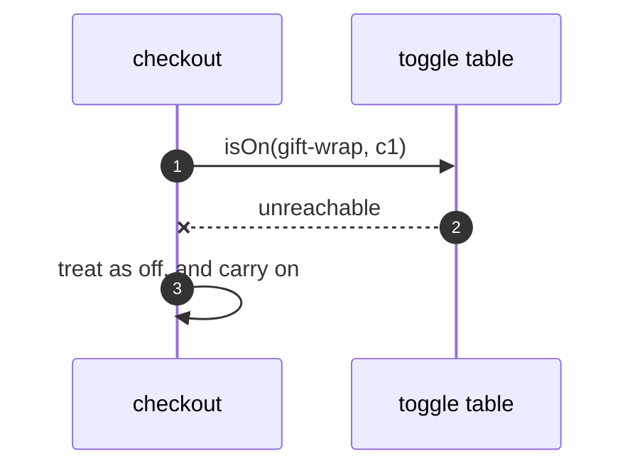

# Feature Toggle Pattern — UML Sequence Diagrams

Four sequences.

## 1. Table Down

Mermaid source

```mermaid
sequenceDiagram
    autonumber
    participant K as checkout
    participant T as toggle table
    K->>T: isOn(gift-wrap, c1)
    T--xK: unreachable
    K->>K: treat as off, and carry on
```

