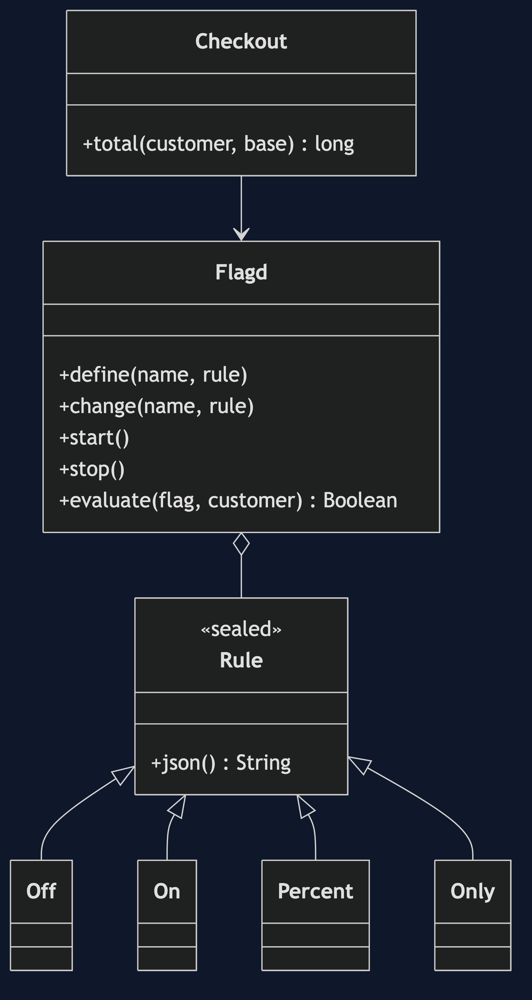
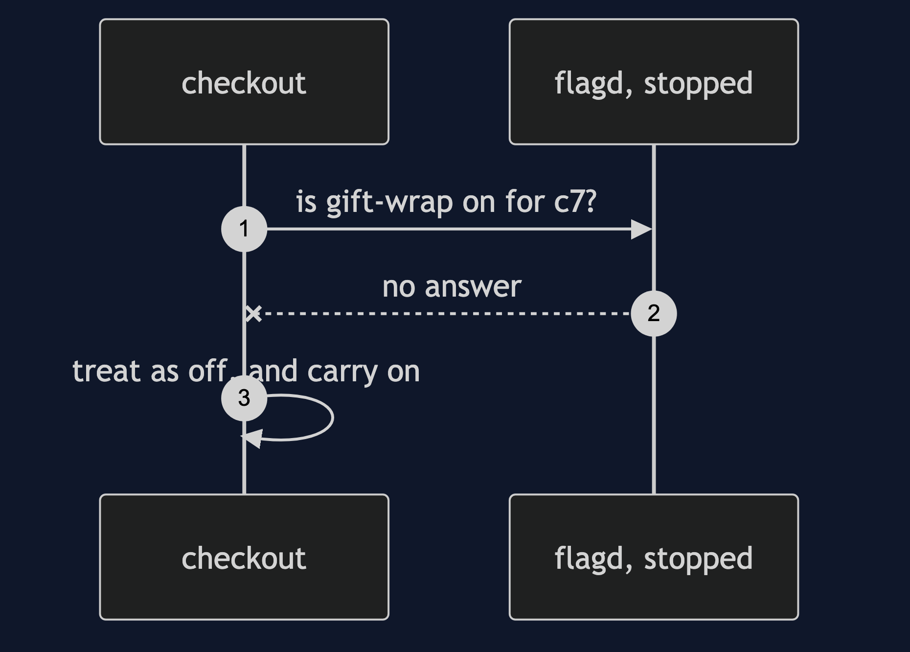

# Feature Toggle with flagd Pattern

```
src/main/java/com/jk/explore/flagd/
├── FlagdDemo.java               the six acts
├── Flagd.java                   writes the flags file, runs the container, asks it
├── Rule.java                    off, on, a fractional rollout, or named customers
├── Checkout.java                ships with gift wrap in it; flagd says who gets it
├── Shell.java                   runs docker
```

**With flagd, a flag is a line in a watched file, and the application asks a daemon.**

This project is the framework version of [Feature Toggle](../feature-toggle-pattern). That project built the mechanism by hand. This one shows the same idea inside flagd and OpenFeature. It does not re-teach the pattern. It shows what flagd and OpenFeature adds, the failures that are its own, and what it costs.

## Run

```bash
./gradlew run
```

Six acts. The partner project, Feature Toggle, built the mechanism by hand. Here the same idea runs through flagd and OpenFeature, and every count comes from real output.

```
ONE. Deploying is releasing.
  gift wrap goes live by deploying it: 1 deploy. it has a bug, so taking it away is another: 2 deploys.
  each deploy ships every other change waiting in the branch too.
TWO. Deploy dark, switch later.
  gift wrap is in the deployed code, and flagd has it off. an order of 5000 costs: 5000.
  the flags file was edited, and flagd noticed by itself. no deploy, no restart. the same order costs: 5300.
THREE. Switch on for some.
  a 10 percent rollout, decided by flagd's own hash of the customer. of 100 customers, got it: about a tenth.
  only two named testers. of 100 customers, got it: 2.
FOUR. The kill switch.
  gift wrap has a bug. with 20 percent on, some of 100 orders failed: yes, about a fifth.
  one edit to the file turned it off. of 100 orders, failed: 0. no deploy.
FIVE. When flagd cannot be reached.
  flagd is up. an order of 5000: 5300.
  flagd is stopped. an order of 5000: 5000. the order still works, and every feature falls back to off.
SIX. The bill.
  this file has one real flag. a shop with 5 flags like it would have 32 possible combinations. the tests usually run one.
  flagd is another process to run and keep up, and every flag check is a network call: this demo made hundreds.
  and a flag that is settled and still in the file is an if that nobody needs. flagd does not remove it for you.
```

## Test

```bash
./gradlew test
```

2 test classes, 4 test methods, offline, with each Spring context started inside the test, and no server.

## Technologies and versions

| What | Version | Why it is here |
| --- | --- | --- |
| Java | 21 | The repository standard, via the Gradle toolchain block |
| Gradle | 9.2.1 | The wrapper in this directory |
| Docker | 24+ | Runs flagd |
| flagd | latest (2026-09-10) | The flag daemon |
| JUnit 5 | 5.10.2 | Test runner; the flagd test is skipped when Docker is missing |

See [`docs/dependencies.md`](docs/dependencies.md).

## Learning Material

| Document | What it covers |
| --- | --- |
| [`docs/problem-statement.md`](docs/problem-statement.md) | The partner's table, and what is new |
| [`docs/feature-toggle-with-flagd-pattern-explained.md`](docs/feature-toggle-with-flagd-pattern-explained.md) | A real daemon, and a real file |
| [`docs/class-diagram.md`](docs/class-diagram.md) | The types |
| [`docs/architecture-diagram.md`](docs/architecture-diagram.md) | The checkout, flagd and the flags file |
| [`docs/data-flow-diagram.md`](docs/data-flow-diagram.md) | How a flag change reaches the checkout |
| [`docs/sequence-diagram.md`](docs/sequence-diagram.md) | Written for a listener with the screen off |
| [`docs/uml-diagram.md`](docs/uml-diagram.md) | Four sequences |
| [`docs/animation.html`](docs/animation.html) | The six acts in a browser |
| [`docs/prerequisites.md`](docs/prerequisites.md) | What you need to know |
| [`docs/session.md`](docs/session.md) | A one-hour taught session |
| [`docs/spec.md`](docs/spec.md) | The generated specification |
| [`docs/youtube.md`](docs/youtube.md) | Title, description and chapters |
| [`docs/dependencies.md`](docs/dependencies.md) | What flagd and OpenFeature is, what it costs, and that skipping this project loses none of the pattern |

### The pattern in one picture



### Where each piece sits


### How one request moves


### Who calls whom, in order


### All four sequences



### Video

Built from [`video/scenes.py`](video/scenes.py) by
[`video/build_video.sh`](video/build_video.sh). The rendered file is not
committed; see the repository README for why.

## Where you have already met this

Companies that use OpenFeature with LaunchDarkly, Flagsmith, Unleash or their own service.

## When this is too much

For a handful of switches that change with each release, a setting in the deployment is enough. A daemon adds a process and a network call to every check.

## Where this sits

This project pairs with [Feature Toggle](../feature-toggle-pattern), and is a framework version in [`platform-design-patterns`](..).
