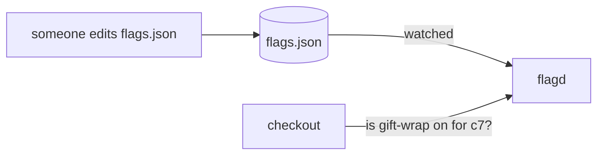

# Feature Toggle with flagd Pattern — Architecture Diagram

The daemon watches the file. The checkout asks the daemon.

Mermaid source

```mermaid
flowchart LR
    E["someone edits flags.json"] --> F[("flags.json")]
    F -->|watched| D["flagd"]
    C["checkout"] -->|is gift-wrap on for c7?| D
```

