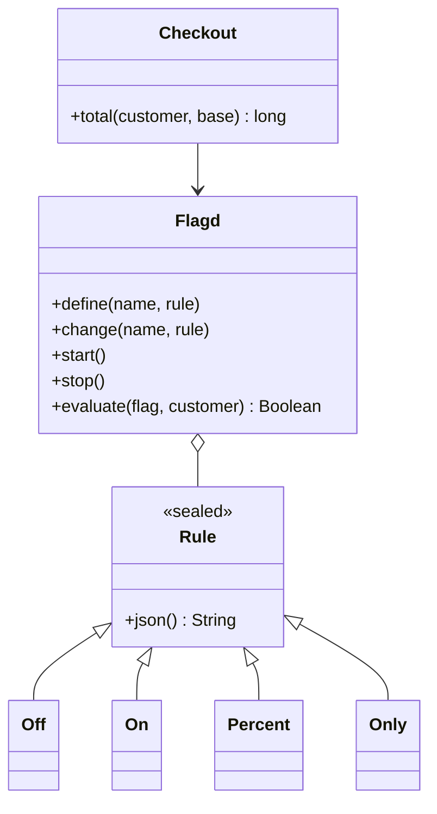

# Feature Toggle with flagd Pattern — Class Diagram

A daemon in a container, a file it watches, and a checkout that asks.

Mermaid source

```mermaid
classDiagram
    class Flagd {
        +define(name, rule)
        +change(name, rule)
        +start()
        +stop()
        +evaluate(flag, customer) Boolean
    }
    class Rule {
        <<sealed>>
        +json() String
    }
    class Checkout {
        +total(customer, base) long
    }
    Rule <|-- Off
    Rule <|-- On
    Rule <|-- Percent
    Rule <|-- Only
    Flagd o-- Rule
    Checkout --> Flagd
```

