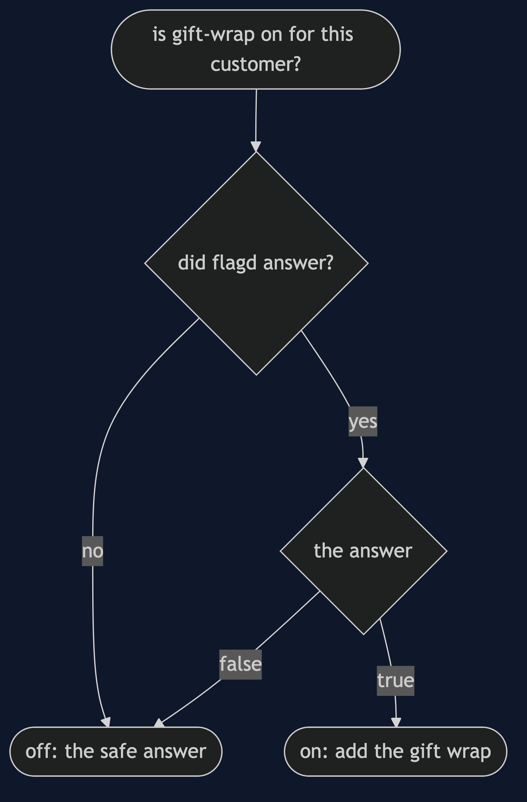
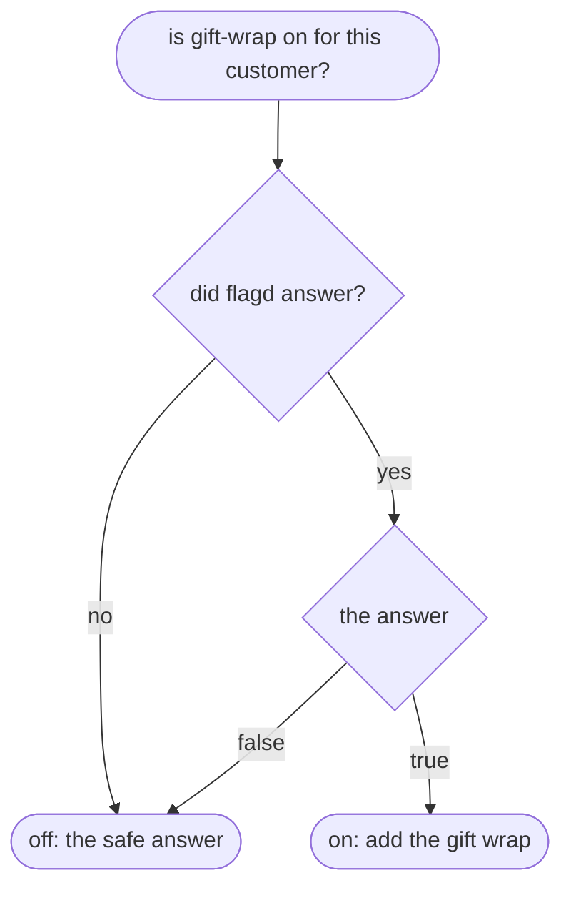

# Feature Toggle with flagd Pattern — Data Flow Diagram

What the checkout does with a flag.

Mermaid source

```mermaid
flowchart TD
    Ask(["is gift-wrap on for this customer?"])
    Up{"did flagd answer?"}
    Off(["off: the safe answer"])
    Val{"the answer"}
    On(["on: add the gift wrap"])
    Ask --> Up
    Up -- no --> Off
    Up -- yes --> Val
    Val -- true --> On
    Val -- false --> Off
```

