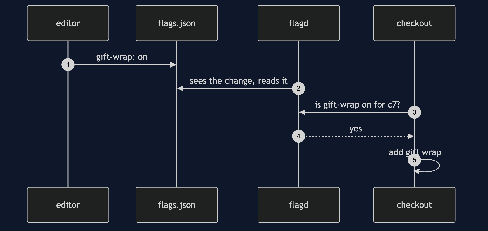
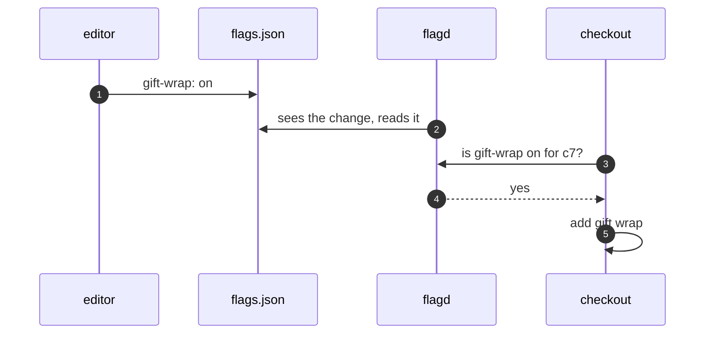

# Feature Toggle with flagd Pattern — Sequence Diagram

Written for a listener with the screen off.

Say it in words. Someone edits the flags file and turns gift wrap on. Flagd sees the file change, and reads it again, with no restart. The next order asks flagd whether gift wrap is on for this customer. Flagd checks its rule, which is on for everyone, and says yes. The checkout adds the fee.

Mermaid source

The load-bearing sentence: **the file is the switch, and flagd reads it live.**
