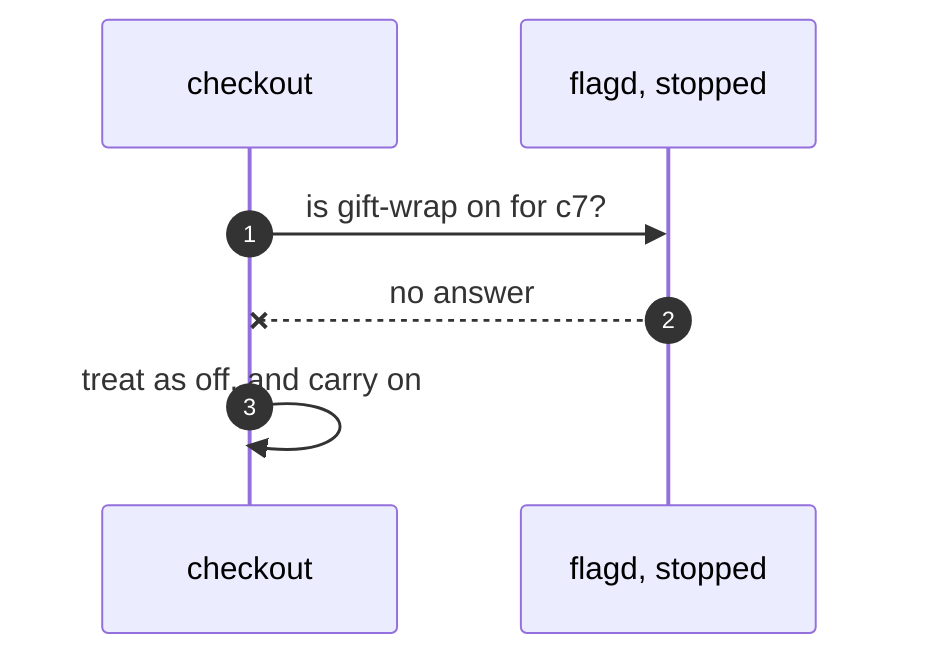

# Feature Toggle with flagd Pattern — UML Sequence Diagrams

Four sequences.

## 1. Flagd Stopped

Mermaid source

```mermaid
sequenceDiagram
    autonumber
    participant C as checkout
    participant D as flagd, stopped
    C->>D: is gift-wrap on for c7?
    D--xC: no answer
    C->>C: treat as off, and carry on
```

