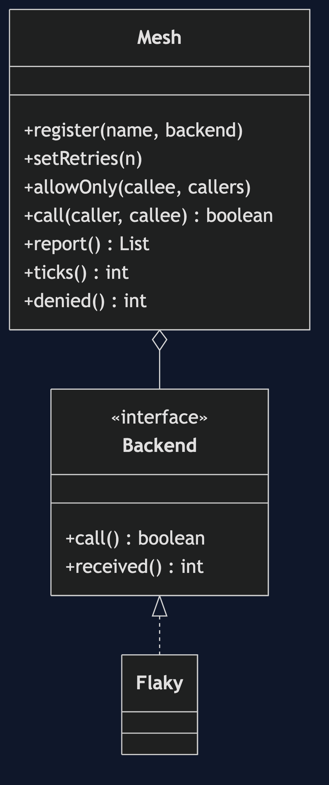
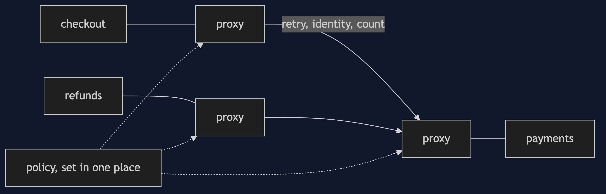
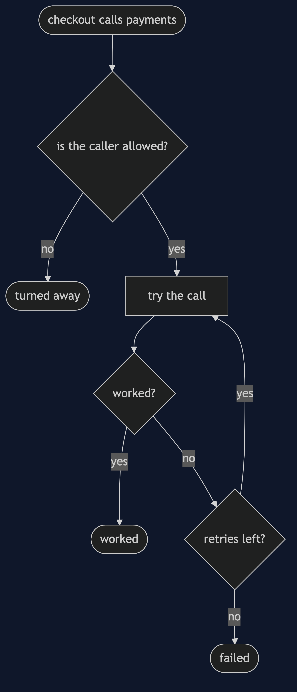
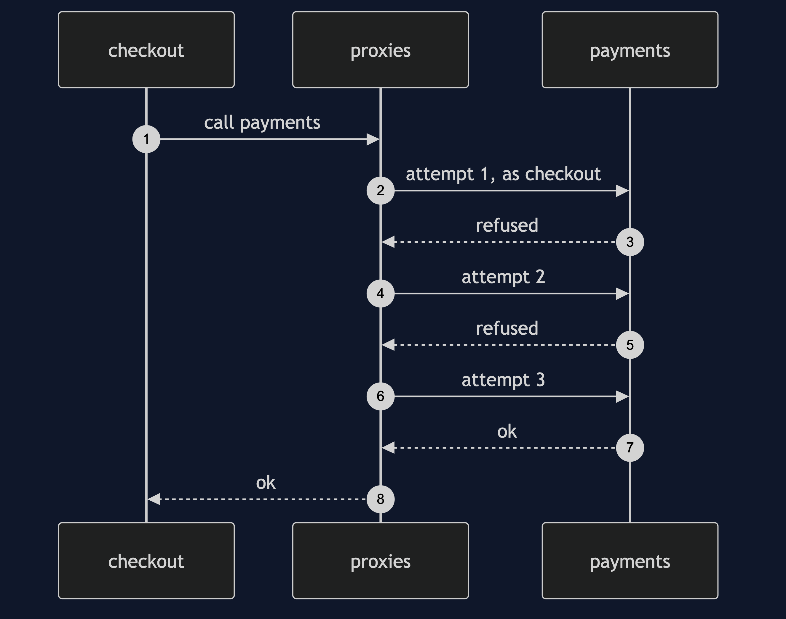
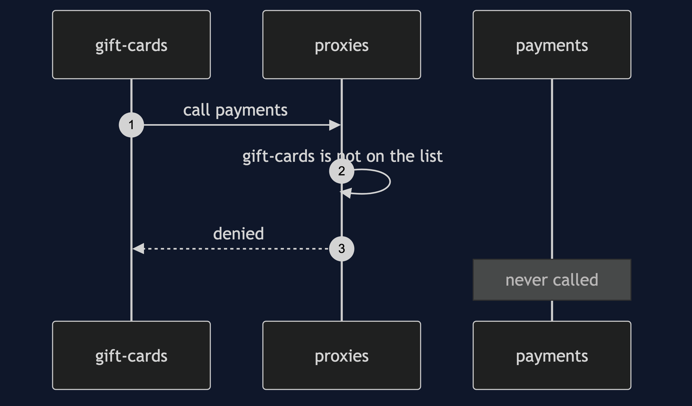

# Service Mesh Pattern

```
src/main/java/com/jk/explore/servicemesh/
├── ServiceMeshDemo.java             the six acts
├── Mesh.java                        one policy, applied at every call: retry, identity, counts
├── Backend.java                     a service that can be called
├── Flaky.java                       the payment service on a bad day
│
└── LibraryClient.java               retry code carried inside a service
```

**Service mesh: a proxy beside every service, doing retries, identity and counting to one policy.**

This project is in [platform-design-patterns](..). It is [Sidecar](../sidecar-pattern) used for every service at once, and it takes over the work of [Retry](../../micro-services-design-patterns/retry-with-resilience4j-pattern), [Timeout](../../micro-services-design-patterns/timeout-pattern) and [Distributed Tracing](../distributed-tracing-pattern) from the services.

## Run

```bash
./gradlew run
```

Six acts. Every number quoted below comes from this program's own output.

```
ONE. Each service carries its own.
  the payment service refuses its first 2 calls. checkout retries 3 times: true. refunds never retries: false. reports retries once: false.
  three services, three copies of the retry code, three different behaviours.
TWO. A proxy beside each service.
  the same bad day, the same policy for everyone: the call worked, attempts made by the proxy: [checkout->payments calls 1, failed 0, attempts 3].
  the checkout service has no retry code at all.
THREE. Change the policy once.
  retries 3: true. one setting changed to 0: false.
  every service's calls changed. services redeployed: 0.
FOUR. Who is calling.
  checkout calls payments: true. an unknown service calls payments: false.
  the payment service received 1 call. the proxy turned the other one away before it got there. denied: 1.
FIVE. Numbers for free.
  checkout->payments calls 2, failed 0, attempts 4.
  refunds->payments calls 1, failed 0, attempts 1.
  no service counted anything. the proxies did.
SIX. The bill.
  one call, with 2 refusals: the payment service received 3 calls. retrying multiplies the load on a service that is already struggling.
  one attempt takes 3 ticks through the proxies, and 1 directly. this call took 9 ticks.
  and 3 services means 3 more processes to run, upgrade and understand.
```

## Test

```bash
./gradlew test
```

2 test classes, 6 test methods, offline, with nothing installed and no framework.

## Technologies and versions

| What | Version | Why it is here |
| --- | --- | --- |
| Java | 21 | The repository standard, via the Gradle toolchain block |
| Gradle | 9.2.1 | The wrapper in this directory; no separate install needed |
| JUnit 5 | 5.10.2 | Test runner |

No framework. A hand-built project stays plain Java so the mechanism is the whole lesson.

## Learning Material

| Document | What it covers |
| --- | --- |
| [`docs/problem-statement.md`](docs/problem-statement.md) | The scenario, and the problem |
| [`docs/service-mesh-pattern-explained.md`](docs/service-mesh-pattern-explained.md) | The pattern, and six acts |
| [`docs/class-diagram.md`](docs/class-diagram.md) | The types |
| [`docs/architecture-diagram.md`](docs/architecture-diagram.md) | The parts and how they connect |
| [`docs/data-flow-diagram.md`](docs/data-flow-diagram.md) | What happens to one request |
| [`docs/sequence-diagram.md`](docs/sequence-diagram.md) | Written for a listener with the screen off |
| [`docs/uml-diagram.md`](docs/uml-diagram.md) | Four sequences |
| [`docs/animation.html`](docs/animation.html) | The six acts in a browser |
| [`docs/prerequisites.md`](docs/prerequisites.md) | What you need to know |
| [`docs/session.md`](docs/session.md) | A one-hour taught session |
| [`docs/spec.md`](docs/spec.md) | The generated specification |
| [`docs/youtube.md`](docs/youtube.md) | Title, description and chapters |

### The pattern in one picture



### Where each piece sits



### How one request moves



### Who calls whom, in order



### All four sequences




### Video

Built from [`video/scenes.py`](video/scenes.py) by
[`video/build_video.sh`](video/build_video.sh). The rendered file is not
committed; see the repository README for why.

## Where you have already met this

Kubernetes platforms at large companies, and Lyft, where Envoy began.

## When this is too much

For a few services, a shared library, or none, is simpler. A mesh is a system in itself, and needs people who understand it.

## Where this sits

This project is in [`platform-design-patterns`](..), and is meant to be read with its neighbours there.
