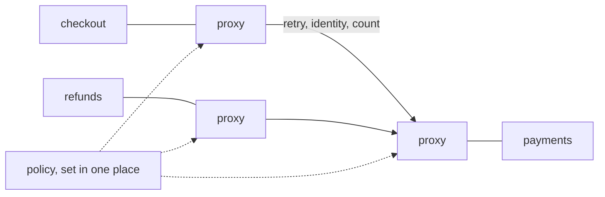

# Service Mesh Pattern — Architecture Diagram

Every service has a proxy. The proxies apply the policy.

Mermaid source

```mermaid
flowchart LR
    C["checkout"] --- PC["proxy"]
    R["refunds"] --- PR["proxy"]
    PC -->|retry, identity, count| PP["proxy"]
    PR --> PP
    PP --- P["payments"]
    POL["policy, set in one place"] -.-> PC
    POL -.-> PR
    POL -.-> PP
```

