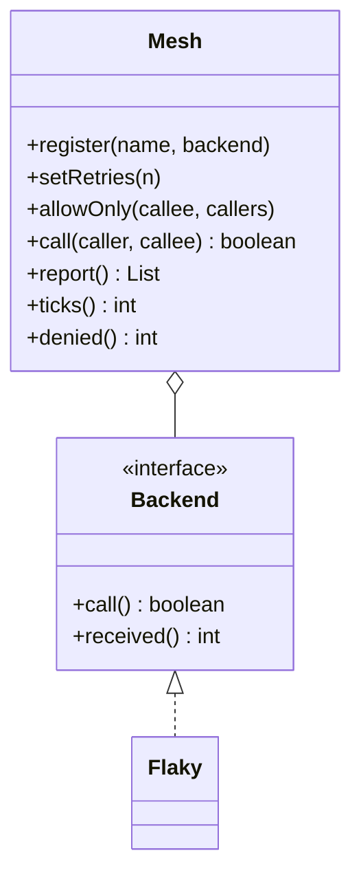

# Service Mesh Pattern — Class Diagram

A mesh that applies one policy to every call.

Mermaid source

```mermaid
classDiagram
    class Mesh {
        +register(name, backend)
        +setRetries(n)
        +allowOnly(callee, callers)
        +call(caller, callee) boolean
        +report() List
        +ticks() int
        +denied() int
    }
    class Backend {
        <<interface>>
        +call() boolean
        +received() int
    }
    Backend <|.. Flaky
    Mesh o-- Backend
```

