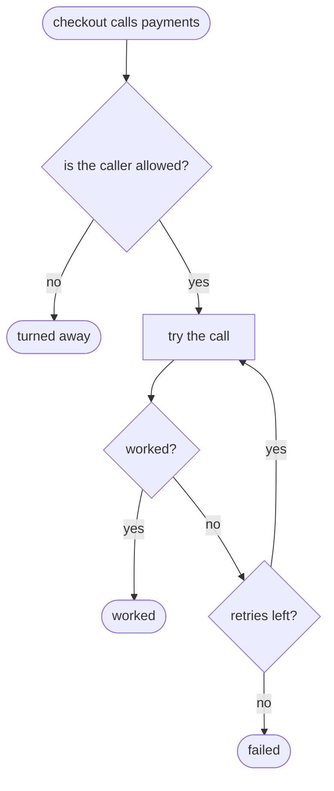

# Service Mesh Pattern — Data Flow Diagram

What the proxies do with one call.

Mermaid source

```mermaid
flowchart TD
    Call(["checkout calls payments"])
    Who{"is the caller allowed?"}
    Deny(["turned away"])
    Try["try the call"]
    Ok{"worked?"}
    More{"retries left?"}
    Done(["worked"])
    Fail(["failed"])
    Call --> Who
    Who -- no --> Deny
    Who -- yes --> Try --> Ok
    Ok -- yes --> Done
    Ok -- no --> More
    More -- yes --> Try
    More -- no --> Fail
```

