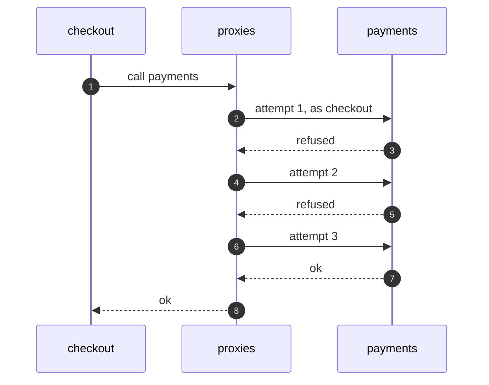

# Service Mesh Pattern — Sequence Diagram

Written for a listener with the screen off.

Say it in words. The checkout service calls payments, and does nothing else. Its proxy adds its identity, and sends the call. The payments proxy checks the identity, and lets it in. Payments refuses. The proxy tries again. Payments refuses again. The proxy tries a third time, and payments answers. The checkout service gets one answer, and never saw the failures.

Mermaid source

The load-bearing sentence: **the service sees one answer. The proxies absorbed the failures.**
