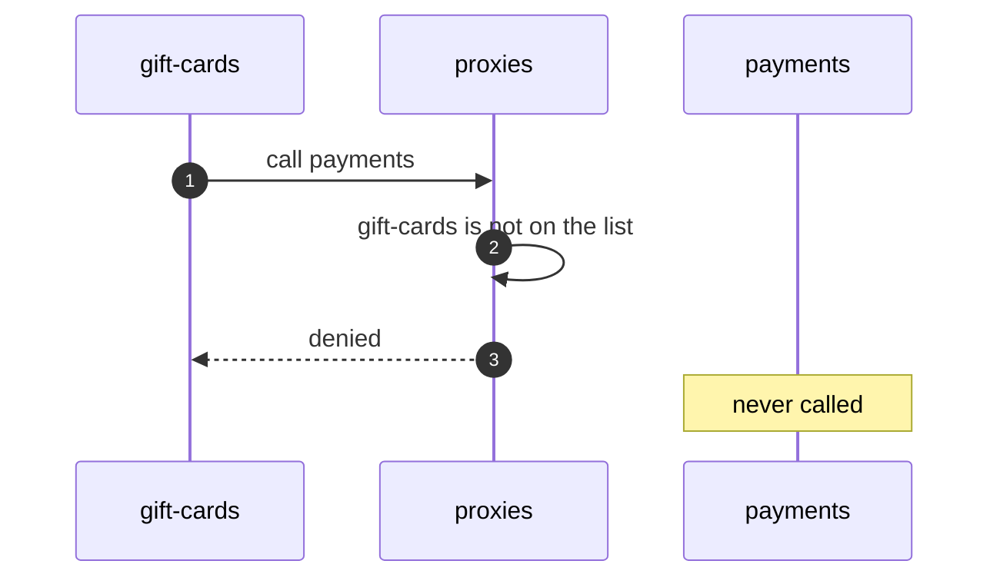

# Service Mesh Pattern — UML Sequence Diagrams

Four sequences.

## 1. An Unknown Caller

Mermaid source

```mermaid
sequenceDiagram
    autonumber
    participant G as gift-cards
    participant X as proxies
    participant P as payments
    G->>X: call payments
    X->>X: gift-cards is not on the list
    X-->>G: denied
    Note over P: never called
```

