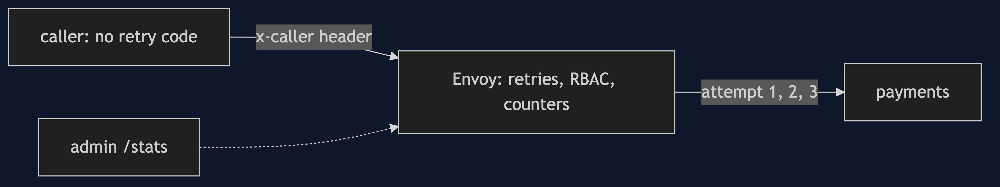
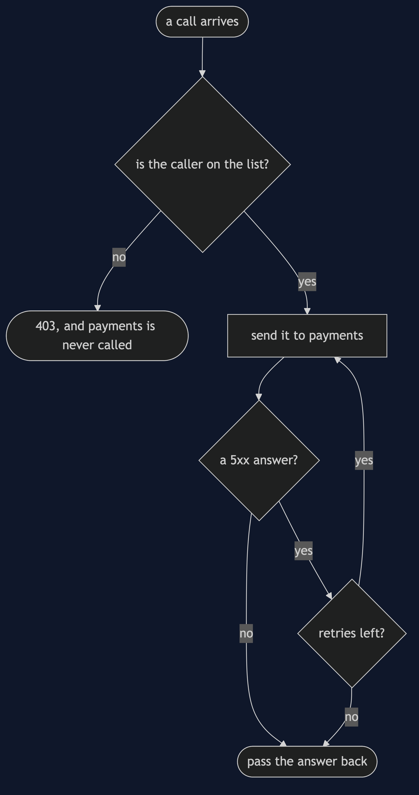
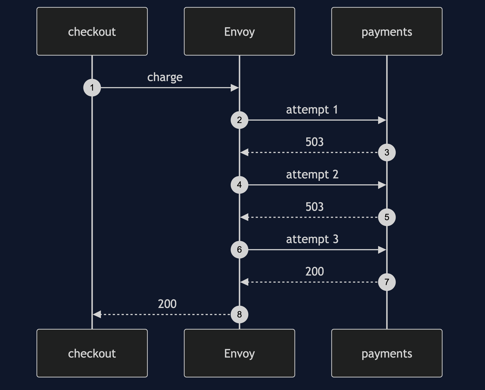
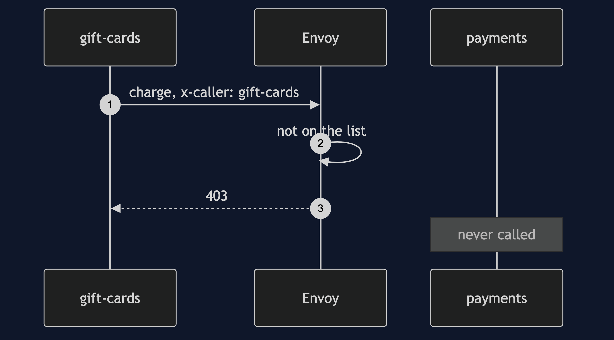

# Service Mesh with Envoy Pattern

```
src/main/java/com/jk/explore/meshenvoy/
├── MeshEnvoyDemo.java           the six acts
├── Envoy.java                   writes the configuration, runs the container, reads its counters
├── Payments.java                the payment service: a real HTTP server that refuses its first calls
├── Caller.java                  a service that calls payments, with or without retry code
├── Shell.java                   runs docker
```

**With Envoy, the proxy retries, refuses and counts for a service that has none of that code.**

This project is the framework version of [Service Mesh](../service-mesh-pattern). That project built the mechanism by hand. This one shows the same idea inside Envoy. It does not re-teach the pattern. It shows what Envoy adds, the failures that are its own, and what it costs.

## Run

```bash
./gradlew run
```

Six acts. The partner project, Service Mesh, built the mechanism by hand. Here the same idea runs through Envoy, and every count comes from real output.

```
ONE. Each service carries its own.
  the payment service refuses its first 2 calls, for each caller in turn. with retry code of 3, 0 and 1 tries: checkout worked, refunds failed, reports failed.
  three services, three copies of the retry code, three different behaviours.
TWO. A proxy beside the service.
  Envoy is told to retry 5xx answers up to 3 times. the checkout has no retry code. the call worked. the payment service received 3 calls, and Envoy counts 2 retries.
THREE. Change the policy once.
  one setting in Envoy's configuration changed, from 3 retries to 0. the same call failed. services changed or redeployed: 0.
FOUR. Who is calling.
  only checkout and refunds are allowed. checkout: status 200. gift-cards: status 403.
  the payment service received 1 call. the proxy turned the other one away before it got there.
  here the caller's name is a header. a real mesh checks a certificate instead, which a service cannot forge.
FIVE. Numbers for free.
  read from Envoy, and not from any service: requests to payments 3, retries 2, retries that ended in success 1.
  no service counted anything. the proxy did.
SIX. The bill.
  one call, with 2 refusals: the payment service received 3 calls. retrying multiplies the load on a service that is already struggling.
  every call now crosses a proxy, which is a second process and a second network hop. this demo needed 1 more container for 1 service.
  and the policy is in a configuration file of about 45 lines, that someone must read, and keep right.
```

## Test

```bash
./gradlew test
```

1 test classes, 4 test methods, offline, with each Spring context started inside the test, and no server.

## Technologies and versions

| What | Version | Why it is here |
| --- | --- | --- |
| Java | 21 | The repository standard, via the Gradle toolchain block |
| Gradle | 9.2.1 | The wrapper in this directory |
| Docker | 24+ | Runs Envoy |
| Envoy | v1.37 | The proxy |
| JUnit 5 | 5.10.2 | Test runner; the Envoy test is skipped when Docker is missing |

See [`docs/dependencies.md`](docs/dependencies.md).

## Learning Material

| Document | What it covers |
| --- | --- |
| [`docs/problem-statement.md`](docs/problem-statement.md) | The partner's proxies, and what is new |
| [`docs/service-mesh-with-envoy-pattern-explained.md`](docs/service-mesh-with-envoy-pattern-explained.md) | A real proxy, and its real counters |
| [`docs/class-diagram.md`](docs/class-diagram.md) | The types |
| [`docs/architecture-diagram.md`](docs/architecture-diagram.md) | Callers, Envoy and payments |
| [`docs/data-flow-diagram.md`](docs/data-flow-diagram.md) | What Envoy does with one call |
| [`docs/sequence-diagram.md`](docs/sequence-diagram.md) | Written for a listener with the screen off |
| [`docs/uml-diagram.md`](docs/uml-diagram.md) | Four sequences |
| [`docs/animation.html`](docs/animation.html) | The six acts in a browser |
| [`docs/prerequisites.md`](docs/prerequisites.md) | What you need to know |
| [`docs/session.md`](docs/session.md) | A one-hour taught session |
| [`docs/spec.md`](docs/spec.md) | The generated specification |
| [`docs/youtube.md`](docs/youtube.md) | Title, description and chapters |
| [`docs/dependencies.md`](docs/dependencies.md) | What Envoy is, what it costs, and that skipping this project loses none of the pattern |

### The pattern in one picture


### Where each piece sits



### How one request moves



### Who calls whom, in order



### All four sequences




### Video

Built from [`video/scenes.py`](video/scenes.py) by
[`video/build_video.sh`](video/build_video.sh). The rendered file is not
committed; see the repository README for why.

## Where you have already met this

Istio, Consul Connect, AWS App Mesh, and many gateways and load balancers.

## When this is too much

For a few services, a shared library is simpler. A proxy for each service is more processes to run and understand.

## Where this sits

This project pairs with [Service Mesh](../service-mesh-pattern), and is a framework version in [`platform-design-patterns`](..).
