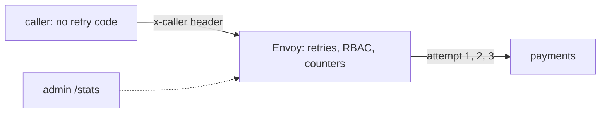

# Service Mesh with Envoy Pattern — Architecture Diagram

The caller talks to Envoy. Envoy talks to payments.

Mermaid source

```mermaid
flowchart LR
    C["caller: no retry code"] -->|x-caller header| E["Envoy: retries, RBAC, counters"]
    E -->|attempt 1, 2, 3| P["payments"]
    A["admin /stats"] -.-> E
```

