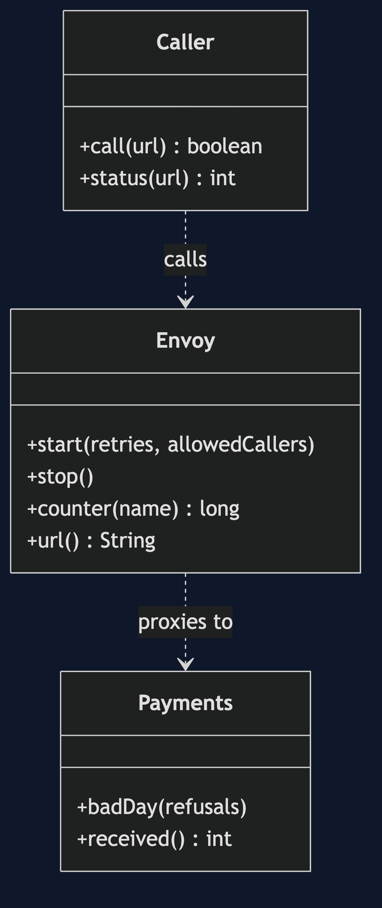
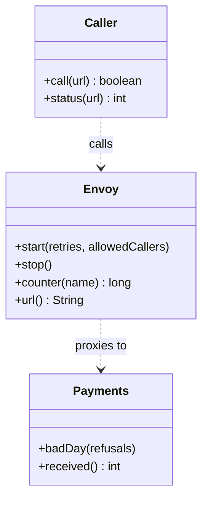

# Service Mesh with Envoy Pattern — Class Diagram

A real Envoy in a container, a real payment server, and callers.

Mermaid source

```mermaid
classDiagram
    class Envoy {
        +start(retries, allowedCallers)
        +stop()
        +counter(name) long
        +url() String
    }
    class Payments {
        +badDay(refusals)
        +received() int
    }
    class Caller {
        +call(url) boolean
        +status(url) int
    }
    Caller ..> Envoy : calls
    Envoy ..> Payments : proxies to
```

