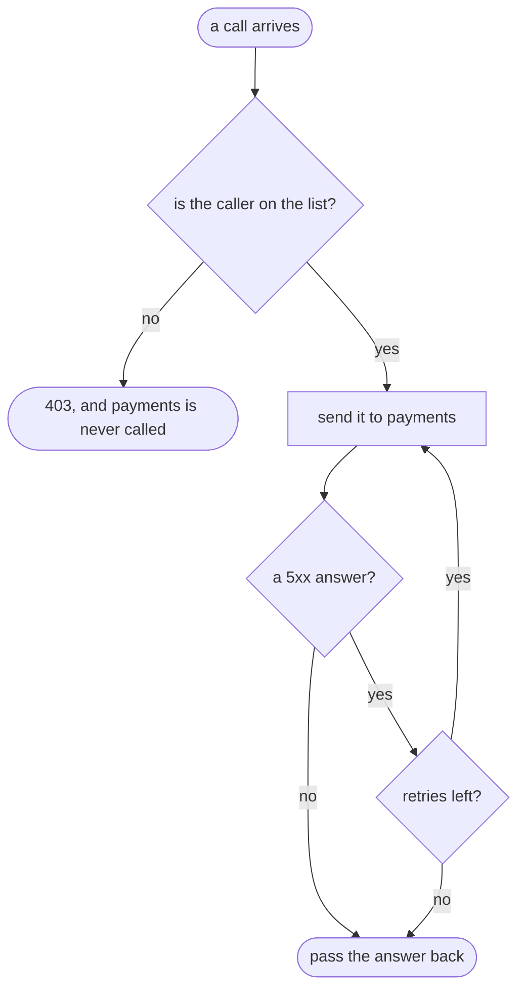

# Service Mesh with Envoy Pattern — Data Flow Diagram

What Envoy does with one call.

Mermaid source

```mermaid
flowchart TD
    Call(["a call arrives"])
    Who{"is the caller on the list?"}
    Deny(["403, and payments is never called"])
    Try["send it to payments"]
    Ok{"a 5xx answer?"}
    More{"retries left?"}
    Done(["pass the answer back"])
    Call --> Who
    Who -- no --> Deny
    Who -- yes --> Try --> Ok
    Ok -- no --> Done
    Ok -- yes --> More
    More -- yes --> Try
    More -- no --> Done
```

