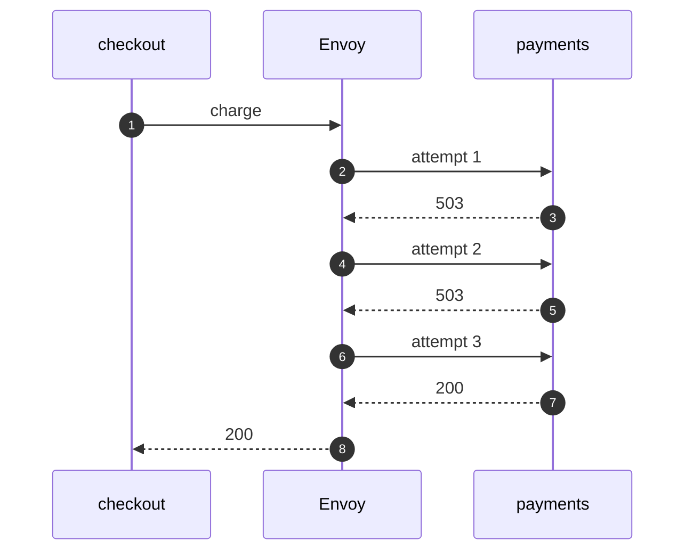

# Service Mesh with Envoy Pattern — Sequence Diagram

Written for a listener with the screen off.

Say it in words. The checkout calls the proxy, once, with no retry code. Envoy passes the call to payments, which refuses. Envoy tries again, and payments refuses again. Envoy tries a third time, and payments answers. Envoy passes the answer back. The checkout sees one answer, and never saw the refusals.

Mermaid source

The load-bearing sentence: **the caller sees one answer. The proxy absorbed the refusals.**
