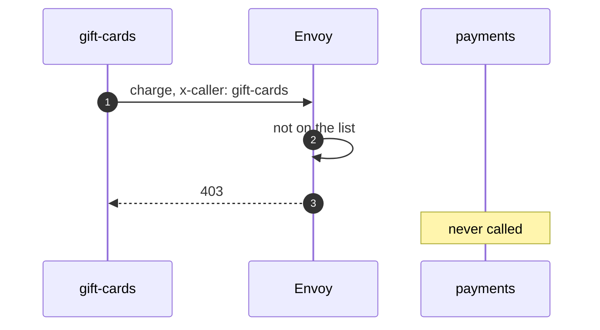

# Service Mesh with Envoy Pattern — UML Sequence Diagrams

Four sequences.

## 1. A Refused Caller

Mermaid source

```mermaid
sequenceDiagram
    autonumber
    participant G as gift-cards
    participant E as Envoy
    participant P as payments
    G->>E: charge, x-caller: gift-cards
    E->>E: not on the list
    E-->>G: 403
    Note over P: never called
```

