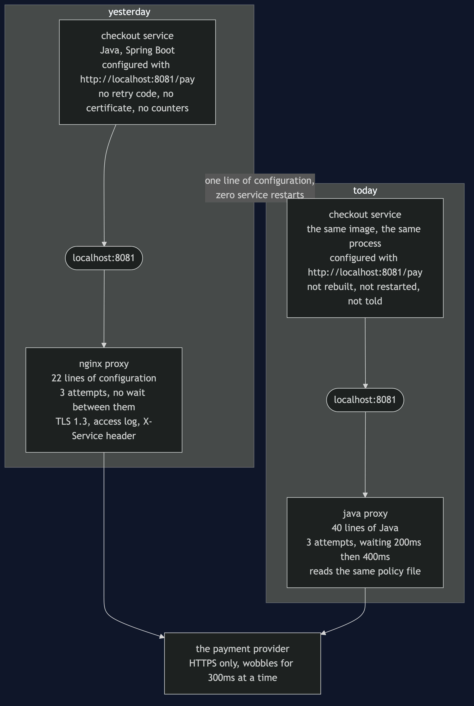
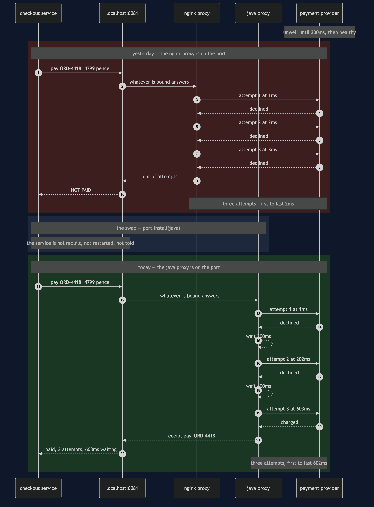

# Sidecar, With the Proxy Written in Java

**Change the thing next door without touching the thing it stands next to.**

This is a follow-on project. Read [`sidecar-pattern`](../sidecar-pattern) first — it
explains what a sidecar is, why the retry code left the service, and what a second process
costs. Nothing here re-teaches any of that. This project takes one sentence that project
left as a claim and turns it into something you watch happen.

Think about the plug on a kettle. The kettle knows nothing about the electricity — not the
voltage, not which wire is live, not what the fuse is rated at. So when somebody discovers
the fuse is wrong, they change the fuse. They do not open the kettle, and the kettle never
knew a fuse existed. That works because the contract is a *shape of socket*, not a wiring
diagram.

The shop's checkout service is the kettle. The proxy beside it is the plug. The contract
between them is an address — `localhost:8081` — which is a socket with a shape. This
project changes the plug while the kettle is boiling.

## The gap the last project shipped with

In March the payment provider wrote to every merchant asking for two things: **at most
three attempts per payment, and wait properly between them.**

The shop's proxy is nginx. nginx can say the first of those. It cannot say the second.

That is not a bug and nobody wrote one. nginx has no retry counter; it has an **upstream
group** — a list of servers — and a rule that says if this one fails, move to the next.
§41's configuration lists the provider's address three times, because three entries is how
you spell *up to three attempts* when there is only one address to talk to. Moving to the
next entry happens immediately, which is exactly right when the next entry is a different
machine and is probably fine. It stops being right when every entry in the list is the one
supplier having one bad second.

There is no directive to fix it with. The sentence does not exist in the language.

## Run

```bash
./gradlew run
```

Seven acts. Two are the gap, one is the swap, and four are the bill.

Act 2 is the provider's bad three hundred milliseconds. A customer buys a coffee maker for
£47.99, and here is what the provider recorded at **its** end — not what the proxy claims:

```
    attempt at    1ms   declined
    attempt at    2ms   declined
    attempt at    3ms   declined
    3 attempts, first to last: 2ms
```

Three attempts spanning two milliseconds against a provider that recovered at three
hundred. The whole allowance for that payment was spent before the provider had time to get
better. **The half of the agreement that limits the shop was kept; the half that would have
helped was not.**

Act 4 is the swap. Somebody writes about forty lines of Java — read the policy, try, catch,
wait, double the wait, try again — and puts it on the same port beside the same service,
handed **the very same policy object** the nginx proxy was reading:

```
  before the swap, listening on localhost:8081: nginx
  checkout is on start number:       1
  checkout's configured endpoint:    http://localhost:8081/pay

  after the swap, listening:         java-proxy
  checkout is on start number:       1
  checkout's configured endpoint:    http://localhost:8081/pay
  payments services ever started:    1
```

The start number did not move, and that is not the demo being careful. There is exactly one
place in the entire program where a payments service is constructed, and it runs before
Act 1. `ServiceStaysEmptyTest` reads the demo's own source with the comments stripped and
counts the constructions, so it stays that way.

Act 5 is the identical wobble, the identical payment and the identical allowance of three
attempts:

```
    attempt at    1ms   declined
    attempt at  202ms   declined
    attempt at  603ms   charged
    3 attempts, first to last: 602ms
```

Read Act 2 and Act 5 side by side and notice what is **not** different. Three attempts in
both. The provider's allowance is untouched, the shop is not being greedier, and the change
costs the provider nothing at all. Only the spacing changed — and the spacing was the
difference between a customer walking away and a coffee maker being sold.

## And then the bill

Act 6 is the thing Acts 4 and 5 skipped, and it is the one that will page somebody. A swap
is not instant: the old proxy stops, and for a moment there is nothing on the port at all.

```
  The provider is healthy. The network is healthy. Checkout is
  healthy. A customer pays for a £31.50 kettle:
    ORD-4419     £31.50    NOT PAID
      connection refused to localhost:8081 — nothing is listening

  attempts that reached the provider: 0
```

Zero, on a completely healthy system, and nothing to fall back on — the service's retry
code was deleted in §41 on purpose. So a real swap is a rollout, not an assignment: start
the new proxy before stopping the old one, move one service at a time, and keep the old
proxy installable, because **the honest reason to be able to swap forwards is to be able to
swap back.**

Act 7 is the demonstration and the price of it:

```
  proxy        language              lines
  nginx        nginx configuration      22
  java-proxy   Java                     40

  what nginx has no words for:
    wait 200ms between attempts, doubling
  what java-proxy has no words for:
    nothing
```

Twenty-two lines of somebody else's configuration became forty lines of your own code —
yours to test, review, keep working on the next JDK, and fix at three in the morning.
Everything nginx brought for free is gone until you write it: TLS termination, a structured
access log, connection pooling, and twenty years of somebody answering security advisories
before you have heard of them. A JVM now sits beside every service where a few megabytes of
nginx used to sit. And nothing stops the next person putting the shop's refund rules in the
proxy, because a general-purpose language will happily let them — a configuration language
was a fence, and the fence is gone.

Those forty lines are the kindest possible reading, and [`real/`](real/README.md) prints the
unkind one. Inside one JVM the Java proxy is a retry loop and nothing else, because the
program around it already exists. As an actual process it has to bind a port, read the
request, present a certificate, hand an answer back and decide what to trust first, and the
measured figure is **112 lines against nginx's 27**. The retry loop is still only
twenty-five of them. The other eighty-seven are the part nginx was doing for free, and the
list above of what is still missing applies on top.

## The rule

> **Swap the proxy when the thing you need cannot be said in the configuration language at
> all.**

Not when it is awkward. Not when the config file has grown ugly. Not when you would rather
write Java, which you would, because everybody would. Here the missing sentence was the
difference between a payment going through and a payment failing, and that clears the bar.
Very little else does. Most of the time the right answer is to keep nginx, accept the gap,
and spend the afternoon on something that matters more.

What is worth keeping either way is that **the choice was available**. Because the service
talks to an address rather than to a library, swapping the proxy was a decision somebody
could make on a Tuesday afternoon — and swapping it back is the same decision in the other
order. That optionality is what §41 actually bought, and this project is what it looks like
when somebody finally spends it.

## Test

```bash
./gradlew test
```

30 tests, in about a second, with nothing random and nothing sleeping. `Clock.waitFor` adds
to a total and returns, so a run that narrates six hundred milliseconds of backoff finishes
instantly and two runs print byte-identical output — which is what lets `DemoRunsTest`
assert every number quoted in these documents and in the video.

Three tests are worth reading before the rest.

- **`TheSwapTest`** proves the swap with `assertSame` on the service's identity, not with
  behaviour. A service that merely *behaves* the same afterwards is a service somebody
  carefully rebuilt.
- **`TheSpacingTest`** asserts the arrival times — `1, 2, 3` against `1, 202, 603` — taken
  from the provider's own log, and asserts that both proxies spend exactly three attempts
  and that neither retries a 429. The improvement must not be greed.
- **`ServiceStaysEmptyTest`** reads `PaymentsService.java` with its comments stripped and
  fails if the words *retry*, *backoff*, *timeout*, *keystore* or *tls* appear in it, then
  counts the constructions of a payments service in the demo and asserts there is exactly
  one.

## One JVM, no infrastructure

Tier 1 starts nothing. `LocalPort` is an object with one field holding whatever proxy is
bound to it, and both proxies are objects. There is no socket, no TLS handshake and no
process boundary — the phrase *separate process* is carried by the narration.

What that model is genuinely good at is the arithmetic: the arrival times, the attempt
counts, and the proof that the service object is the same object afterwards. What it cannot
show is the swap's real timing, which depends on how fast a new proxy accepts connections
and whether the old one drains what it is holding.

For that, see [`real/`](real/README.md). It runs §41's service and §41's nginx configuration
in containers, starts the service **once**, and then swaps the proxy underneath it — so
Docker's own record of when the service container started is what makes the claim checkable
rather than asserted, and in the captured transcript that timestamp is identical before and
after. The provider on the far end records the millisecond each attempt landed, because a
proxy claiming to have waited is a claim and an arrival time is not. It is a separate Gradle
build, so `./gradlew test` here never resolves Spring and still passes offline.

## Technologies and versions

Nothing here is a range and nothing is `latest`: a course that worked last year and does not
work today is worse than one that never took the dependency. The Java versions are pinned in
[`../gradle/libs.versions.toml`](../gradle/libs.versions.toml) because Gradle can read that
file, and the container tags in
[`../docs/pinned-versions.md`](../docs/pinned-versions.md) because nothing can.

**Tier 1 — this project.** Clone it, run `./gradlew test`, and it passes with no network
and no Docker.

| What | Version | Why it is here |
| --- | --- | --- |
| Java | 21 | The repository standard, requested through the Gradle toolchain block |
| Gradle | 9.2.1 | The wrapper in this directory; no separate install needed |
| JUnit 5 | 5.10.2 | The 30 tests. The only Tier 1 dependency in the whole category |

**Tier 2 — [`real/`](real/README.md), a separate Gradle build.** None of this is on the
path of `./gradlew test` here.

| What | Version | Why it is here |
| --- | --- | --- |
| Spring Boot | 4.1.1 | The payments service — **§41's image, reused and not rebuilt.** Rebuilding it would destroy the only claim this tier makes |
| `spring-boot-starter-web` | with Boot 4.1.1 | The HTTP endpoint the service exposes |
| `spring-boot-starter-restclient` | with Boot 4.1.1 | The one call the service makes, to the proxy next door |
| Spring dependency-management plugin | 1.1.7 | Applies the Boot BOM so no starter carries a version of its own |
| nginx | `1.31.5-alpine` | The proxy that is there first, and the one being replaced |
| Eclipse Temurin | `21-jre-alpine` | The base image for the service and for the Java proxy container |
| Docker Compose | v2 | Starts the containers by name, so only one proxy is ever bound to the port; the swap is `stop` on one and `up -d` on the other, and nothing else is touched |

The Java proxy container takes no framework at all — it is plain Java on the JDK's built-in
HTTP server. A forty-line proxy that pulls in a web framework is not a forty-line proxy, and
the line count is part of the argument.

## Learning Material

| Document | What it covers |
| --- | --- |
| [`docs/problem-statement.md`](docs/problem-statement.md) | The sentence the configuration language has no words for, and why nobody wrote a bug |
| [`docs/sidecar-java-proxy-pattern-explained.md`](docs/sidecar-java-proxy-pattern-explained.md) | The kettle, the gap, the swap, and a bill longer than the benefit |
| [`docs/class-diagram.md`](docs/class-diagram.md) | The types — and the three claims a class diagram cannot show |
| [`docs/architecture-diagram.md`](docs/architecture-diagram.md) | What runs where, before and after, and the one box that differs |
| [`docs/data-flow-diagram.md`](docs/data-flow-diagram.md) | The same payment down both branches, with the millisecond on every arrow |
| [`docs/sequence-diagram.md`](docs/sequence-diagram.md) | The two runs in call order, and the swap that has no arrow into the service |
| [`docs/uml-diagram.md`](docs/uml-diagram.md) | Why nginx does not wait, the swap done badly, the swap done properly, and the rule both proxies obey |
| [`docs/animation.html`](docs/animation.html) | The two proxies' attempts drawn on one timeline in a browser |
| [`docs/prerequisites.md`](docs/prerequisites.md) | What you need to know, and what you explicitly do not |
| [`docs/session.md`](docs/session.md) | A one-hour taught session with four exercises |
| [`docs/spec.md`](docs/spec.md) | The generated specification, with measured test counts and timings |
| [`docs/youtube.md`](docs/youtube.md) | Title, description and chapters for the video |

### The pattern in one picture

The class diagram, and the thing to look for is which boxes touch which. `PaymentsService`
has two fields — a name and a `LocalPort` — and there is **no line at all** from the service
to either proxy. The only line out of the service goes to the port; the only line out of the
port goes to an interface. Whatever is bound to it is on the other side of that shape, and
nothing in the service can tell what.


### What runs where

The same machine twice: yesterday with nginx on the port, today with the Java proxy. The
service is the same box in both halves — same image, same process, same start time — and
the arrow out of it points at the same address either way.



### How the data moves

One payment down both branches, with the millisecond marked at every attempt. Nothing in the
data changed; both branches send the same bytes to the same address the same number of
times, and one of them gets paid.


### Who calls whom, in order

The same payment in call order. The two self-arrows on the Java proxy's lifeline — *wait
200ms* and *wait 400ms* — are the entire difference between the two halves. And notice that
the swap in the middle has no arrow touching the service's lifeline, because there is
nothing to send it.



### The four sequences the main story walks past

**One. Why nginx does not wait.** It is walking a list of servers, and it believes the next
one is a different machine. That belief is correct almost everywhere and wrong here, where
all three entries are the same unwell address.


**Two. The swap done badly.** Stop the old proxy, then start the new one. In between, a
healthy payment fails instantly having reached nobody — and the provider's dashboards will
never show that it happened.


**Three. The swap done properly.** Start the new proxy, prove it answers, move the traffic,
let the old one drain, and only then stop it — keeping it installable, because the fastest
fix for a bad new proxy at three in the morning is the old one.


**Four. The rule both proxies obey.** A 429 means the allowance is spent, and retrying it is
not persistence. One attempt each, from both proxies — because *how many times to try* and
*when it is pointless to try* are two different decisions, and only the first one changed.


### Video

The narrated walkthrough is built from [`video/scenes.py`](video/scenes.py) by
[`video/build_video.sh`](video/build_video.sh). The rendered file is not committed — see the
repository README for why.

## Where this sits

This is pattern 42, the fifth of the [`platform-design-patterns`](..) as the category lists
them, and the middle of three Sidecar projects. [`sidecar-pattern`](../sidecar-pattern) (§41)
is the pattern itself and is required reading. [`sidecar-on-kubernetes-pattern`](../sidecar-on-kubernetes-pattern)
(§43) takes the same pair and makes them one Pod, where starting, stopping and ordering stop
being something a person types.

If you only remember one thing from this one, make it the narrow rule — and the reason it is
narrow. A configuration language you cannot express everything in is not only a limitation.
It is also a fence that stops the shop's business rules ending up in a proxy, and you take
the fence down at the same moment you take the limitation away.
