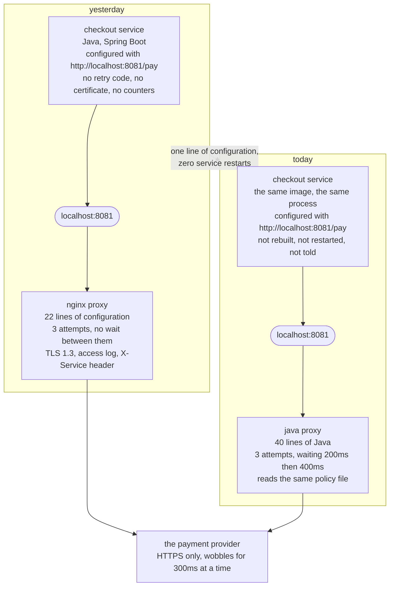

# Sidecar with a Java Proxy — Architecture Diagram

What is running, where, and which box is being replaced.

Read it as one machine with two things on it. On the left is the checkout service, and it
is the same service in both halves of the picture — same image, same process, same start
time. On the right is the port, and bound to the port is a proxy. The top half shows the
proxy that was there yesterday; the bottom half shows the one that is there now. **The
only box that differs between the two halves is the proxy**, and the arrow out of the
service points at the same address in both.

The dashed line down the middle of each half is the process boundary. Everything to the
left of it is the shop's Java, rebuilt when the shop ships. Everything to the right of it
is a neighbour with its own lifecycle, its own version number and its own restart, which
is the whole reason the swap is possible at all.

Mermaid source

## What runs where, and what that buys

**The service is one process and the proxy is another.** That is inherited from §41 and
it is the load-bearing decision. If the proxy were a library inside the service, changing
it would mean a new jar, a new build, a new test run and a new deployment of checkout —
and it would mean the replacement had to be written in Java, because a jar is.

**The proxy has its own lifecycle.** It starts and stops on its own schedule. Replacing
it is an operation on the proxy, not on the pair.

**The address is the contract.** `http://localhost:8081/pay` appears in the service's
configuration and nowhere else in this diagram. Both proxies bind to it. Neither
advertises what it is, and the service has no call it could make to find out.

## Where the two tiers sit on this picture

**Tier 1** — `./gradlew run` — draws all of it in one JVM. The port is an object with a
field, the proxies are objects, and the "process boundary" is a comment. What Tier 1 is
genuinely good at is the arithmetic: the arrival times, the attempt counts, and the proof
that the service object is the same object afterwards.

**Tier 2** — [`../real/`](../real) — is the same picture with real containers. The service
image is §41's, reused byte-for-byte and not rebuilt, and the proxy container is replaced
underneath it with `docker compose up -d --no-deps`. Docker's own record of when each
container started is what makes the claim checkable rather than asserted.

Neither tier shows a fleet. Two containers on a laptop are not a rollout across two
hundred services with half of them on the new proxy for an hour, and that is where a real
proxy swap gets interesting.

## The box that is missing, and when it appears

There is no control plane on this diagram.

In a service mesh there would be one: a thing that knows every proxy in the estate, hands
each of them its configuration, and rolls a new proxy version out across all of them
without anybody typing a command per machine. That is what turns "somebody swapped the
proxy beside checkout" into "the platform team changed the data plane".

It is deliberately absent here for the same reason §41 left it out. A control plane is a
large piece of infrastructure with its own failure modes, and this project has one job.
The arithmetic that decides whether you want one is in §41's closing act; what this
project shows is the single swap that a control plane would do a few hundred times.
