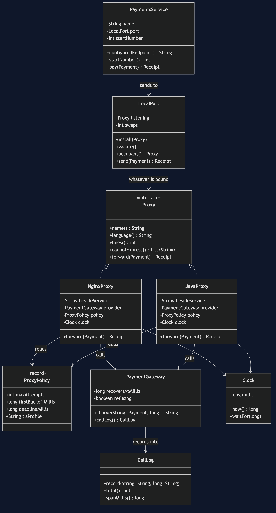
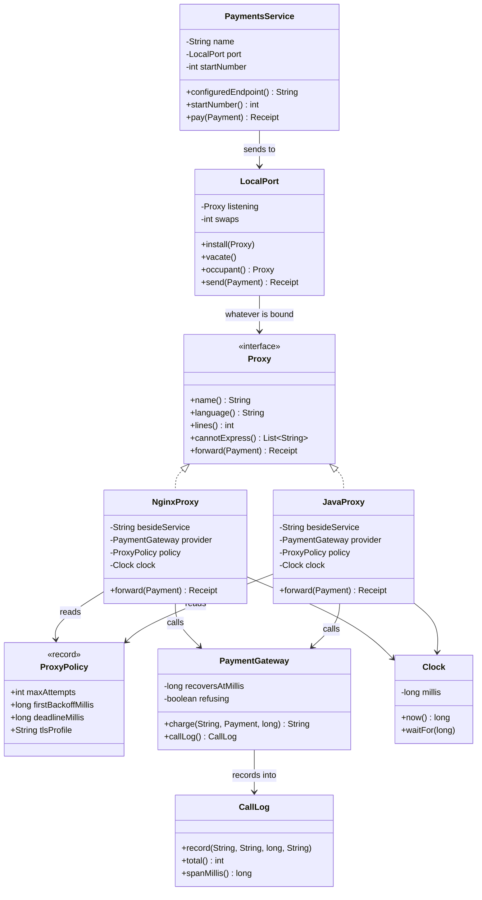

# Sidecar with a Java Proxy — Class Diagram

Shows the static structure: the address the service talks to, the two things that may be
bound to it, the one policy both of them read, and the service that knows about none of
it.

**The important thing on this diagram is which boxes touch which.** `PaymentsService`
has exactly two fields — a name and a `LocalPort` — and there is no line at all from the
service to either proxy. It cannot reach one. The only line out of the service goes to
the port, and the only line out of the port goes to the `Proxy` interface, which is a
shape rather than a thing. Whatever is bound to the port at the time is on the other side
of that shape, and nothing in the service can tell what.

**The second thing is a pair of boxes that are almost identical.** `NginxProxy` and
`JavaProxy` implement the same interface, hold the same three fields — the service name,
the provider and the policy — and have the same method. They were not written to match;
they match because the contract is that small. The one difference between them is not
visible here at all, because it is a difference in what happens inside one method, and a
class diagram does not draw the inside of a method. It shows up in `cannotExpress()`,
which returns one entry for nginx and an empty list for the Java one.

**The third is that `ProxyPolicy` is pointed at twice and owned by nobody.** Both proxies
read it; neither of them can change it, because it is a record and records are immutable.
The demo hands the same instance to both. Four equal copies would have been the old
problem with better manners, and only sharing one object rules that out.

Mermaid source

## What the diagram cannot show you

Three of this project's claims are invisible on a class diagram, and it is worth being
explicit about which ones, because a reader who expects to find them here will conclude
the diagram is wrong.

**The swap does not appear.** There is no arrow for "was nginx, is now Java". A class
diagram draws relationships that hold for all time, and the whole point of `install` is
that the relationship it creates does not.

**The difference between the two proxies does not appear.** Both boxes have a `forward`
method; one of those methods waits between attempts and the other does not, and that is
four lines inside a method body. For that, read
[`sequence-diagram.md`](sequence-diagram.md), where the arrival times are drawn on a
timeline and the gap is the thing you see first.

**The process boundary does not appear.** In the deployed version the service and the
proxy are two containers and there is no `Proxy` interface at all — the contract is that
something accepts a request on a port. Java needs a type here because Tier 1 runs in one
JVM. For the boundary drawn as a boundary, see
[`architecture-diagram.md`](architecture-diagram.md).

## The rule the diagram does enforce

Look at what `NginxProxy` and `JavaProxy` hold: a name, a provider, a policy and a clock.
Neither of them holds anything about the shop. There is no basket, no order, no refund
window and no customer.

That is the test for whether something belongs in a proxy at all, and it is the test that
gets harder the moment you swap a configuration language for a general-purpose one. How
many times to retry a failed connection is a fact about the network and the provider's
contract, true whoever is calling. Whether a refund is allowed after ninety days is a fact
about the shop. nginx could not have expressed the second one if it tried; Java will let
anybody put it in, and this diagram is the shape to check a change against when they do.
