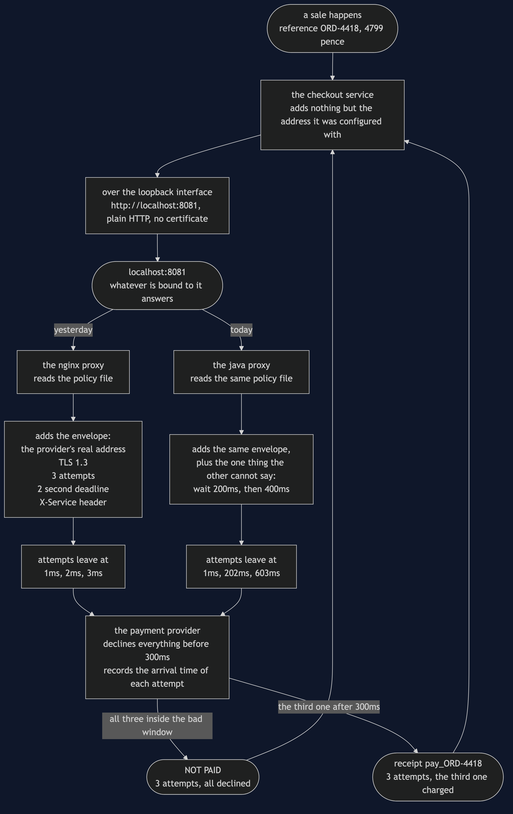
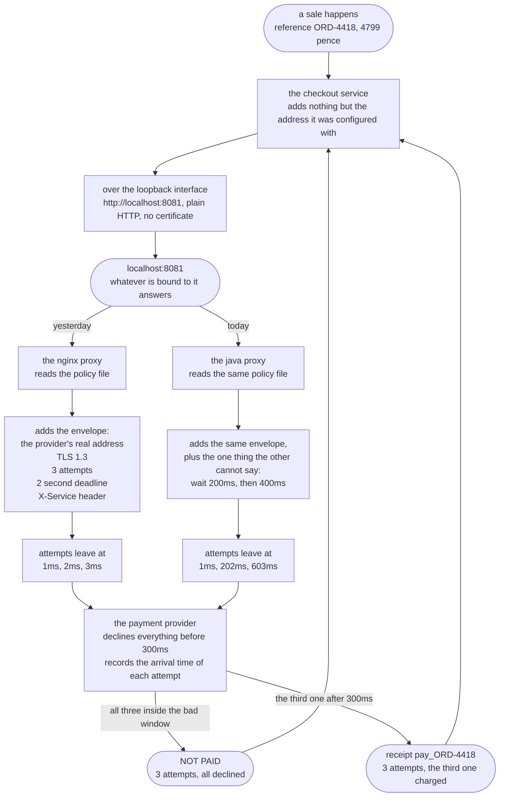

# Sidecar with a Java Proxy — Data Flow Diagram

One payment during a wobble, followed twice — once through each proxy — with the
millisecond marked at every attempt. The architecture diagram says what is running; this
one says what moves, and above all **when**.

Follow the left-hand branch down. The service hands over a reference and an amount in
pence and is finished. The nginx proxy adds the envelope — the provider's real address,
TLS 1.3, a limit of three attempts, a two-second deadline, a header saying who is calling
— and then makes its three attempts at one, two and three milliseconds. The provider is
unwell until three hundred. All three land in the bad window and one failure goes back.

Now follow the right-hand branch. The service hands over the identical reference and
amount. The Java proxy adds the identical envelope, from the identical policy file. Then
it makes three attempts at one, two hundred and two, and six hundred and three
milliseconds — and the third one arrives after the provider has recovered, so a receipt
goes back instead.

**Nothing in the data changed. Only the timing did.** Both branches send the same bytes
to the same address the same number of times, and one of them gets paid.

Mermaid source

## The three things this flow proves

**The payment data itself is untouched by the change.** `ORD-4418` and `4799` leave the
service and arrive at the provider unchanged in both branches. Everything either proxy
adds is envelope, not content. That is still the test for whether a concern may live in a
proxy at all: if the box would have to understand what a refund is to do its job, it is
in the wrong place — and it is a test worth re-running after a swap, because a
general-purpose language will let somebody break it and a configuration language would
not have.

**The allowance is spent identically.** Three attempts in both branches. The provider's
quota, the shop's contract and the provider's capacity are all exactly as they were. This
is not a change that buys reliability by asking for more; it buys it by asking at better
moments, which costs nobody anything.

**The service cannot see any of it.** One arrow leaves the service and one comes back, in
both branches. There is no place in the service's code where the second and third
attempts could be observed, counted or logged — which is why every time in this document
is taken from the provider's own record rather than from the proxy that made the calls. A
proxy claiming it spaced its retries out is a claim; arrival times measured at the far
end are evidence.

## The arrow that is not drawn

There is a moment between the two branches that this diagram does not have a shape for:
the point where the old proxy has stopped and the new one has not started, and the port
has nothing bound to it at all.

A payment arriving then does not take the left branch or the right one. It stops at the
port and comes straight back as a connection refused, having reached nobody — and the
service has no retry code to cover it, because that was deleted in §41 on purpose.

The demo's sixth act is that moment, and the practical consequence is the reason a real
swap is a rollout rather than an assignment: start the new proxy before stopping the old
one, and move one service at a time.
