# Sidecar with a Java Proxy — Sequence Diagram

The same payment, twice, in order, with the millisecond written beside every arrow. This
is the diagram where the difference between the two proxies is the thing you see first,
because the difference *is* a difference in order and timing and nothing else.

Read it top to bottom as one story. In the first half the nginx proxy is bound to the
port; it makes three attempts and they all leave within three milliseconds of each other.
In the middle, one line of configuration replaces the occupant of the port — and notice
there is no arrow touching the service's lifeline at that moment, because there is nothing
to send it. In the second half the Java proxy makes three attempts, and the gaps between
them are the point.

The provider recovers at three hundred milliseconds in both halves. The only thing that
decides whether the shop gets paid is whether any attempt is still to come by then.

```mermaid
sequenceDiagram
    autonumber
    participant C as checkout service
    participant P as localhost:8081
    participant N as nginx proxy
    participant J as java proxy
    participant G as payment provider

    Note over G: unwell until 300ms, then healthy

    rect rgb(60, 30, 30)
    Note over C,G: yesterday — the nginx proxy is on the port
    C->>P: pay ORD-4418, 4799 pence
    P->>N: whatever is bound answers
    N->>G: attempt 1 at 1ms
    G-->>N: declined
    N->>G: attempt 2 at 2ms
    G-->>N: declined
    N->>G: attempt 3 at 3ms
    G-->>N: declined
    N-->>P: out of attempts
    P-->>C: NOT PAID
    Note over N,G: three attempts, first to last 2ms
    end

    rect rgb(30, 40, 60)
    Note over C,J: the swap — port.install(java)
    Note over C,P: the service is not rebuilt, not restarted, not told
    end

    rect rgb(25, 55, 35)
    Note over C,G: today — the java proxy is on the port
    C->>P: pay ORD-4418, 4799 pence
    P->>J: whatever is bound answers
    J->>G: attempt 1 at 1ms
    G-->>J: declined
    J-->>J: wait 200ms
    J->>G: attempt 2 at 202ms
    G-->>J: declined
    J-->>J: wait 400ms
    J->>G: attempt 3 at 603ms
    G-->>J: charged
    J-->>P: receipt pay_ORD-4418
    P-->>C: paid, 3 attempts, 603ms waiting
    Note over J,G: three attempts, first to last 602ms
    end
```

Mermaid source

## What to look at, in order

**The first two arrows are identical in both halves.** The service sends the same
reference and the same amount to the same address. There is no version, no proxy name and
no capability check in that message, and no branch in the service that could depend on
one.

**The two self-arrows on the Java proxy's lifeline are the entire difference.** `wait
200ms` and `wait 400ms`. Those four lines of Java are what nginx's http proxy module has
no directive for. Everything else on the right-hand half is what the left-hand half
already did.

**The doubling matters more than the first number.** The first wait is two hundred
milliseconds; the second is four hundred. If every retry in the estate waited a fixed two
hundred, then every service that failed at the same moment would come back at the same
moment, and the provider's first breath after a bad second would be the entire shop
arriving at once. Doubling spreads them out. A production proxy would also add a small
random jitter to each wait for the same reason; this one does not, because a random number
would make the demo print something different on every run and the tests assert on its
exact output.

**The provider's line says the same thing in both halves.** It recovers at three hundred
milliseconds either way. Nothing was done to the provider, nothing was negotiated with it,
and it did not get less traffic — it got exactly three attempts in both stories.

**The swap has no arrow into the service.** That gap in the middle of the diagram is the
claim this project exists to make. There is no notification step, no rolling restart of
checkout and no configuration reload, because the address did not change.

## The order this diagram hides

A sequence diagram draws time going down, which makes it very good at spacing and
completely silent about the one dangerous ordering question in a swap: whether the old
proxy stops before the new one starts.

Drawn here, the swap is a single instant. In reality it is two events, and if they happen
in the wrong order — stop, then start — there is a window with nothing bound to the port
at all, and requests arriving in it are refused by the operating system before anybody
sees them. The demo's sixth act puts the program in exactly that state on purpose and
shows a healthy payment failing with zero attempts reaching the provider.

So the ordering to remember is the one the diagram does not draw: **start the new proxy
first, confirm it is answering, and only then stop the old one.**
