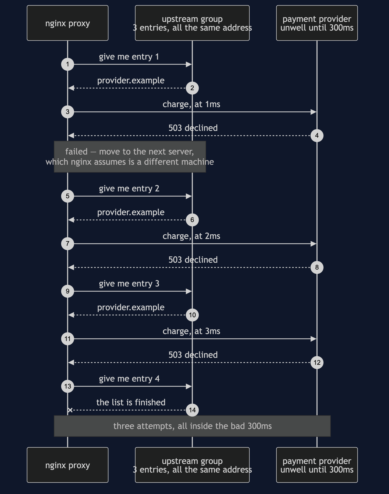
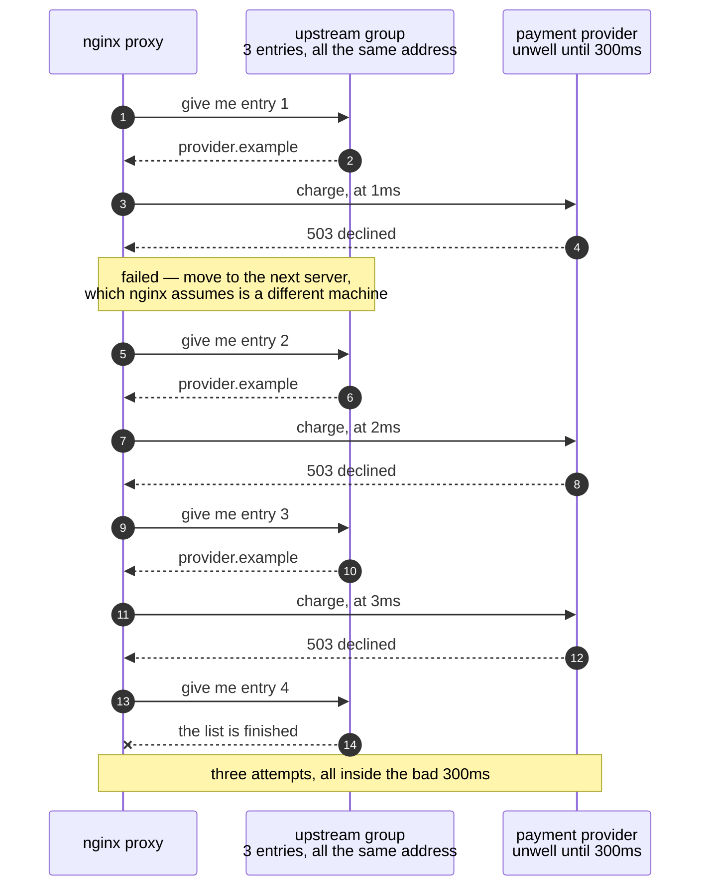
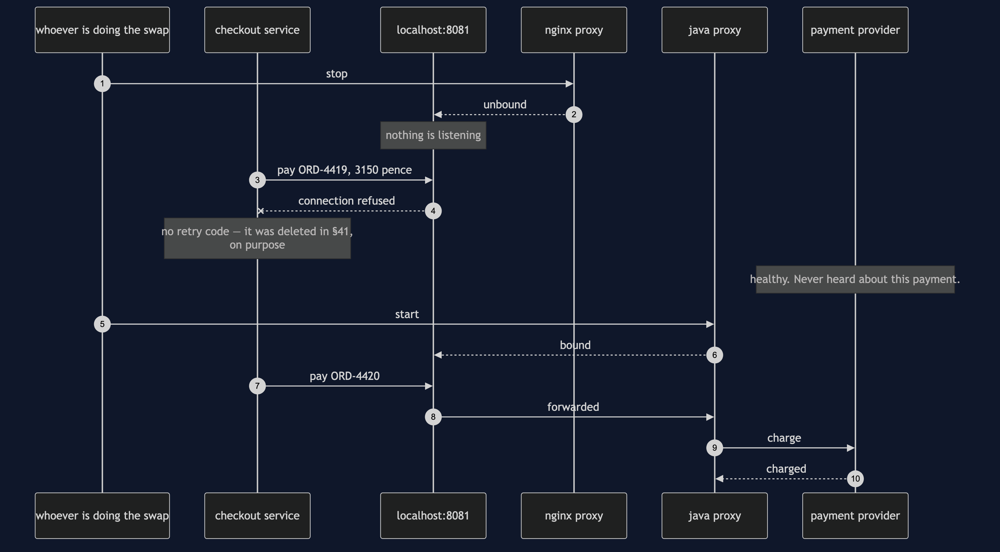
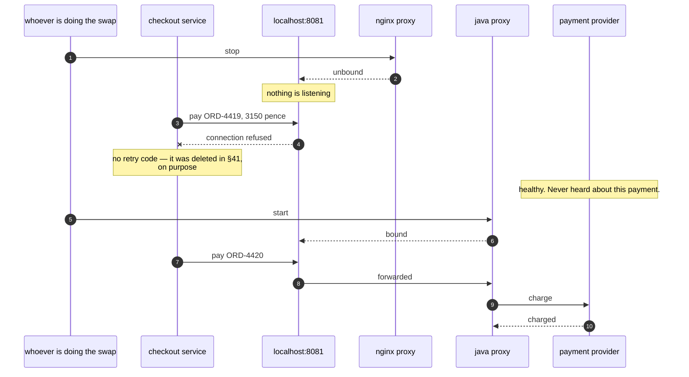
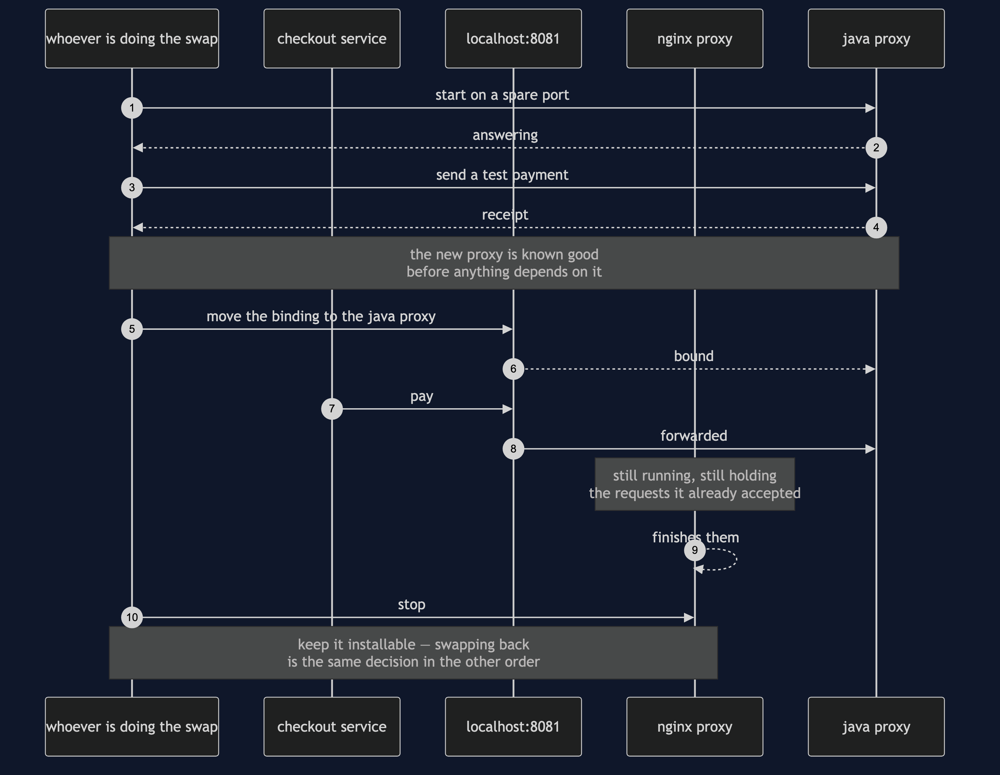
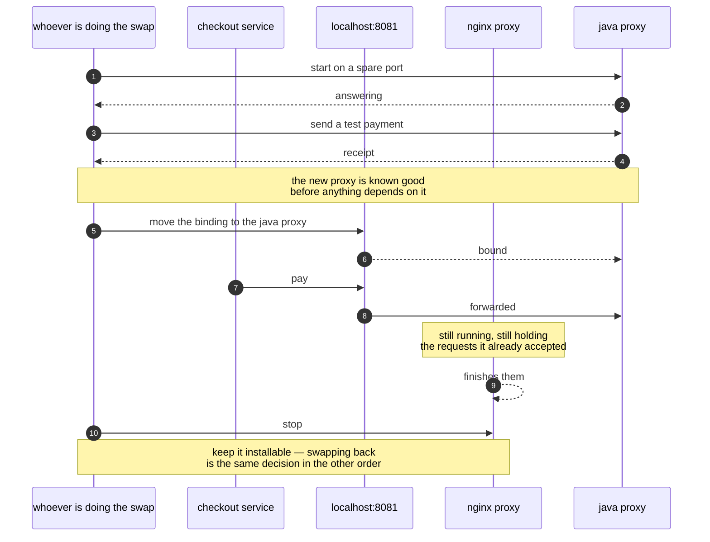
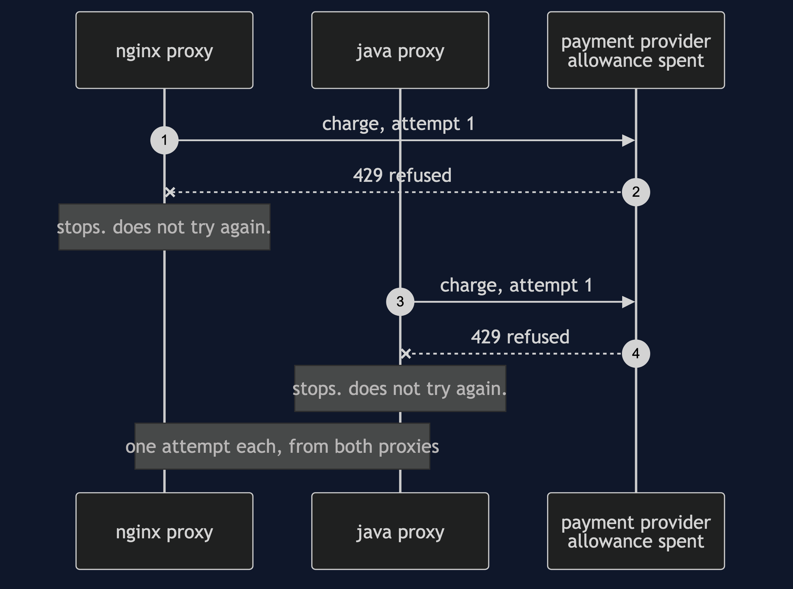
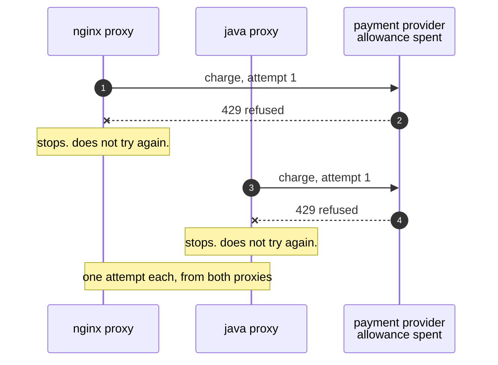

# Sidecar with a Java Proxy — UML Sequence Diagrams

Four sequences. The first is why nginx behaves the way it does, which is not a bug and is
worth understanding before replacing anything. The second is the swap done badly. The
third is the swap done properly. The fourth is the rule both proxies obey identically, and
it is there to show that the Java one did not quietly become greedier.

The main before-and-after story is in [`sequence-diagram.md`](sequence-diagram.md). These
are the four things that story walks past.

## 1. Why nginx Does Not Wait

nginx has no retry counter. It has an **upstream group** — a list of servers — and a rule
that says if this one fails, move to the next one. §41's configuration lists the provider's
address three times, because three entries is how you spell *up to three attempts* when
there is only one address to talk to.

Watch what nginx believes it is doing. It thinks it is walking a list of different
machines, and moving to a different machine is something you want to happen at once.
Nothing in its model tells it that all three entries are the same unwell address.



<details>
<summary>Mermaid source</summary>



</details>

The design is correct for the case it was built for. In a pool of ten web servers, waiting
before trying the ninth would make every request slower to no purpose, because the ninth
server is a different computer and is probably fine. It stops being correct when every
entry in the pool is one supplier having one bad second — which is exactly the shape of a
sidecar in front of a single provider.

There is no directive to change it with. That is the whole reason this project exists.

## 2. The Swap Done Badly

Stop the old proxy, then start the new one. It reads like the obvious order and it is the
wrong one.



<details>
<summary>Mermaid source</summary>



</details>

The demo's sixth act is this window, held open on purpose. A healthy provider, a healthy
network, a healthy service, and a payment that fails having reached nobody:

```
  attempts that reached the provider: 0
```

That number is what makes the point. The failure is not slow, it is instant, and it is
invisible at the provider's end — so nothing in the provider's dashboards will ever tell
you it happened.

## 3. The Swap Done Properly

Start the new proxy first on its own port. Check it answers. Move the traffic. Let the old
one finish what it is already holding. Only then stop it.



<details>
<summary>Mermaid source</summary>



</details>

Written out like that, the honest conclusion is that a proxy swap is a rollout rather than
an assignment. `port.install(java)` is one line in Tier 1 because Tier 1 has one service.
With two hundred services, the same change is a schedule, a canary, and a way back.

And the way back is the part people skip. The reason to keep the old proxy deployable is
not sentiment about nginx; it is that the fastest fix for a bad new proxy at three in the
morning is the old one.

## 4. The Rule Both Proxies Obey

If the shop's allowance with the provider is spent, the provider answers 429 and means it.
Retrying a 429 is not persistence, it is making a busy supplier busier — and it is the one
place where a general-purpose language gives you enough rope to get it wrong.

So it is worth being able to see that the Java proxy did not.



<details>
<summary>Mermaid source</summary>



</details>

A test makes the provider refuse everything and asserts that each proxy reached it exactly
once. Three allowed attempts, one used, in both languages — because *how many times to try*
and *when it is pointless to try* are two different decisions, and only the first one
changed.

This is the sequence to re-run in your head after any change to a hand-written proxy. The
forty lines of Java are yours now, which means the next person to edit them can make the
proxy greedier by accident in a way an nginx configuration file would never have allowed.
The fence is gone; the test is what is left.
