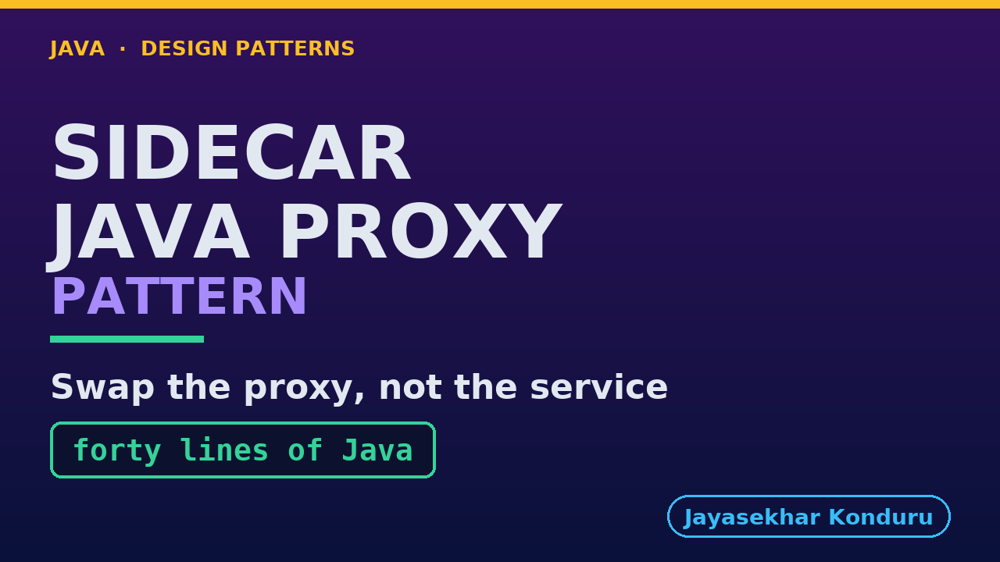

# YouTube — Sidecar Java Proxy Pattern

Everything needed to publish `video/sidecar-java-proxy-pattern-explained.mp4`. Copy the fields straight out of this file.

Chapter timings are generated from the video's `.srt`. Re-run `python3 docs/make_youtube_docs.py sidecar-java-proxy` after any change to the narration, or they will be wrong.

## Title

```
Sidecar in Java - Swapping the Proxy, Not the Service
```

53 characters — under the 60 YouTube shows before truncating in search results.

## Description

The first two lines are what a viewer sees above the fold, so they carry the hook rather than the boilerplate.

```
Watch a sidecar proxy be replaced, on the same port, by one written in a different language — while the service beside it keeps running and is never told. An online shop takes payments through a proxy running next door, which is twenty-two lines of nginx configuration. In March the payment provider asks for two things: at most three attempts per payment, and a proper wait between them. The shop can say the first half and not the second, and three weeks later a bad three hundred milliseconds costs it a sale — three attempts at one, two and three milliseconds, all inside the wobble, and a £47.99 order NOT PAID. Nobody wrote a bug: nginx has no retry counter, it has an upstream group, and moving to the next entry is immediate by design. The sentence the provider asked for does not exist in the language the policy is written in. So we put forty lines of Java on the port instead — the same loop plus four lines — and the same three attempts arrive at one, two hundred and two, and six hundred and three milliseconds, and the payment goes through with no extra traffic to the provider at all. The service is not rebuilt, not restarted, and not told; a test asserts it is the same object afterwards rather than that it merely behaves the same. Then the bill, which is longer than the benefit: somebody else's configuration became your code to test and patch, TLS termination and access logs and connection pooling are gone until you write them, a JVM now sits beside every service, a request arriving mid-swap is refused with zero attempts reaching the provider — and nothing now stops the next person putting the shop's refund rules in the proxy, because the limitation and the fence were the same thing. Finishing with the narrow rule: swap the proxy when the thing you need cannot be said in the configuration language at all — not when it is awkward. Java 21, no Docker, no Kubernetes and no network needed; it all runs in one JVM. Watch the Sidecar video first. Full source code and written notes are in the repository.

CHAPTERS
00:00 Introduction
01:58 One Minute On Where We Are
03:17 The Letter From The Provider
04:05 Three Attempts That Bought Nothing
05:18 Nobody Wrote A Bug
06:54 Three Ways Out, Two Of Them Bad
08:17 The Loop, With The Sentence Missing
08:53 Forty Lines Of Java
09:52 The Swap
11:05 The Same Wobble, The Same Three Attempts
12:03 What Is Actually In This Program
13:34 The Gap In The Middle Of A Swap
14:53 A Claim Is Not A Demonstration
15:42 The Bill, Which Is Longer
17:24 The Rule To Take Away
18:27 What To Remember
19:29 Thanks for watching

SOURCE CODE, WRITTEN NOTES AND AN INTERACTIVE ANIMATION
https://github.com/jk-boot-up/java-design-patterns/tree/main/gradle-java/platform-design-patterns/sidecar-java-proxy-pattern

WHAT YOU NEED FIRST
Java 21 and a working knowledge of classes and interfaces. No prior design-pattern knowledge is assumed. The full prerequisites are in docs/prerequisites.md in the repository.
```

## Chapters

YouTube renders these as chapters only if there are at least three and the first is at `00:00`.

```
00:00 Introduction
01:58 One Minute On Where We Are
03:17 The Letter From The Provider
04:05 Three Attempts That Bought Nothing
05:18 Nobody Wrote A Bug
06:54 Three Ways Out, Two Of Them Bad
08:17 The Loop, With The Sentence Missing
08:53 Forty Lines Of Java
09:52 The Swap
11:05 The Same Wobble, The Same Three Attempts
12:03 What Is Actually In This Program
13:34 The Gap In The Middle Of A Swap
14:53 A Claim Is Not A Demonstration
15:42 The Bill, Which Is Longer
17:24 The Rule To Take Away
18:27 What To Remember
19:29 Thanks for watching
```

## Tags

```
sidecar pattern, java proxy server, polyglot microservices, design patterns, java design patterns, gang of four, java 21, software design, clean code, object oriented design, java tutorial, ecommerce, programming tutorial
```

221 characters, under YouTube's 500 limit.

## Thumbnail



**Upload `docs/thumbnail.png`** — 1280×720, the size YouTube recommends, generated by `docs/make_thumbnails.py`. It is deliberately not the same image as the video's opening frame: a thumbnail is judged at about 360 pixels wide in a search result, so this one carries only the pattern name, one line of promise and one short piece of code, each set large enough to survive the shrink.

`video/poster.png` is the 1920×1080 opening frame, produced by the video build. It stays in the repository as the title card; it is not what gets uploaded.

YouTube will not pick the thumbnail up on its own — upload it under **Details → Thumbnail → Upload file**. A custom thumbnail requires a verified channel.

## Upload checklist

- [ ] Upload `video/sidecar-java-proxy-pattern-explained.mp4` (1080p, H.264, 30 fps, AAC 48 kHz — already YouTube's recommended settings, no re-encode needed)
- [ ] Set the video language to **English** first, or the subtitle option may not appear
- [ ] Add subtitles: *Video elements → Add subtitles → Upload file → With timing* → `video/sidecar-java-proxy-pattern-explained.srt`
- [ ] Upload `docs/thumbnail.png` as the thumbnail — do not let YouTube auto-pick a frame
- [ ] Paste the title, description and tags from above
- [ ] Add to the **Java Design Patterns** playlist, in learning order
- [ ] Wait for 1080p processing before sharing the link — code slides are unreadable at 360p

## Cards and end screen

End screen links to whichever pattern video goes up next — set it at upload time rather than assuming an order.

Add a card partway through pointing at the playlist, so a viewer who arrives at this pattern from search can find the rest of the series.

## Runtime

Approximately 19:58, narrated at 145 words per minute.
