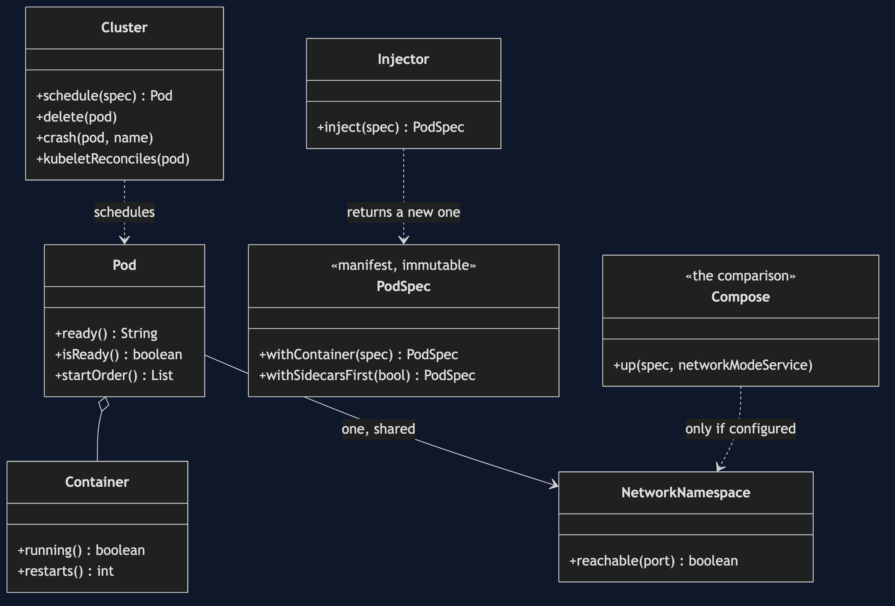
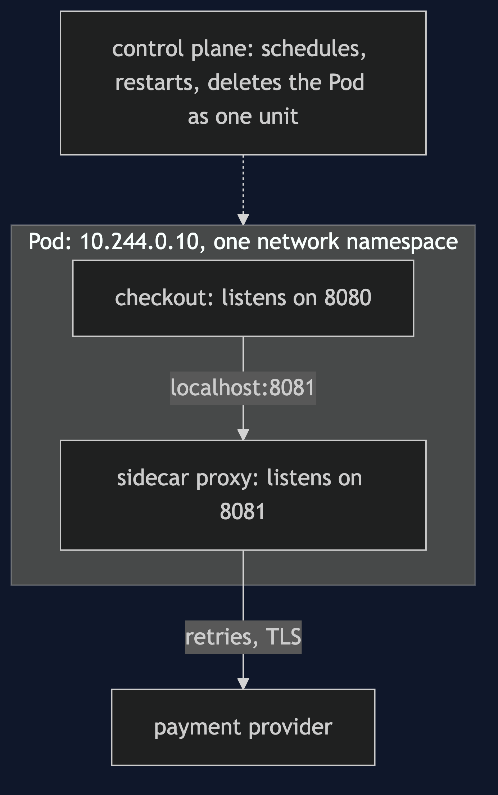
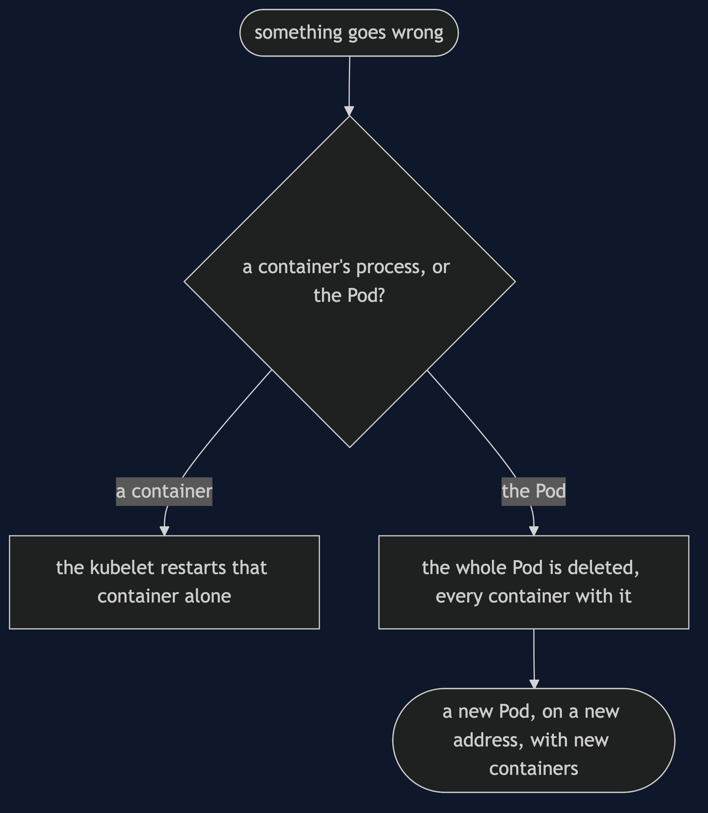
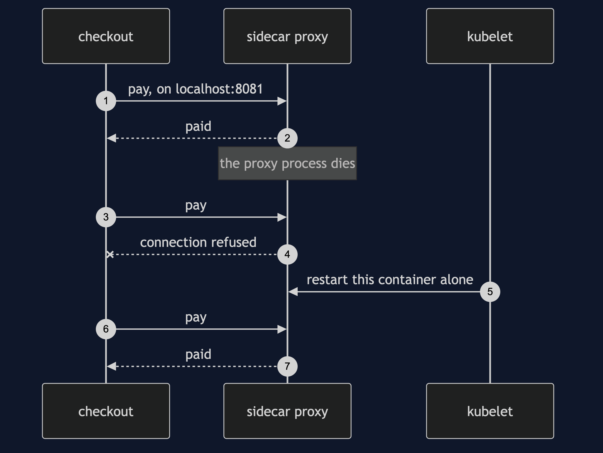
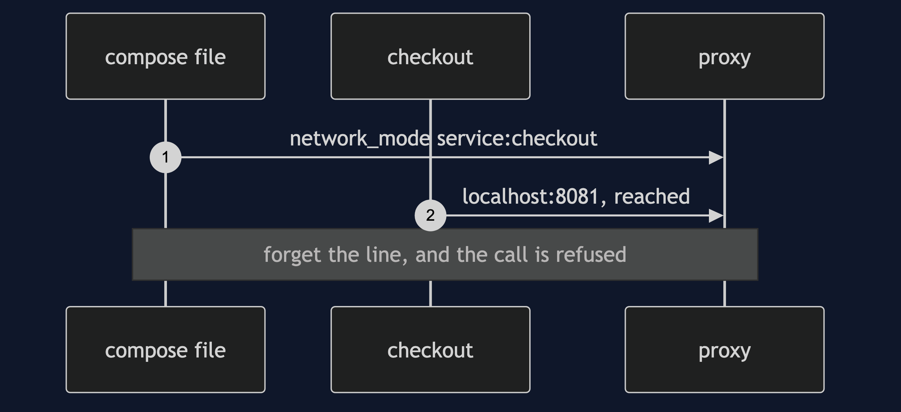
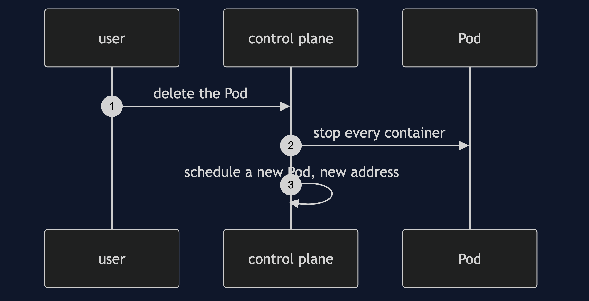
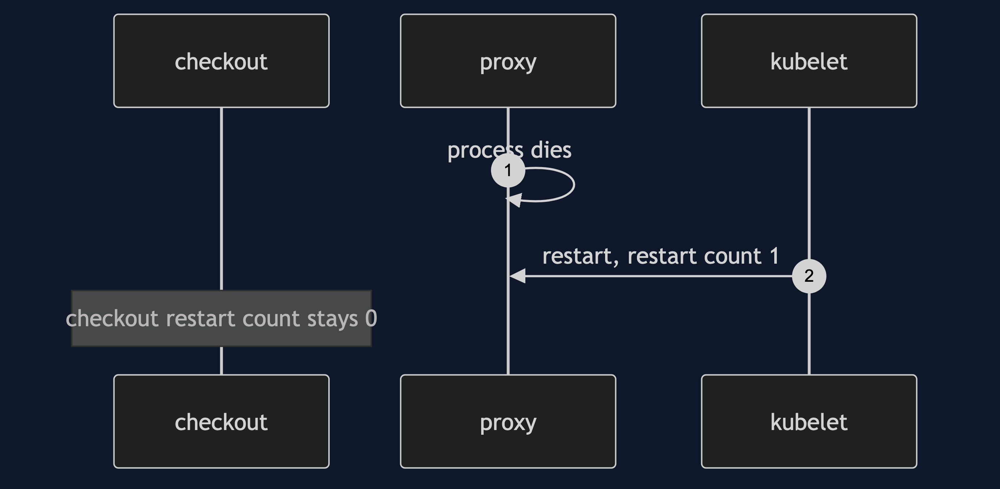
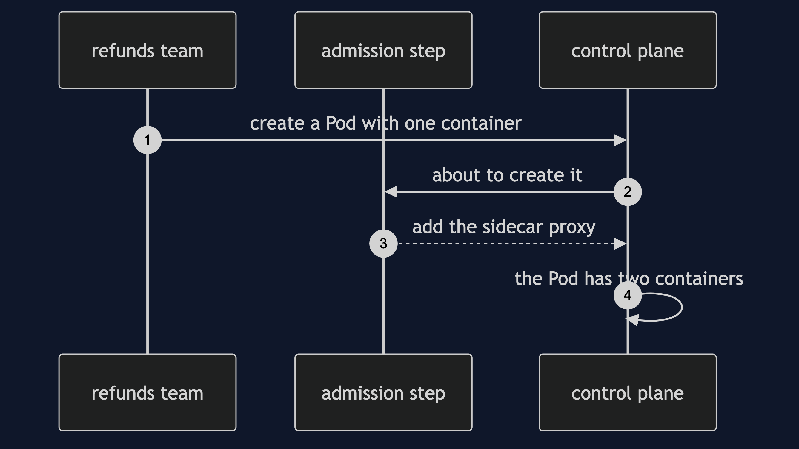

# Sidecar on Kubernetes Pattern

```
src/main/java/com/jk/explore/sidecarkubernetes/
├── PodDemo.java                     composition root — the six acts
│
├── PodSpec.java  ContainerSpec.java  a manifest: what somebody wrote, immutable
├── Cluster.java                      a control plane in about twenty lines: schedule, delete, restart
├── Pod.java  Container.java          containers that share a network namespace and a fate
├── NetworkNamespace.java             one set of ports, one loopback
├── Compose.java                      the comparison: sharing only when the file says so
├── Injector.java                     the sidecar arrives beside a manifest that never mentions it
└── ServiceCall.java                  the checkout's one call, to localhost:8081
```

**A Pod is two or more containers that share one network and one fate. That is where sidecars live, and it is a guarantee rather than a configuration line.**

This is the third of three Sidecar projects, and the one that shows where sidecars actually live. Read [`sidecar-pattern`](../sidecar-pattern) first: it explains what a sidecar is and why the retry code left the service. [`sidecar-java-proxy-pattern`](../sidecar-java-proxy-pattern) is the second. This project takes the same two containers and asks what changes when the thing that runs them is Kubernetes. It is the heaviest dependency in the course, so [`docs/dependencies.md`](docs/dependencies.md) explains Kubernetes before anything uses it, and **skipping this project loses none of the pattern**.

## Run

```bash
./gradlew run
```

Six acts. Tier 1: a plain-Java model of what a Pod guarantees, contrasted with Docker Compose. Nothing here starts a container. The real cluster, `kind`, is in [`real/`](real/), and is optional.

```
SIDECAR ON KUBERNETES — two containers, one Pod

ONE. Shared by configuration, or shared by definition.
  Compose, with network_mode: service:checkout: checkout reaches localhost:8081: true
  Compose, with that one line forgotten:        checkout reaches localhost:8081: false
  a Pod: checkout reaches localhost:8081: true. there is no line to forget.
  both containers are on 10.244.0.10, one network, because that is what a Pod is.

TWO. One lifecycle.
  Compose: checkout stopped. the proxy is still running: true.
  Pod: deleted. checkout running: false, proxy running: false. they go together.
  the replacement is a new Pod on a new address (10.244.0.10 became 10.244.0.11), with both containers new.

THREE. Restarts, however, are per container.
  the proxy's process dies. the Pod is 1/2. a payment now: connection refused on localhost:8081
  the kubelet restarts the proxy alone. Pod 2/2, proxy restarts 1, checkout restarts 0.
  a payment now: paid, through the proxy
  the service was not touched, and its calls failed for the gap. a crash does not take a neighbour with it.
  what is shared is the Pod: scheduling, eviction and deletion, not process death.

FOUR. Injection.
  the manifest the refunds team wrote lists 1 container: [refunds]
  the Pod that was created lists 2: [refunds, sidecar-proxy]
  the authored manifest is unchanged: true. the sidecar arrived from outside.
  that is the mechanism a service mesh is built on: every Pod gets a proxy, and no team wrote it.

FIVE. READY 2/2, and the start-up race.
  kubectl get pods: checkout   READY 2/2   one logical service, two containers.
  with the proxy down it reads 1/2, and the Pod is ready for traffic: false.
  containers started together, in manifest order: [checkout, sidecar-proxy]. the service can start, and call the proxy, before the proxy is listening.
  a native sidecar starts first: [sidecar-proxy, checkout]. the ordering problem is gone.

SIX. The bill, and the honest question.
  everything the Compose version cost, plus a cluster: a scheduler, a control plane,
  a YAML dialect and a networking model, added to a shop that worked with two containers and a file.
  do you need Kubernetes yet? for four services: almost certainly not. for a fleet: this is the bargain.
  what this model does not show: a real scheduler, real restarts with back-off, a control plane that fails.
  where you have met this: every Pod in every cluster, and every service mesh's injected proxy.
```

## Test

```bash
./gradlew test
```

2 test classes, 10 test methods, offline, offline, with no cluster and no Docker.

## Technologies and versions

| What | Version | Why it is here |
| --- | --- | --- |
| Java | 21 | The repository standard, via the Gradle toolchain block |
| Gradle | 9.2.1 | The wrapper in this directory; no separate install needed |
| JUnit 5 | 5.10.2 | Test runner |

No framework. A hand-built project stays plain Java so the mechanism is the whole lesson.

## Learning Material

| Document | What it covers |
| --- | --- |
| [`docs/problem-statement.md`](docs/problem-statement.md) | The same two containers, and what changes |
| [`docs/sidecar-on-kubernetes-pattern-explained.md`](docs/sidecar-on-kubernetes-pattern-explained.md) | Four guarantees, one correction, the bill, and what the model does not show |
| [`docs/class-diagram.md`](docs/class-diagram.md) | The types |
| [`docs/architecture-diagram.md`](docs/architecture-diagram.md) | Two containers in one Pod |
| [`docs/data-flow-diagram.md`](docs/data-flow-diagram.md) | A container dying, and a Pod being deleted |
| [`docs/sequence-diagram.md`](docs/sequence-diagram.md) | Written for a listener with the screen off |
| [`docs/uml-diagram.md`](docs/uml-diagram.md) | Four sequences |
| [`docs/animation.html`](docs/animation.html) | The six acts in a browser |
| [`docs/prerequisites.md`](docs/prerequisites.md) | What you need to know |
| [`docs/session.md`](docs/session.md) | A one-hour taught session |
| [`docs/spec.md`](docs/spec.md) | The generated specification |
| [`docs/youtube.md`](docs/youtube.md) | Title, description and chapters |

### The pattern in one picture



### Where each piece sits



### How one request moves



### Who calls whom, in order



### All four sequences









### Video

Built from [`video/scenes.py`](video/scenes.py) by
[`video/build_video.sh`](video/build_video.sh). The rendered file is not
committed; see the repository README for why.

## Tier 2: a real cluster

[`real/`](real/) runs the same two containers as a Pod on a real `kind` cluster, reusing
[`sidecar-pattern`](../sidecar-pattern)'s images and nginx template. It is optional, it is not on the path of
`./gradlew test`, and [`real/README.md`](real/README.md) holds the transcript, captured from a real run. It confirms
what Tier 1 claims, including the correction: a crash restarts only the container that died.

```bash
cd real && ./demo.sh     # creates the cluster, runs six acts, deletes the cluster
```

## Where you have already met this

Every Pod in every cluster, and the proxy a service mesh injects beside your service.

## When this is too much

For four services, or one team, Compose is cheaper, faster to start, and has fewer ways to fail.

## Where this sits

This is the third of three Sidecar projects. Read [Sidecar](../sidecar-pattern) first, and see [Sidecar with a Java proxy](../sidecar-java-proxy-pattern).
