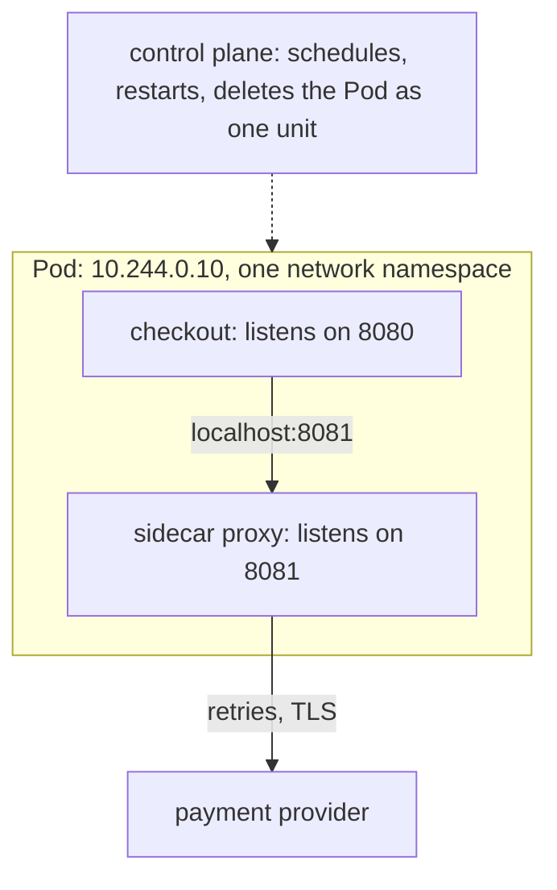

# Sidecar on Kubernetes Pattern — Architecture Diagram

Two containers in one Pod. One network, one address, one fate.

Mermaid source

```mermaid
flowchart TB
    subgraph Pod["Pod: 10.244.0.10, one network namespace"]
        C["checkout: listens on 8080"]
        S["sidecar proxy: listens on 8081"]
        C -->|localhost:8081| S
    end
    S -->|retries, TLS| G["payment provider"]
    K["control plane: schedules, restarts, deletes the Pod as one unit"] -.-> Pod
```

