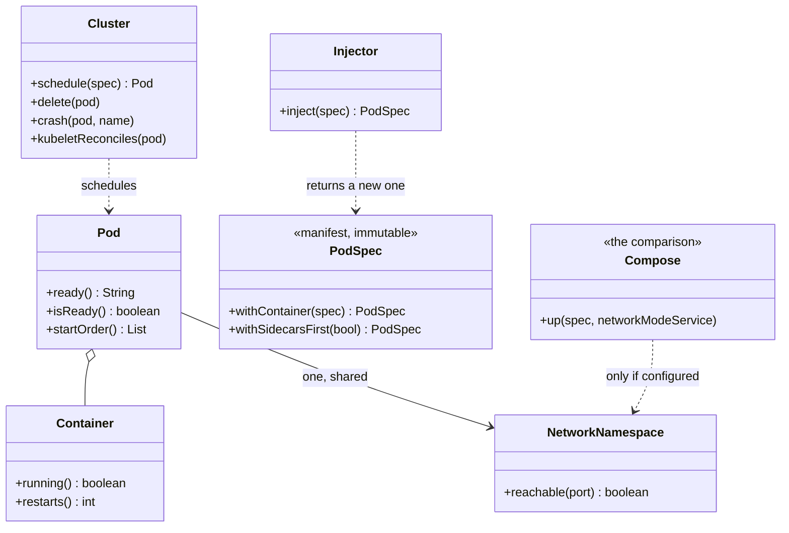

# Sidecar on Kubernetes Pattern — Class Diagram

A Pod owns one network namespace and its containers. A Cluster schedules and restarts.

Mermaid source

```mermaid
classDiagram
    class Cluster {
        +schedule(spec) Pod
        +delete(pod)
        +crash(pod, name)
        +kubeletReconciles(pod)
    }
    class Pod {
        +ready() String
        +isReady() boolean
        +startOrder() List
    }
    class Container {
        +running() boolean
        +restarts() int
    }
    class NetworkNamespace {
        +reachable(port) boolean
    }
    class PodSpec {
        <<manifest, immutable>>
        +withContainer(spec) PodSpec
        +withSidecarsFirst(bool) PodSpec
    }
    class Injector {
        +inject(spec) PodSpec
    }
    class Compose {
        <<the comparison>>
        +up(spec, networkModeService)
    }
    Cluster ..> Pod : schedules
    Pod o-- Container
    Pod --> NetworkNamespace : one, shared
    Injector ..> PodSpec : returns a new one
    Compose ..> NetworkNamespace : only if configured
```

