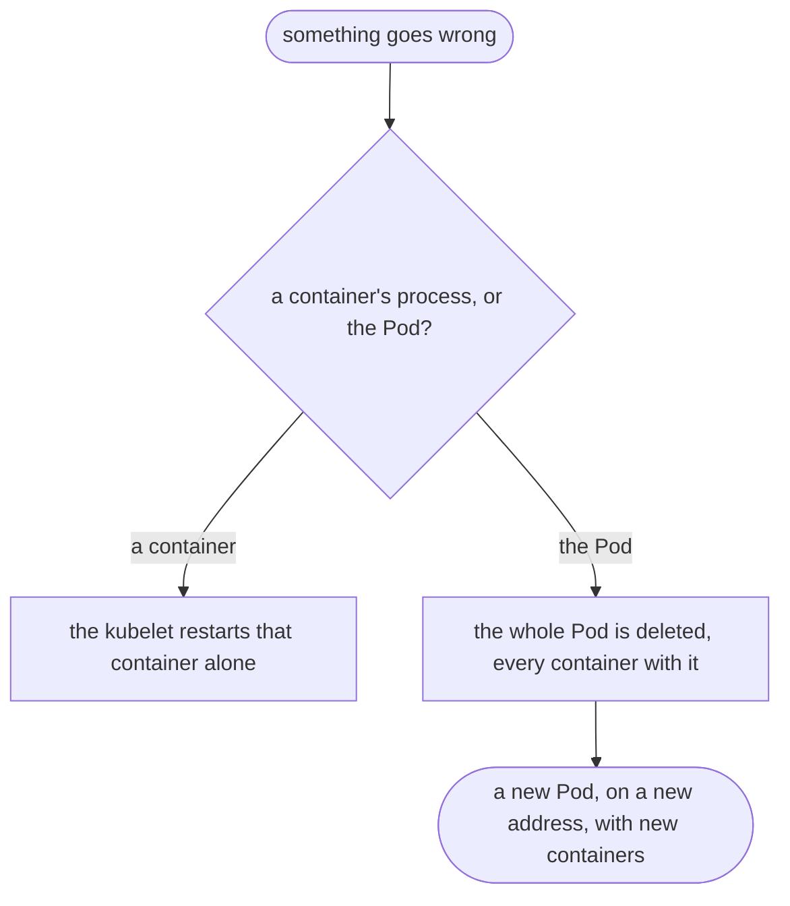

# Sidecar on Kubernetes Pattern — Data Flow Diagram

What happens to a Pod when a container dies, and when the Pod is deleted.

Mermaid source

```mermaid
flowchart TD
    Ev(["something goes wrong"])
    Which{"a container's process, or the Pod?"}
    Proc["the kubelet restarts that container alone"]
    Pod["the whole Pod is deleted, every container with it"]
    New(["a new Pod, on a new address, with new containers"])
    Ev --> Which
    Which -- a container --> Proc
    Which -- the Pod --> Pod --> New
```

