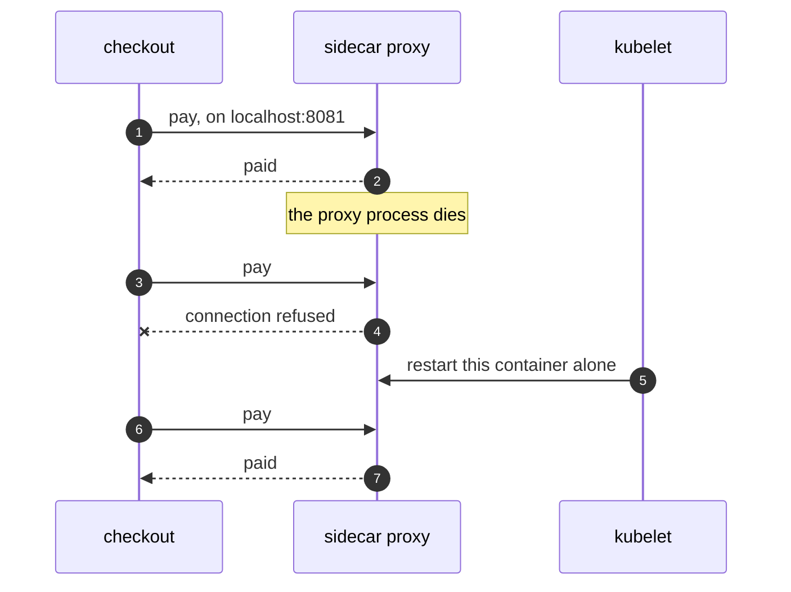

# Sidecar on Kubernetes Pattern — Sequence Diagram

Written for a listener with the screen off.

Say it in words. Checkout makes a payment by calling its own local port, eighty-eighty-one. Something is listening there, the proxy, because the proxy is in the same Pod and so shares checkout's network. If the proxy's process dies, the kubelet notices and restarts the proxy on its own, and checkout is never touched. During the gap, a payment fails with connection refused. Then the proxy is back, and payments work again, with no change to checkout.

Mermaid source

The load-bearing sentence: **a crash does not take a neighbour with it, and what is shared is the Pod.**
