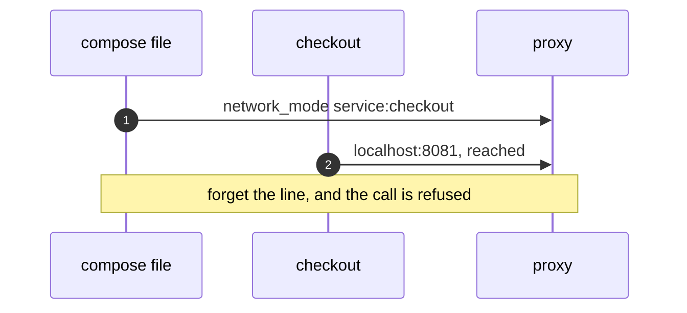
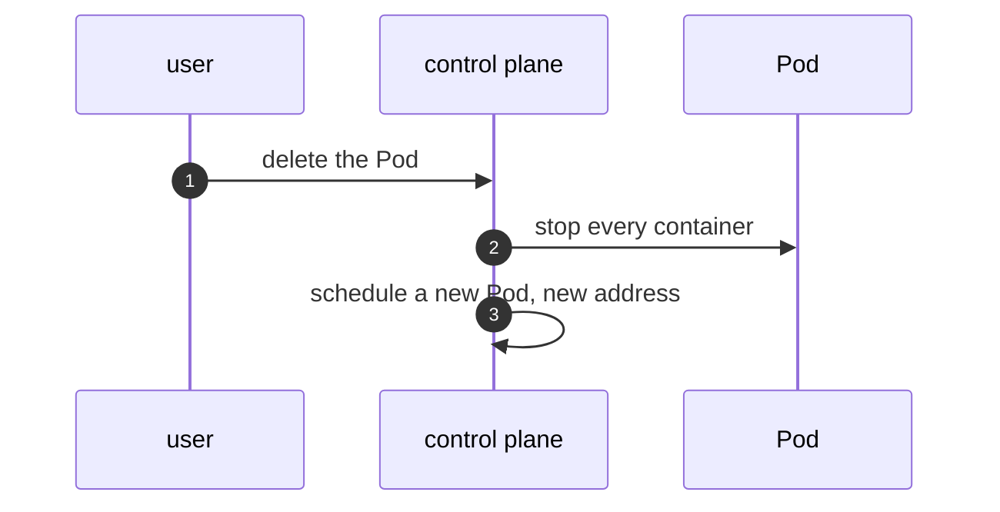
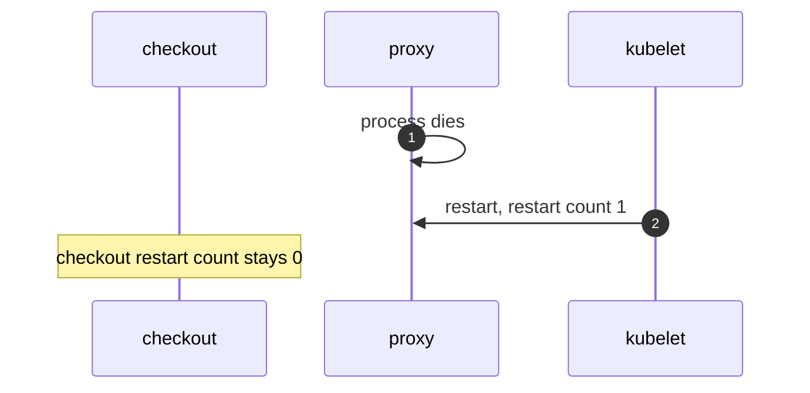
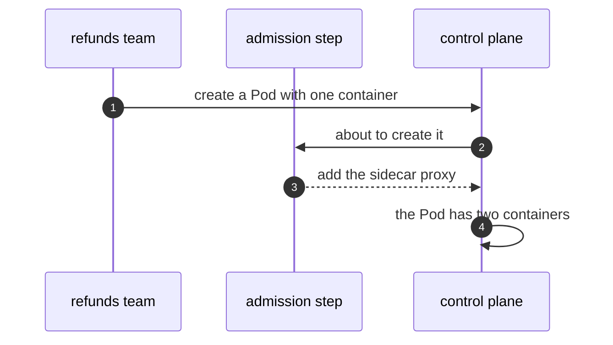

# Sidecar on Kubernetes Pattern — UML Sequence Diagrams

Four sequences.

## 1. Compose Needs The Line

Mermaid source

## 2. Deleting A Pod

Mermaid source

## 3. A Container Restarts Alone

Mermaid source

## 4. Injection

Mermaid source

