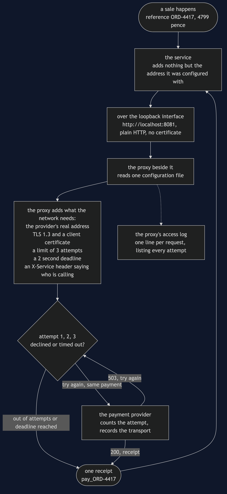

# Sidecar Pattern

**Take a concern that is not about your business — retrying, timing out, presenting a
certificate, counting what happened — out of the service and run it in a separate process
beside it, on the same machine, so the policy is stated once instead of copied into every
service that happens to make the call.**

Think of a busy kitchen where every chef is also expected to take deliveries at the back
door: check the paperwork, refuse anything out of date, sign for the rest. Four chefs,
four sets of rules in four heads, all of them about the supplier and none of them about
cooking. The day the supplier changes its paperwork, you have to tell four people, and
you will tell three. The fix is not a rule book. It is one person standing at the back
door, next to the kitchen, who takes every delivery for all of them.

The shop takes money in four places: checkout, refunds, subscription billing and
marketplace payouts. Four teams, four repositories, four release days — and one payment
provider behind all four.

## Run

```bash
./gradlew run
```

Seven acts. The first three are the problem, the fourth is the pattern, and the last
three are the bill.

Act 1 is the state everybody starts in. Each of the four services had to answer the same
four questions before going live:

```
    service               attempts  backoff  deadline     tls
    checkout                     6     10ms    2000ms  TLS1.3
    refunds                      6     10ms    2000ms  TLS1.3
    subscription-billing         6     10ms    2000ms  TLS1.3
    marketplace-payouts          6     10ms    2000ms  TLS1.3

  copies of a cross-cutting decision: 16
  places to edit to change one:       4
```

Sixteen values, and not one of them is about checkout, refunds, subscriptions or payouts.
They are facts about a network and a supplier's contract. **They would be identical if the
shop sold bicycles.**

Act 2 is March. The provider writes to every merchant: at most three attempts per payment,
and wait properly between them. An engineer changes checkout, then refunds, then payouts —
three pull requests in one afternoon, and everybody goes home.

```
    service               attempts  backoff  deadline     tls
    checkout                     3    200ms    2000ms  TLS1.3
    refunds                      3    200ms    2000ms  TLS1.3
    marketplace-payouts          3    200ms    2000ms  TLS1.3
    subscription-billing         6     10ms    2000ms  TLS1.3
```

The fourth row is the whole project. Subscription billing runs overnight, its team was not
in the meeting, it lives in its own repository, and it had no open work that sprint. There
was no fourth place to look unless you already knew there was a fourth place to look.
**Nothing throws, nothing is logged, and every test in all four services still passes**,
because each one tests its own copy and each copy is internally consistent.

Go looking for the bug in `SubscriptionBillingService` and you will not find one. The
class has no `applyPolicyReview()` method at all — and `CopiedConcernsTest` asserts that
absence on purpose. **The incident is a missing thing, not a wrong thing.**

Act 3 is three weeks later, at two in the morning. The gateway declines everything for
300 milliseconds and is then fine. The merchant account allows twelve attempts.

```
    subscription-billing  £12.99   6x, 310ms    pay_SUB-90118
    checkout              £47.99   3x, 600ms    pay_ORD-4417
    refunds               £22.50   3x, 600ms    pay_REF-3820
    marketplace-payouts   £186.40  —            NOT PAID
      429 refused — the account's 12-attempt allowance is spent

    total                 13 of 12 allowed, 1 refused
```

Subscription billing is always running at two in the morning, so it reaches the wobble
first and spends six attempts on the stale policy. Marketplace payouts arrives fourth,
makes one attempt, and is refused. The sellers are not paid. **There is nothing wrong with
the payouts service** — it was updated in March and did exactly what the provider asked.
It arrived fourth. On Monday morning somebody opens an incident against the service whose
every line is correct.

Act 4 moves the four decisions out. Each service talks to a proxy running beside it on the
same machine, its own process; the service sends its payment to localhost and knows
nothing else, and the proxy is the only thing that goes out to the internet.

```
  All four proxies read the same configuration:
    maxAttempts=3 firstBackoff=200ms deadline=2000ms tls=TLS1.3

    public Receipt pay(Payment payment) {
        return sidecar.send(payment);
    }
```

The same wobble, the same four payments, the same night:

```
    total                 12 of 12 allowed, 0 refused
```

Not four equal copies of the configuration — **the same one**.
`SidecarTest.oneConfigurationForAllOfThem` asserts `assertSame`, not `assertEquals`, because
four equal copies would be March all over again with better manners. **The policy was not
applied four times and missed once. It was stated once.**

## And then the bill

Act 5 is the arithmetic, and all three rows count:

```
                                            before     after
  copies of a cross-cutting decision            16         4
  places to edit for one policy change           4         1
  processes to run and patch                     4         8
```

The first two rows are why you would do this. The third is why it is not free: four
proxies is four more things wanting memory, a version number, a restart when they are
patched, and a line in somebody's runbook. But notice which row scales — add a fifth
service that takes payments and the copies go 16 to 20 the old way, and stay at 4 beside
the services. `Concerns.copiesBesideTheServices()` takes no argument at all, and **the
missing argument is the answer.**

The line for what may move out: retry counts, deadlines, certificates and counters are
facts about the network. Whether a refund is allowed after ninety days is a fact about the
shop, and if it ever appears in a proxy configuration you have hidden a business rule
somewhere no developer will think to look.

Act 6 is the second thing that can be down. A healthy gateway, a healthy service, a
healthy network — and the proxy beside checkout fails to start after a patch:

```
    connection refused to localhost — no sidecar beside checkout

  attempts that reached the gateway: 0
```

Zero. The request never left the machine, and the service has no retry code left to fall
back on, because we deleted it on purpose in Act 4. **You added a dependency to every
single call in order to make those calls more reliable.** That trade is usually worth it —
a proxy on the same machine with no business logic in it fails far less often than the
internet does — but on the night it goes wrong, it goes wrong for every call the service
makes rather than for one of them.

Act 7 is one millisecond:

```
    retry code inside the service      3 attempts, 600ms
    retry code in a proxy next door    3 attempts, 603ms
```

One millisecond per attempt to cross to a neighbouring process and back. Nothing on a
payment that already takes 600. Fifty per cent on an internal call that takes two. And in
a system where every service talks through a proxy, **every hop between two services is
paid twice** — once leaving one, once entering the next. That is the arithmetic that
decides whether a service mesh belongs in your system, and it is arithmetic, not taste.

## The admission

Everything above happens inside one Java program. In one program, a proxy that a service
talks through is an object wrapping another object — and an object wrapping another object
is [Decorator](../../structural/decorator-pattern), from earlier in this course. `Sidecar`
would not surprise anybody who has read it.

What makes this a different pattern is not the code. It is where the code runs. A decorator
is compiled into your jar, is written in your language, and changes when your service is
rebuilt. A sidecar is its own process, may be written in a language nobody on your team
knows, and changes when somebody restarts it.

So the question is never *wrapper or no wrapper*. It is:

> **Does this concern have to change without rebuilding the service? Must it work for a
> service written in a language your library does not support?**
>
> Yes to either, and it goes next door. No to both, and a shared library in your own
> process is cheaper, faster, and has one fewer thing that can fail.

## Test

```bash
./gradlew test
```

59 tests, in about a second, with nothing random and nothing sleeping. `Clock.waitFor`
adds to a total and returns, so a run that narrates 600 milliseconds of backoff finishes
instantly and two runs print byte-identical output — which is what lets `DemoRunsTest`
assert the numbers quoted in these documents, in the notes and in the video.

Three tests are worth reading before the rest.
`CopiedConcernsTest.billingHasNoWayToApplyTheReview` asserts the *absence* of a method.
`SidecarTest.oneConfigurationForAllOfThem` asserts identity rather than equality.
And `TheIncidentTest` runs the same night twice — once with the concerns copied into the
services and once with a proxy beside each — on the same gateway, with the same wobble.

## One JVM, no infrastructure

This project starts nothing. No network, no HTTP, no socket, no Docker, no framework. The
sidecar is an object the service calls, and the phrase *separate process* is carried by the
narration rather than by the Java.

That is a deliberate trade. What you get is the pattern's shape: which decisions move,
what is left in the service, what the copies cost, what a dead proxy does to a healthy
service, and what the hop costs per call. None of that changes when the proxy becomes a
real process. What you do not get is a real process boundary — the one thing the pattern
is actually about.

For the version where the proxy really is a separate process, see
[`real/`](real/README.md). Five containers on Docker Compose: two services, a payment
provider that speaks TLS 1.3 and nothing else, and an nginx sidecar beside each service
sharing its network namespace, so `http://localhost:8081` in the service's configuration
is literally true. It shows the three claims a single JVM cannot make — the retry policy
changed in one file with neither service restarted, a proxy written in a language the
service knows nothing about, and a stopped proxy taking every call with it on a
completely healthy network. It is optional and additive: it is a separate Gradle build,
so `./gradlew test` here never resolves Spring and still passes offline. The two projects
after this one go further still — `sidecar-java-proxy-pattern` (§42) swaps nginx for a
proxy you can read, and `sidecar-on-kubernetes-pattern` (§43) runs the pair as one Pod.

## Technologies and versions

Two tiers, two very different dependency lists. Nothing here is a range and nothing is
`latest`: a course that worked last year and does not work today is worse than one that
never took the dependency. The Java versions are pinned in
[`../gradle/libs.versions.toml`](../gradle/libs.versions.toml) because Gradle can read
that file, and the container tags in
[`../docs/pinned-versions.md`](../docs/pinned-versions.md) because nothing can.

**Tier 1 — this project.** Clone it, run `./gradlew test`, and it passes with no network
and no Docker.

| What | Version | Why it is here |
| --- | --- | --- |
| Java | 21 | The repository standard, requested through the Gradle toolchain block |
| Gradle | 9.2.1 | The wrapper in this directory; no separate install needed |
| JUnit 5 | 5.10.2 | The 59 tests. The only Tier 1 dependency in the whole category |

**Tier 2 — [`real/`](real/README.md), a separate Gradle build.** None of this is on the
path of `./gradlew test` here.

| What | Version | Why it is here |
| --- | --- | --- |
| Spring Boot | 4.1.1 | The three Java containers: checkout, refunds and the payment provider. Newest generally available release; a milestone is not a release |
| `spring-boot-starter-web` | with Boot 4.1.1 | The HTTP endpoints each service exposes |
| `spring-boot-starter-restclient` | with Boot 4.1.1 | The one call the payments service makes, to the proxy next door. In Boot 4 this is a separate starter from `web` |
| Spring dependency-management plugin | 1.1.7 | Applies the Boot BOM so no starter carries a version of its own |
| nginx | `1.31.5-alpine` | **The sidecar itself.** The proxy is deliberately not Java: a service that cannot tell what language its proxy is written in is the claim this tier exists to make |
| Eclipse Temurin | `21-jre-alpine` | The base image for the three Java containers |
| Docker Compose | v2 | Starts the five containers and, crucially, shares one network namespace between each service and its proxy |
| `keytool` | ships with the JDK | Generates the provider's self-signed certificate at the start of `demo.sh`, so nothing secret is committed |

The alpine images are chosen for size rather than preference — a reader on a slow
connection pulling two images notices — and neither project needs anything the slim
variant leaves out.

## Learning Material

| Document | What it covers |
| --- | --- |
| [`docs/problem-statement.md`](docs/problem-statement.md) | Sixteen copies, one letter from the provider, and an incident nobody can be blamed for |
| [`docs/sidecar-pattern-explained.md`](docs/sidecar-pattern-explained.md) | The pattern, the code, the bill, and why this is Decorator until you deploy it |
| [`docs/class-diagram.md`](docs/class-diagram.md) | The types — and the one boundary that does not appear in any of them |
| [`docs/architecture-diagram.md`](docs/architecture-diagram.md) | What runs where, in both tiers, and the dashed line that is the whole pattern |
| [`docs/data-flow-diagram.md`](docs/data-flow-diagram.md) | One payment, hop by hop, and who adds what to it on the way |
| [`docs/sequence-diagram.md`](docs/sequence-diagram.md) | The same payment in call order: one arrow out of the service, three across the network |
| [`docs/uml-diagram.md`](docs/uml-diagram.md) | The night that failed, the same night repaired, and the proxy that would not start |
| [`docs/animation.html`](docs/animation.html) | Twelve steps in a browser: the copies, the missed edit, the incident, and the three costs |
| [`docs/prerequisites.md`](docs/prerequisites.md) | What you need to know, and what you explicitly do not |
| [`docs/session.md`](docs/session.md) | A one-hour taught session with four exercises |
| [`docs/spec.md`](docs/spec.md) | The generated specification, with measured test counts and timings |
| [`docs/youtube.md`](docs/youtube.md) | Title, description and chapters for the video |

### The pattern in one picture

The class diagram, and the thing to look for is what is *not* joined up. Four services —
checkout, refunds, subscription billing and marketplace payouts — implement one interface
for taking payments, and not one of them has a field for a retry count, a timeout or a
certificate. Those live in the proxy and in the single configuration it reads. The arrow
from a service points at an address, not at the payment provider.


### What runs where

Both tiers on one page. The dashed boxes in the lower half are shared network namespaces:
one network stack for two containers, which is why the service can be configured with
`http://localhost:8081` and be telling the truth.


### How the data moves

One payment, from the sale to the receipt. Three attempts leave the proxy and one answer
goes back to the service, and there is nowhere in the service's code that the other two
could be observed.



### Who calls whom, in order

The same payment again, this time in the order the calls happen. The proxy reads its
configuration once at start-up, long before any customer. Then the service makes a single
call to `localhost`, the proxy takes three goes at the payment provider, and one receipt
comes back.


### All five sequences

The full set from [`docs/uml-diagram.md`](docs/uml-diagram.md), in the order that document
argues them: the night that went wrong, the same night with the pattern in place, and then
the three parts of the bill.

**One. Four copies of a retry policy, three of them updated.** Subscription billing reaches
the wobbling payment gateway first on the old policy, spends half the shop's allowance, and
the service that was updated correctly is the one refused.


**Two. The same night with a proxy beside each service.** Every service sends to
`localhost`, all four proxies read one configuration, and the twelve attempts are shared
three each.


**Three. The bill, part one: the proxy is down.** A healthy service on a healthy network
takes no payments at all, and zero attempts reach the provider, because the request never
left the machine.


**Four. The bill, part two: the hop.** Every call now crosses a process boundary it did not
cross before, and that cost is paid on every request whether or not anything goes wrong.


**Five. The only difference from Decorator.** The same wrapping, in a different process.
That is the whole distinction, and it is what buys the language independence — and what
costs the extra failure mode in sequence three.


### Video

The narrated walkthrough is built from [`video/scenes.py`](video/scenes.py) by
[`video/build_video.sh`](video/build_video.sh). The rendered file is not committed — see
the repository README for why.

## Where this sits

This is pattern 41, the fourth of the [`platform-design-patterns`](..) as the category
lists them. It depends on none of the others, and the listed order is a dependency order
for the material rather than a difficulty order.

The distinguishing question, if you only remember one thing: **would this decision be
identical if the shop sold bicycles?** A retry count, a deadline, a certificate profile
and the name of a counter all would be. A refund window would not. The first kind can live
next door. The second kind must stay in the service, and a proxy configuration is the last
place anyone will look for it.
