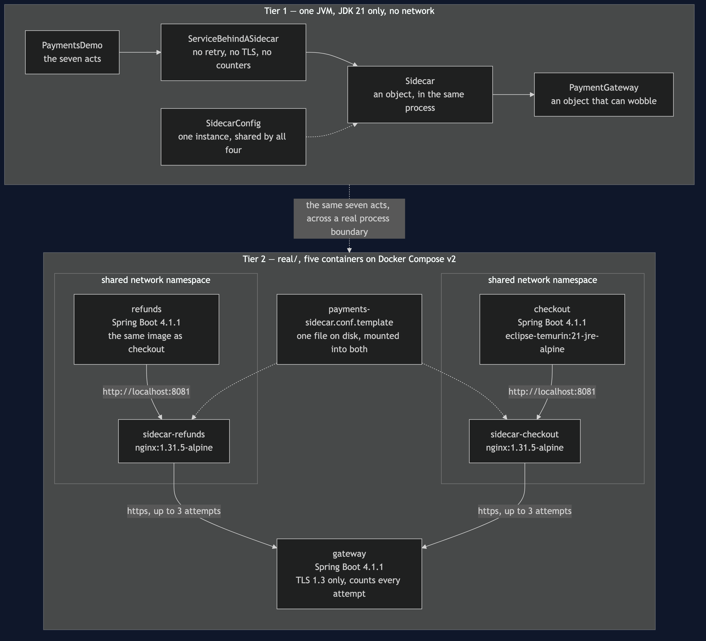
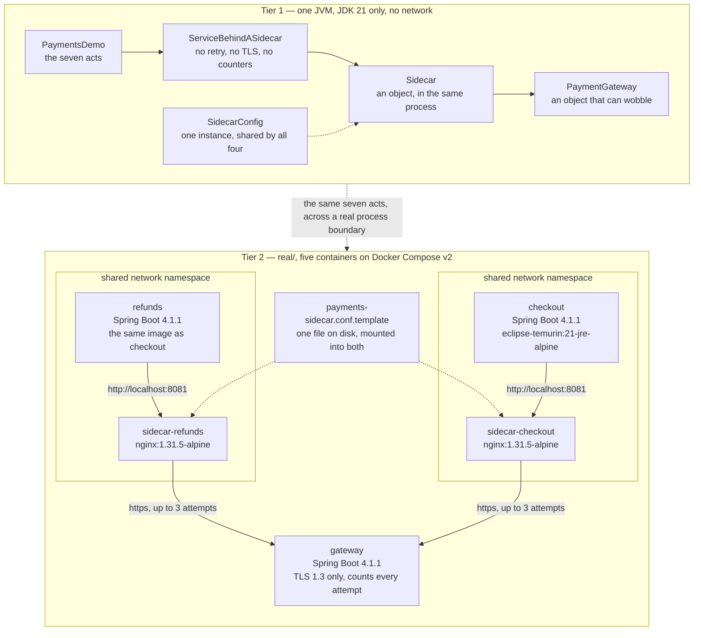

# Sidecar Pattern — Architecture Diagram

Where each piece of this project runs, in both tiers, and which technology it is written
in. The class diagram shows the types and the sequence diagrams show the order of events;
this one answers the question those two cannot, which is **what would I have to start**.

Read it as two boxes stacked. The upper box is Tier 1: one Java program, one process, no
network, nothing installed. The lower box is Tier 2, under `real/`: five containers on
Docker Compose, two of which are nginx and none of which is imaginary.

The important thing on the picture is the dashed line around each service-and-proxy pair
in Tier 2. That line is a shared network namespace — one network stack for two containers
— and it is why the payments service can be configured with the address
`http://localhost:8081` and be telling the truth. Everything else on the diagram is
ordinary: a service, a proxy, a supplier. The dashed line is the pattern.

Notice also what the services in Tier 2 are **not** connected to. There is no arrow from
`checkout` to the payment provider. The provider's address, its certificate and its retry
policy are facts the service never learns, and the absence of that arrow is the whole
argument of the project drawn as a missing line.

Mermaid source

## What the diagram is telling you to count

**Two shapes, five containers.** Two of the five are the shop. One is the supplier. The
other two exist only because the pattern was applied, and that is the third row of the
demo's bill — twice as many processes to start, patch, version and stare at during an
incident — shown rather than asserted.

**One configuration node, two dotted arrows into it.** Not two boxes that happen to agree.
There is one file, and both proxies mount it, which is the difference between *the policy
is stated once* and *the policy is copied and currently matches*.

**The arrows that cross the boundary out of the shop all start at a proxy.** No service
box has a line leaving the system. If you ever draw this diagram for your own system and a
service has such a line, that service is carrying a concern the proxy was supposed to take.

## What it deliberately leaves out

There is no control plane, no service registry and no injecting webhook. A service mesh is
this diagram applied to every service at once, with something on top that configures all
the proxies and puts them there without anyone asking. That extra box is a decision with
its own bill, and the demo's last act gives the arithmetic for taking it.

Tier 2 also stops at two services where Tier 1 uses four. Four were needed to make the
copies hurt; here the copies are already gone, so a third and fourth identical container
would add starting time without adding a claim.
