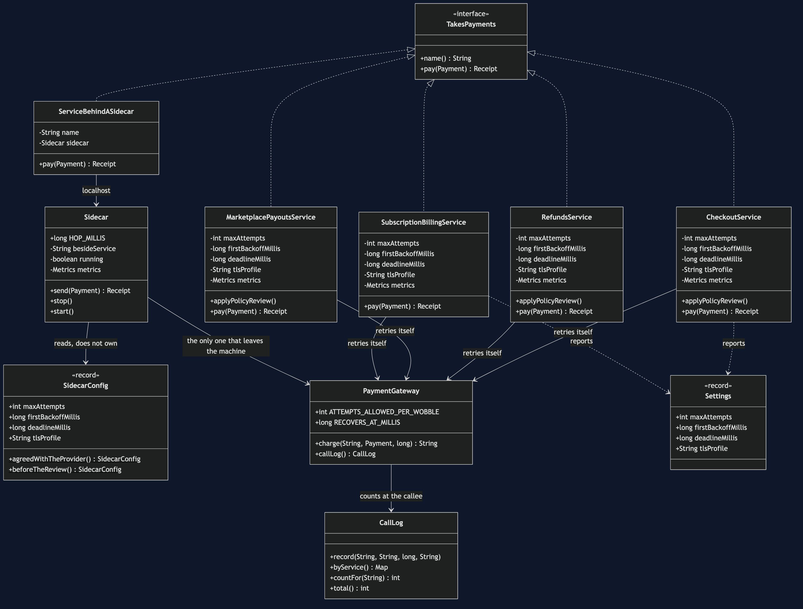
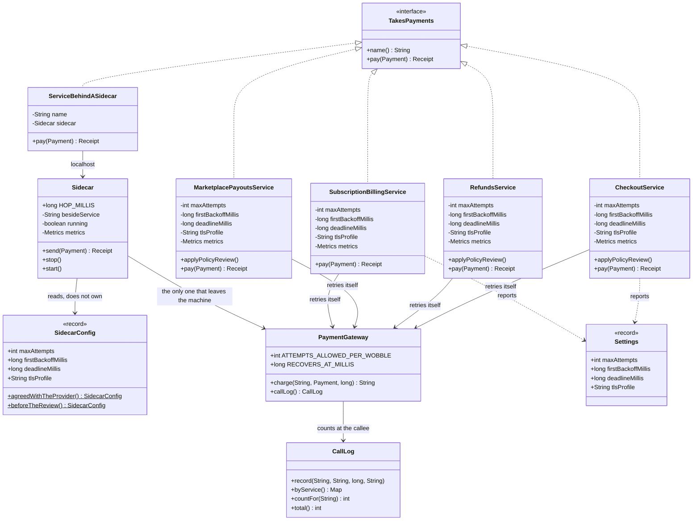

# Sidecar Pattern — Class Diagram

Shows the static structure: the one contract every paying service satisfies, the four
services that each carry their own copy of the four cross-cutting concerns, the one
service that carries none of them, the proxy that carries them instead, and the single
configuration object that all the proxies read.

The most important thing on this diagram is a **count**, and it is a count you can do with
your eyes shut. On the left, four classes implement `TakesPayments`, and each one has its
own `maxAttempts`, its own `firstBackoffMillis`, its own `deadlineMillis` and its own
`tlsProfile` — four boxes, four copies each, sixteen values. On the right, one class
implements `TakesPayments`, it holds nothing but a name and a reference, and the four
values live in exactly one place: `SidecarConfig`.

The second most important thing is an **absence**. `CheckoutService`, `RefundsService` and
`MarketplacePayoutsService` all carry a method called `applyPolicyReview()`.
`SubscriptionBillingService` does not. That missing method is the incident. Nothing on this
diagram is broken, nothing is misnamed, and no arrow points the wrong way — the fault is
that one box is missing an operation the three boxes beside it have, and no compiler, test
or review will ever mention it.

The third: `Sidecar` holds a reference to `PaymentGateway` and presents the same operation
its caller wanted. If that looks exactly like the Decorator diagram from §11, that is
because it is exactly the Decorator diagram from §11. The difference between the two
patterns does not appear on a class diagram at all, because the difference is which
*process* each box runs in — which is why the deployment view in `uml-diagram.md` matters
more here than it does in most projects.



<details>
<summary>Mermaid source</summary>



</details>

## Reading the arrows

**Four arrows into `PaymentGateway` on the left.** Each of the four services goes out to
the internet itself. Four places where a connection is opened, four places where a retry
loop runs, four places where a certificate is chosen.

**One arrow into `PaymentGateway` on the right.** `ServiceBehindASidecar` never touches it.
Its single arrow goes to `Sidecar`, and that arrow is labelled `localhost` because in the
deployed version it does not leave the machine.

**The arrow from `Sidecar` to `SidecarConfig` is labelled "reads, does not own",** and that
is the whole pattern in four words. Four sidecars, one config. The test says so directly:

```java
for (Sidecar sidecar : sidecars) {
    assertSame(one, sidecar.config(), "every sidecar must read the same one");
}
```

Identity, not equality. Four equal copies would be the problem again with better manners.

**`PaymentGateway` points at `CallLog`, and nothing else does.** The log is kept by the
callee. A service's belief about how many times it tried is exactly the thing that went
wrong on the night in question, so no number in this project is taken from the caller.

**`Concerns` is not on the diagram at all**, and its absence is deliberate rather than an
oversight. It holds no state, calls nothing and is called by nothing:

```java
public static int copiesInsideTheServices(int services) { ... }
public static int copiesBesideTheServices() { ... }
public static int processesToRun(int services, boolean withSidecars) { ... }
```

It is pure arithmetic *about* the diagram — how many copies of a decision the left-hand
side contains, how many the right-hand side contains, and how many processes each
arrangement costs to run. A class with no relationships has nothing to draw, and putting it
in the picture would only invite an arrow that does not exist. Act 5 of the demo is a claim
about this diagram, and `Concerns` is where that claim is computed and tested rather than
asserted in prose.

## What this diagram cannot show you

The difference between `Sidecar` and a plain decorator is that `Sidecar` runs in a
different process from the service that calls it. A class diagram has no notation for that.
If you rendered §11's Decorator diagram and this one side by side, you would not be able to
tell which was which — and that is not a flaw in the drawing, it is the honest answer to
"what is new here?" Nothing in the structure. Everything in the deployment.

The deployment is drawn in [`uml-diagram.md`](uml-diagram.md), where the process boundary
is the only thing that matters.
