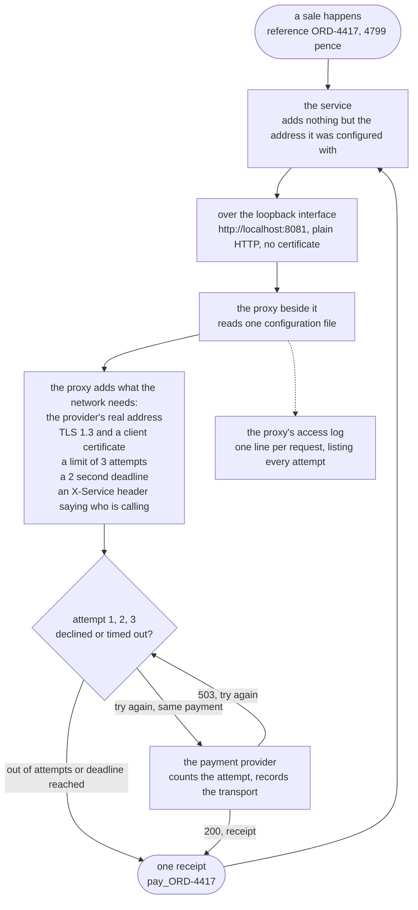

# Sidecar Pattern — Data Flow Diagram

One payment, followed from the moment the shop decides to take it to the moment a receipt
comes back, with a note at every hop saying **what was added to the data and who added
it**. The architecture diagram says what is running; this one says what moves between the
boxes and how it changes on the way.

Follow the left-hand column down and then back up. The shop hands over a reference and an
amount in pence — a few dozen bytes describing a sale — and that is the last the service
knows about it. Everything that gets added between there and the supplier is a fact about
a network: which address, over what transport, how many times, how long to wait, and who
is asking. All of it is added by the proxy, and none of it is visible to the service that
started the payment.

The single most important part of the picture is the loop in the middle. Three attempts
leave the proxy and one answer goes back to the service. The service made one call and
received one answer, and there is no place in its code where the other two attempts could
be observed, counted or logged. **A service cannot see the retries made on its behalf**,
which is exactly why the demo asks the provider for the tally rather than the caller.

Mermaid source

## The three things this flow proves

**The payment data itself never changes.** The reference and the amount that leave the
service are the reference and the amount the provider records. Everything the proxy adds
is envelope, not content. That is the test for whether a concern may move next door at
all: if the box would have to understand what a refund is in order to do its job, it is in
the wrong place.

**The transport is added after the service is finished with it.** The service sends plain
HTTP with no keystore, no trust store and no protocol list anywhere in its configuration,
and the provider — which accepts TLS 1.3 and nothing else — records the call as TLS 1.3.
In the version without a sidecar, that certificate profile was one of sixteen copies
scattered across four repositories.

**One arrow out, one arrow back, three attempts in between.** The retry loop is entirely
inside the proxy box. Delete the proxy and the loop goes with it, which is the cost the
demo's sixth act makes you look at: a healthy service on a healthy network that cannot
take a single payment, with zero attempts reaching the provider, because the request never
left the machine.

## Where the data goes that is not the payment

The dotted arrow to the access log is the pattern's consolation prize. Because every
payment for every service now passes through the same kind of box, reading the same
configuration, the record of what happened is in one format whoever made the call. One log
line lists each attempt, the status it got and how long it took, and nobody had to
persuade four teams to agree on a logging format to get it.
