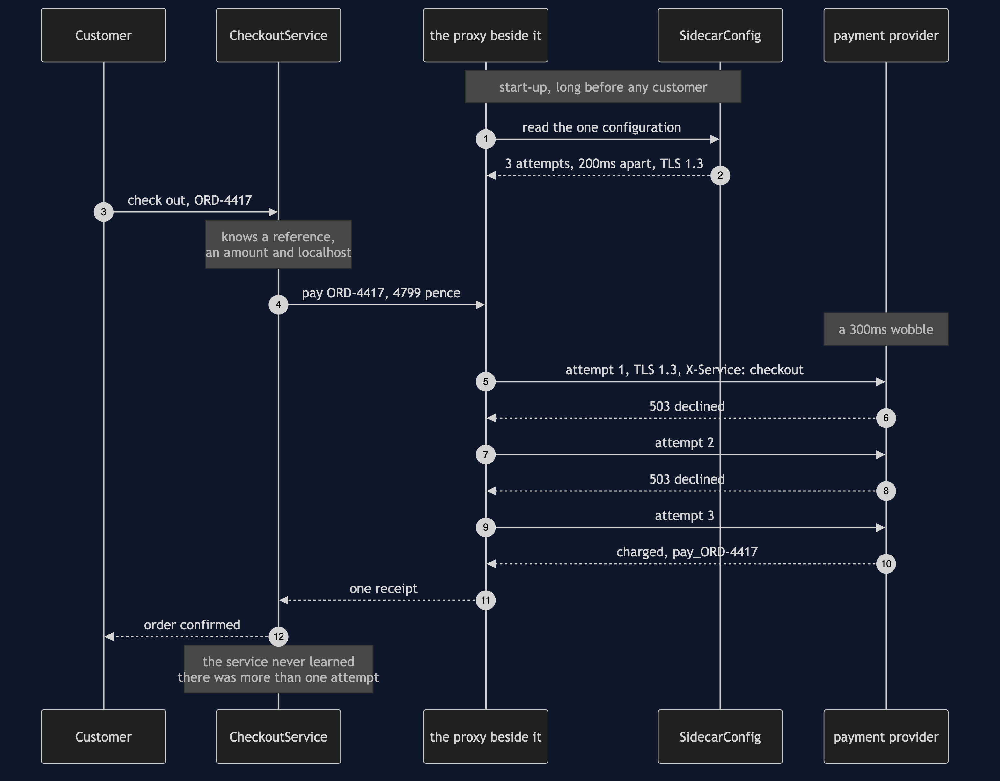
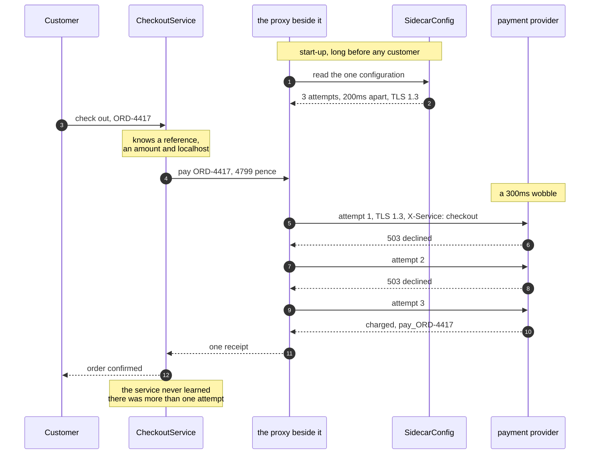

# Sidecar Pattern — Sequence Diagram

One payment, in the order the calls happen. The architecture diagram says what is
running and the data flow diagram says what moves between the boxes; this one says
**who speaks, to whom, and in what order** — including the two exchanges that happen
before any customer has arrived.

Read it as four beats. First, at start-up, each proxy reads the same configuration
file: three attempts, two hundred milliseconds between them, TLS 1.3, and the
provider's real address. Nothing has been sold yet. Second, a customer checks out and
`CheckoutService` makes exactly one call — to `localhost`, in plain HTTP, with a
reference and an amount in pence and nothing else. Third, the proxy beside it talks to
the payment provider three times: two attempts are declined by a provider having a
short wobble, and the third succeeds. Fourth, one receipt goes back to the service.

The whole pattern is in the gap between beat two and beat four. **The service sends
one arrow and receives one arrow.** Three arrows crossed the network and the service
cannot name a line of its own code where the other two could be seen, counted or
logged, because they happened in a different process that it did not start and does
not import.

Mermaid source

## What the order proves

**The configuration is read once, at the top, by the proxy.** Move that first exchange
into the service and you are back where the pattern started: every service holding its
own copy of the retry count, the timeout and the certificate profile, and a change to
any of them meaning four releases instead of one file.

**The service's call is the shortest arrow on the page.** It crosses a loopback
interface with no certificate, no retry policy and no deadline attached, because all
three are somebody else's job. That is the test for whether a concern may move next
door: if the proxy would have to understand what a refund *is* to do its work, it
belongs back inside the service.

**The three attempts sit between two arrows the service can see.** This is the honest
reading of the picture, and it cuts both ways. The service is not more careful than it
was; it is deliberately ignorant. When the proxy is missing or dead, that same
ignorance means a healthy service on a healthy network takes no payments at all and
has no idea why — which is what the demo's sixth act makes you look at.

The four other sequences — the night before the pattern, the proxy being down, the
extra hop, and why this is not the Decorator pattern in a container — are in
[`uml-diagram.md`](uml-diagram.md).
