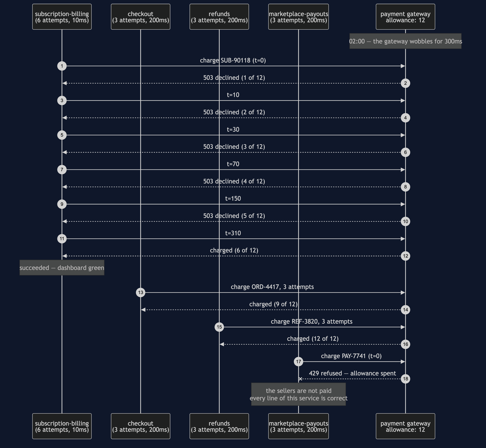
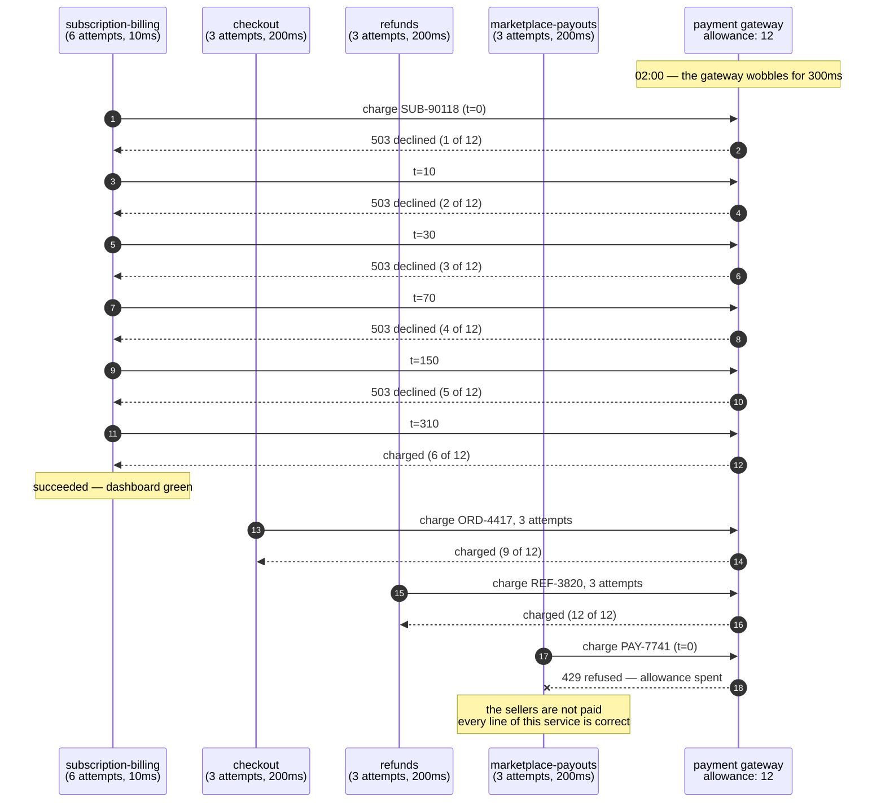
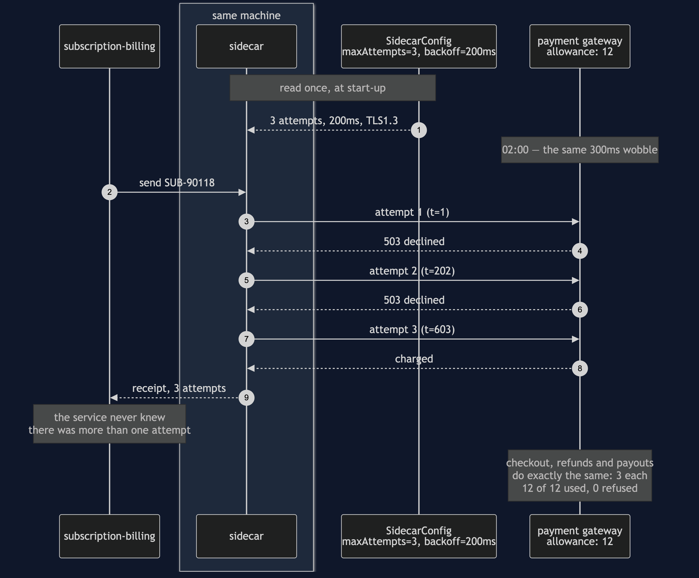
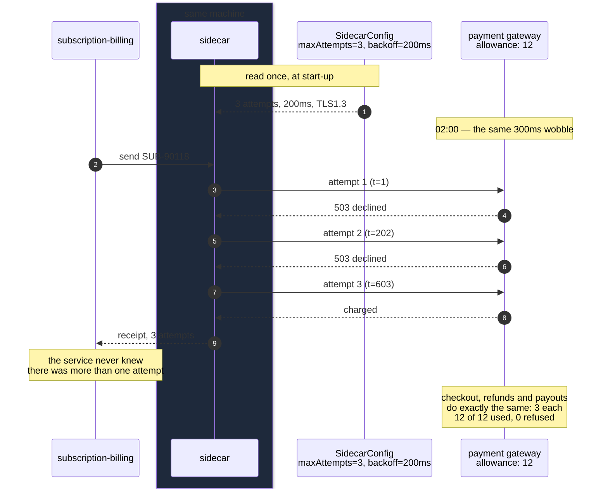
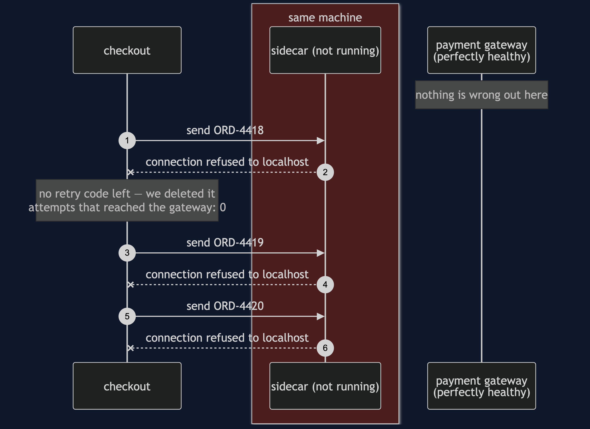
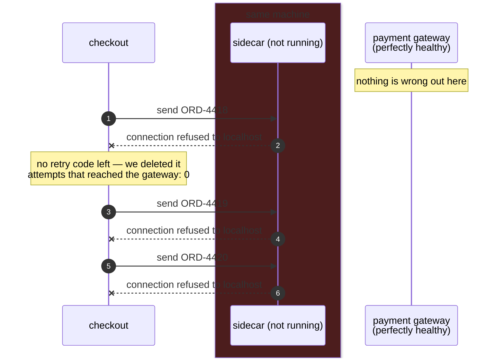
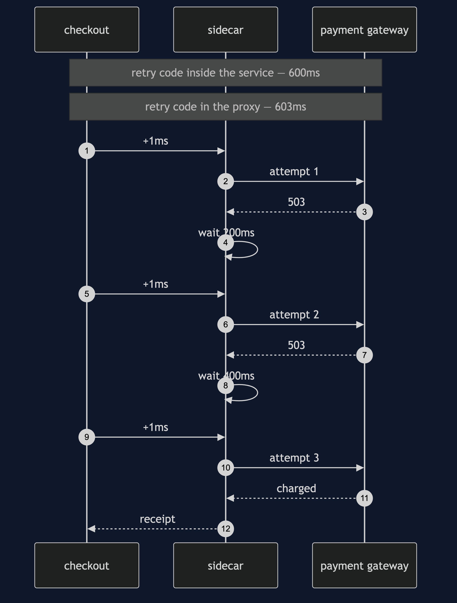
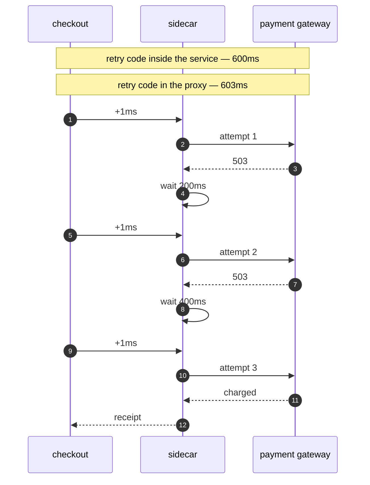
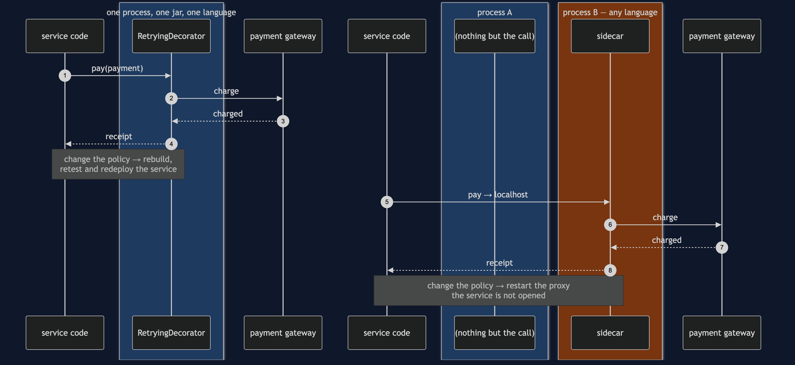
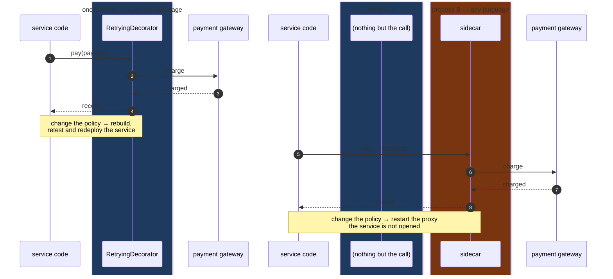

# Sidecar Pattern — UML Sequence Diagrams

Five sequences. The first is the night that went wrong. The second is the same night with
the pattern in place. The last three are the bill: the second thing that can be down, the
extra hop, and the process boundary that is the only real difference between this pattern
and Decorator.

Watch the **boxes** rather than the arrows in every one of these. The boxes are processes,
and this is the one pattern in the course where which process a line of code runs in is the
entire point.

## 1. The Night: Four Copies, Three Updated

Subscription billing is already running, because it is always running at two in the
morning. It reaches the wobbling gateway first, on the policy everybody used before March,
and spends six of the shop's twelve attempts. The three services that *were* updated behave
perfectly and succeed. Marketplace payouts arrives fourth, makes one attempt, and is
refused.

Mermaid source

The arrow to watch is the last one. It is a cross, not a dash, and it belongs to a service
that did nothing wrong. The six arrows at the top belong to a service that succeeded. **The
failure and the cause are in different lanes**, which is why the incident review on Monday
morning looks at the wrong service for a day and a half.

## 2. The Same Night, With A Proxy Beside Each Service

Every service now sends to `localhost`. The retry loop runs in the proxy, and all four
proxies read one configuration.

Mermaid source

Two things to notice, and neither of them is the happy ending.

The first is that **`Bill` sends one arrow and receives one arrow.** Everything between
them happened in a process it cannot see. The service did not become more careful; it
became ignorant, deliberately.

The second is that the arrow from `Cfg` happens **once, at start-up**, and it is the same
arrow for all four proxies. That is the difference between four copies and one statement,
drawn.

## 3. The Bill, Part One: The Proxy Is Down

Mermaid source

There is no arrow to the gateway on this diagram at all. That empty right-hand side is the
cost: the request never left the machine, and the service has nothing left to fall back on
because the fallback was the thing we moved out.

Three requests, three identical failures. **When a sidecar goes, it does not take one call
with it — it takes every call that service makes.** The failure is not smaller than the
network's, it is rarer and wider.

## 4. The Bill, Part Two: The Hop

Mermaid source

One millisecond per attempt, three milliseconds on this call. On a payment that already
takes six hundred, that is nothing. On an internal call that takes two milliseconds it is a
fifty per cent increase — and in a system where every service talks through a proxy, every
hop between two services is paid twice: once leaving one and once entering the next.

**That is the arithmetic that decides whether a service mesh belongs in your system.** It
is arithmetic, not taste.

## 5. The Only Difference From Decorator

Mermaid source

The arrows are the same shape in both halves. The boxes are not.

That is the honest summary of this pattern: **the structure is Decorator, the decision is
about deployment.** Everything you gain and everything you pay comes from the second box
being a different process — the policy change that does not touch the service, the extra
thing that can be down, and the millisecond on every call.

So the question is never "wrapper or no wrapper". It is: does this concern need to change
without rebuilding the service, or apply to a service written in a language your library
does not support? Yes to either, and it goes next door. No to both, and the top half of
this diagram is cheaper, faster and has one fewer thing that can fail.
